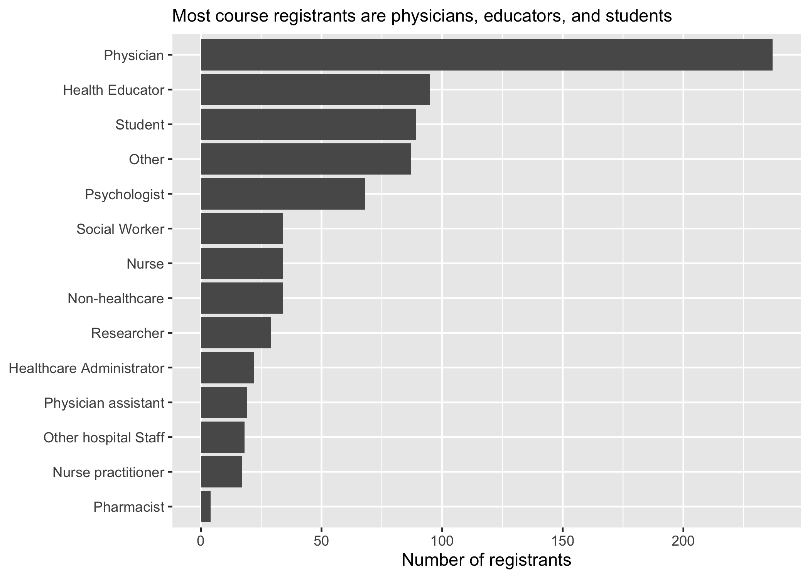
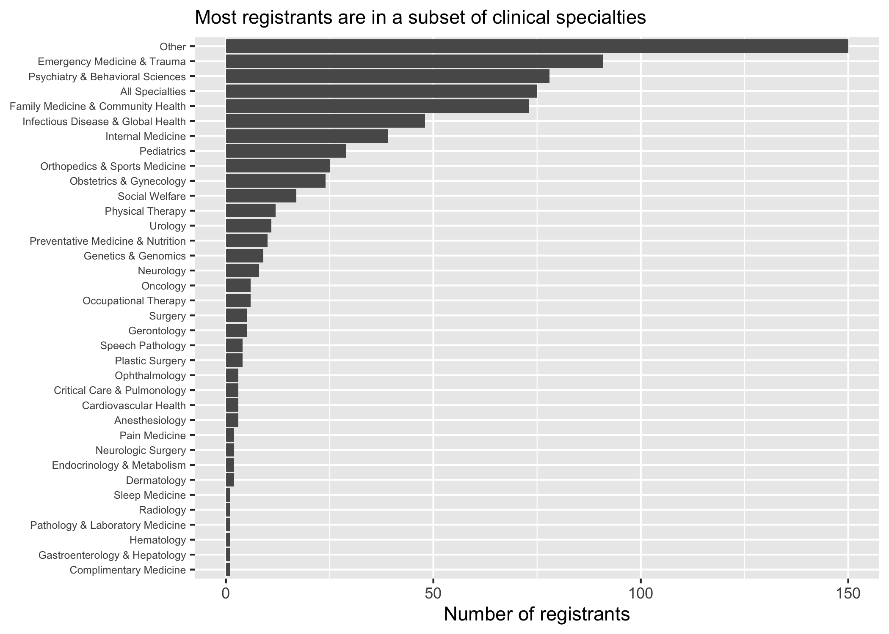
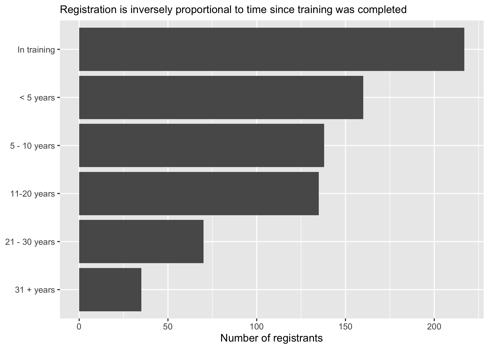
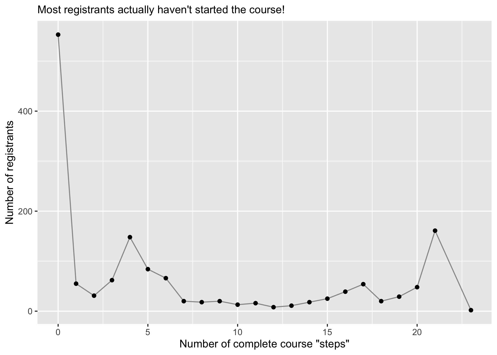
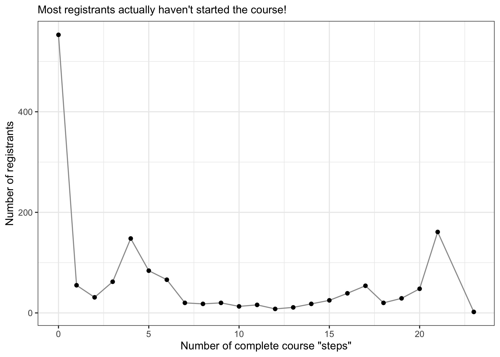
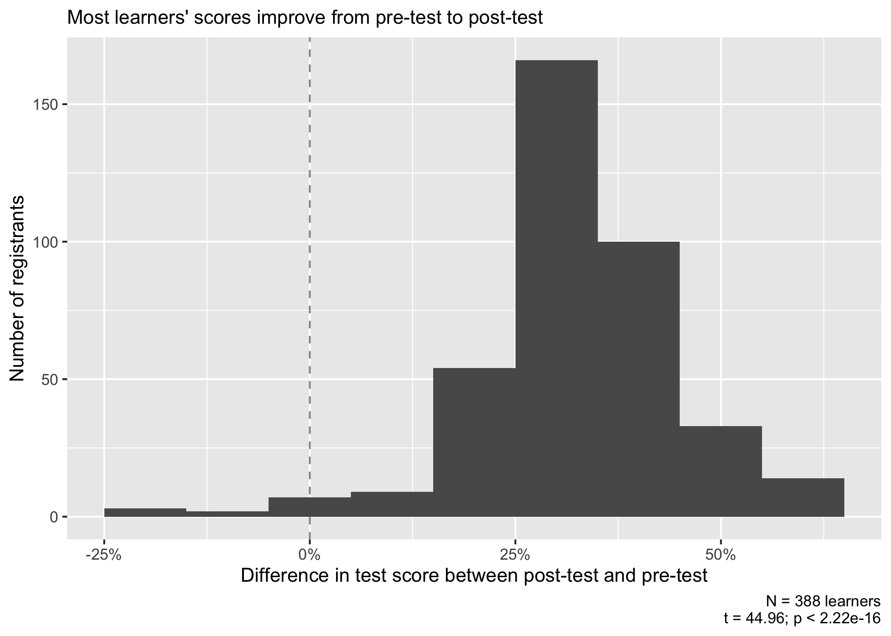
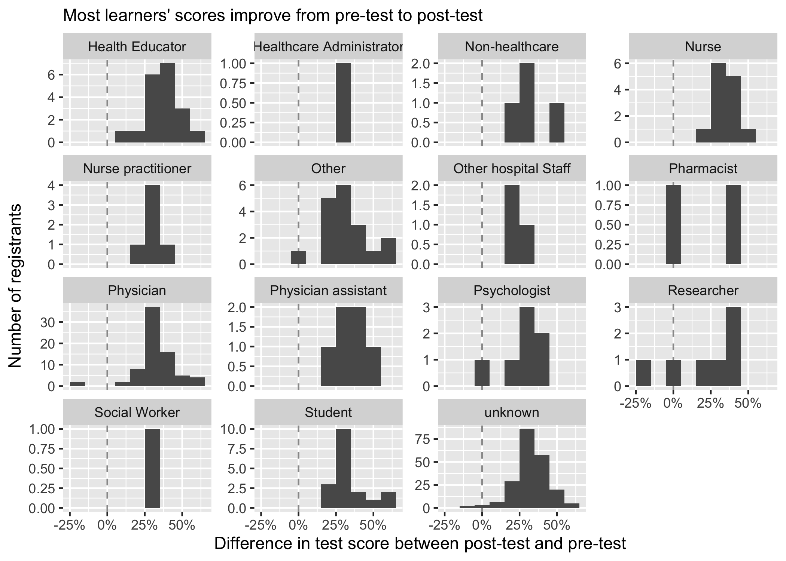
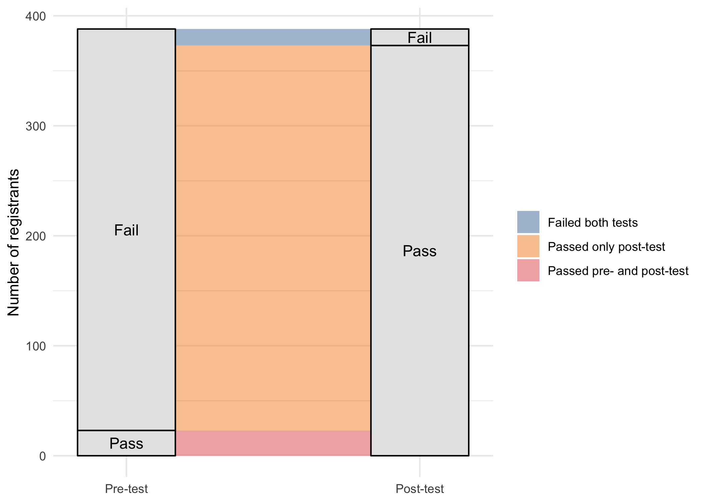

Teaching LGBTQ+ Health Data analysis
================

-   [setup](#setup)
-   [read in data](#read-in-data)
    -   [registrants](#registrants)
    -   [metadata](#metadata)
    -   [assessments](#assessments)
    -   [free-text case reflections](#free-text-case-reflections)
-   [Analysis](#analysis)
    -   [demographics](#demographics)
    -   [course completion](#course-completion)
    -   [assessments](#assessments-1)
        -   [Improvement from pre-test to
            post-test?](#improvement-from-pre-test-to-post-test)
-   [Reflection analysis](#reflection-analysis)

# setup

``` r
# libraries
library(tidyverse)
library(pdftools)
library(lubridate)
library(ggalluvial)
library(tidytext)

# paths 
registrant_path <- 
  here::here("data-raw", "cme", "registrants.csv")

metadata_path <- 
  here::here("data-raw", "cme", "registration_metadata.pdf")

test_path <- 
  here::here("data-raw", "cme", "tests.csv")

teddy_path <- 
  here::here("data-raw", "cme", "teddy_text_responses.pdf")

carla_path <- 
  here::here("data-raw", "cme", "carla_text_responses.pdf")

jesse_path <- 
  here::here("data-raw", "cme", "jesse_text_responses.pdf")

# globals

launch_date <-
  NULL

course_team <- 
  c(
    "Deila Bumgardner", "Stanford CME", "Michael Gisondi", 
    "Shana Zucker", "Timothy Keyes", "William Bottini"
  )

our_title <- 
  "Teaching LGBTQ+ Health"

teddy_stem <- 
  "Teddy Teaching Strategies : Entry # [:digit:]+\n\nPlease share your ideas in the text box below before advancing to the next module. We recommend that you copy and paste your entry into\na separate file for later use before submitting.\n\n"

jesse_stem <- 
  "Jesse Teaching Strategies : Entry # [:digit:]+\n\nPlease share your ideas in the text box below before advancing to the next module. We recommend that you copy and paste your entry into\na separate file for later use before submitting.\n\n"

carla_stem <- 
  "Carla Teaching Strategies : Entry # [:digit:]+\n\nPlease share your ideas in the text box below before advancing to the next module. We recommend that you copy and paste your entry into\na separate file for later use before submitting."
```

# read in data

## registrants

``` r
registrants <- 
  registrant_path %>% 
  read_csv() %>% 
  janitor::clean_names() %>% 
  filter(!(name %in% course_team))
```

## metadata

``` r
metadata_string <- 
  metadata_path %>% 
  pdf_text()

metadata <- 
  tibble(
    name = 
      str_extract(metadata_string, pattern = "Name\n\n.+") %>% 
      str_remove(pattern = "Name\n\n") %>% 
      str_trim(),
    profession = 
      str_extract(metadata_string, pattern = "Healthcare role\n\n.+") %>% 
      str_remove(pattern = "Healthcare role\n\n") %>% 
      str_trim(), 
    area_of_practice = 
      str_extract(
        metadata_string, 
        pattern = "Area of Clinical Practice\n\n.+"
      ) %>% 
      str_remove("Area of Clinical Practice\n\n") %>% 
      str_trim(), 
    experience = 
      str_extract(metadata_string, pattern = "completion of training\n\n.+") %>% 
      str_remove("completion of training\n\n") %>% 
      str_trim(), 
    email =
      str_extract(metadata_string, pattern = "Email\n\n.+") %>% 
      str_remove(pattern = "Email\n\n") %>% 
      str_trim()
  )
```

## assessments

``` r
tests <- 
  test_path %>% 
  read_csv() %>% 
  janitor::clean_names() %>%
  filter(course_title == our_title) %>% 
  mutate(
    quiz_title = str_remove(quiz_title, pattern = "Teaching LGBTQ\\+ Health:?[:space:]")
  )
```

## free-text case reflections

is there a way to match these with respondent `user_id`’s?

``` r
teddy_string <- 
  teddy_path %>% 
  pdf_text() %>% 
  str_c(collapse = TRUE)

# a list in which each entry is a string (a single reflection on Teddy's case")
teddy_responses <- 
  teddy_string %>% 
  str_split(pattern = teddy_stem) %>% 
  flatten() %>% 
  str_trim() %>% 
  str_remove_all(pattern = "\n") %>% 
  str_replace_all(pattern = "[:blank:]+", replacement = " ")
```

``` r
jesse_string <- 
  jesse_path %>% 
  pdf_text() %>% 
  str_c(collapse = TRUE)

# a list in which each entry is a string (a single reflection on Teddy's case")
jesse_responses <- 
  jesse_string %>% 
  str_split(pattern = jesse_stem) %>% 
  flatten() %>% 
  str_trim() %>% 
  str_remove_all(pattern = "\n") %>% 
  str_replace_all(pattern = "[:blank:]+", replacement = " ")
```

``` r
carla_string <- 
  carla_path %>% 
  pdf_text() %>% 
  str_c(collapse = TRUE)

# a list in which each entry is a string (a single reflection on Teddy's case")
carla_responses <- 
  carla_string %>% 
  str_split(pattern = carla_stem) %>% 
  flatten() %>% 
  str_trim() %>% 
  str_remove_all(pattern = "\n") %>% 
  str_replace_all(pattern = "[:blank:]+", replacement = " ")
```

# Analysis

## demographics

``` r
# a useful function
plot_metadata_1d <- 
  function(my_var, subtitle) { 
    metadata %>% 
      count({{my_var}}, sort = TRUE) %>% 
      mutate(my_factor = fct_reorder({{my_var}}, n)) %>% 
      drop_na(my_factor) %>% 
      ggplot(aes(y = my_factor, x = n)) + 
      geom_col() + 
      labs(
        subtitle = subtitle, 
        x = "Number of registrants", 
        y = NULL
      )
  }
```

``` r
plot_metadata_1d(
  my_var = profession, 
  subtitle = "Most course registrants are physicians, educators, and students"
)
```

<!-- -->

``` r
plot_metadata_1d(
  my_var = area_of_practice, 
  subtitle = "Most registrants are in a subset of clinical specialties"
) + 
  theme(axis.text.y = element_text(size = 6))
```

<!-- -->

``` r
plot_metadata_1d(
  my_var = experience, 
  subtitle = "Registration is inversely proportional to time since training was completed"
)
```

<!-- -->

## course completion

``` r
registrants %>% 
  count(completed_steps) %>% 
  ggplot(aes(x = completed_steps, y = n)) + 
  geom_line(color = "gray60") + 
  geom_point() + 
  labs(
    subtitle = "Most registrants actually haven't started the course!",
    x = "Number of complete course \"steps\"", 
    y = "Number of registrants"
  )
```

<!-- -->

Number of “complete” courses:

``` r
registrants %>% 
  count(course_completed)
```

    ## # A tibble: 2 x 2
    ##   course_completed     n
    ##   <chr>            <int>
    ## 1 NO                1336
    ## 2 YES                165

Relatively few people are marking the course “completed” at the very
end, so we will probably have to figure out a way to mark “completeness”
for the people who took most of the course but didn’t click the final
button.

Maybe the number of people who took the post-test?

``` r
num_unique_posttest_users <- 
  tests %>% 
  count(user_id, quiz_title) %>% 
  filter(str_detect(quiz_title, pattern = "Post")) %>% 
  nrow()

num_unique_posttest_users
```

    ## [1] 388

We can see that the number of people who took the post-test was 388,
which is considerably more than the number of people who marked
“complete” at the end of the course.

``` r
registrants %>% 
  filter(completion_date != "-") %>% 
  mutate(
    completion_date = 
      mdy_hms(completion_date) %>% 
      date()
  ) %>% 
  count(completion_date) %>% 
  arrange(completion_date) %>% 
  mutate(cumulative_n = cumsum(n)) %>% 
  ggplot(aes(x = completion_date, y = cumulative_n)) + 
  geom_line() + 
  labs(
    subtitle = 
      "Registrants have completed the course at a ~constant rate since launch", 
    x = "Date of course completion", 
    y = "Cumulative number of course completions"
  )
```

<!-- -->

## assessments

### Improvement from pre-test to post-test?

Scores from (first) pre-test to (final) post-test:

``` r
pre_post_tibble <- 
  tests %>% 
  transmute(
    user_id, 
    email,
    percentage = (score / total) * 100,
    quiz_title = 
      str_to_lower(quiz_title) %>% 
      str_replace("-", "_")
  ) %>% 
  pivot_wider(
    names_from = quiz_title,
    values_from = percentage, 
    values_fn = list
  ) %>% 
  # filter out people who have no post-test responses
  filter(map_lgl(.x = post_test, .f = ~length(.x) > 0)) %>% 
  # take only first pre-test and last post-test
  mutate(
    pre_test = map_dbl(.x = pre_test, .f = ~ .x[[1]]), 
    post_test = map_dbl(.x = post_test, .f = ~ .x[[length(.x)]]), 
    improvement = post_test - pre_test
  )

paired_t <- 
  t.test(
    pre_post_tibble$post_test, 
    pre_post_tibble$pre_test
  ) %>% 
  broom::tidy() %>% 
  select(p_value = p.value, t_value = statistic, df = parameter)

current_n <- nrow(pre_post_tibble)

pre_post_tibble %>% 
  ggplot(aes(x = improvement)) + 
  geom_vline(xintercept = 0, linetype = "dashed", color = "gray60") + 
  geom_histogram(bins = 9) + 
  scale_x_continuous(labels = scales::label_number(suffix = "%")) + 
  labs(
    subtitle = "Most learners' scores improve from pre-test to post-test", 
    x = "Difference in test score between post-test and pre-test", 
    y = "Number of registrants", 
    caption = 
      str_c(
        "N = ", current_n, " learners", "\n", 
        "t = ", round(paired_t$t_value, 2), "; ",
        "p ", format.pval(paired_t$p_value)
      )
  )
```

<!-- -->

We can also break this down by profession, which gives us a
quick-and-dirty plot suggesting that there aren’t huge differences
across professions…

``` r
pre_post_tibble %>% 
  left_join(select(metadata, -name)) %>% 
  mutate(across(any_of(colnames(metadata)), replace_na, replace = "unknown")) %>% 
  ggplot(aes(x = improvement)) + 
  geom_vline(xintercept = 0, linetype = "dashed", color = "gray60") + 
  geom_histogram(bins = 9) + 
  facet_wrap(facets = vars(profession), scales = "free_y") + 
  scale_x_continuous(labels = scales::label_number(suffix = "%")) + 
  labs(
    subtitle = "Most learners' scores improve from pre-test to post-test", 
    x = "Difference in test score between post-test and pre-test", 
    y = "Number of registrants"
  )
```

<!-- -->

Percentage of passes on the pre-test vs. post-test:

Let’s say we define a pass as a 70% or above. Then how many passed on
the pre-test vs. the post-test?

``` r
pre_post_tibble %>% 
  mutate(
    pass_pre = if_else(pre_test >= 70, "Pass", "Fail"), 
    pass_post = if_else(post_test >= 70, "Pass", "Fail"), 
    test_pattern = 
      case_when(
        pass_pre == "Pass" & pass_post == "Pass" ~ "Passed pre- and post-test", 
        pass_pre == "Fail" & pass_post == "Pass" ~ "Passed only post-test", 
        pass_pre == "Fail" & pass_post == "Fail" ~ "Failed both tests"
      )
  ) %>% 
  count(pass_pre, pass_post, test_pattern) %>% 
  ggplot(aes(axis1 = pass_pre, axis2 = pass_post, y = n)) + 
  geom_alluvium(aes(fill = test_pattern)) + 
  geom_stratum(fill = "gray90") + 
  geom_text(stat = "stratum", aes(label = after_stat(stratum))) +  
  scale_x_discrete(limits = c("Pre-test", "Post-test"), expand = c(.2, .05)) +
  ggthemes::scale_fill_tableau() + 
  theme_minimal() + 
  theme(legend.position = "right") + 
  labs(
    x = NULL, 
    y = "Number of registrants", 
    fill = NULL
  ) 
```

<!-- -->

From this plot, we can see that the largest group of learners by far is
the group that failed the pre-test but passed the post-test, indicating
that the course did in fact do its job (get most people from not knowing
enough to pass the test to knowing enough to pass the test).

# Reflection analysis

\[Under construction\]
