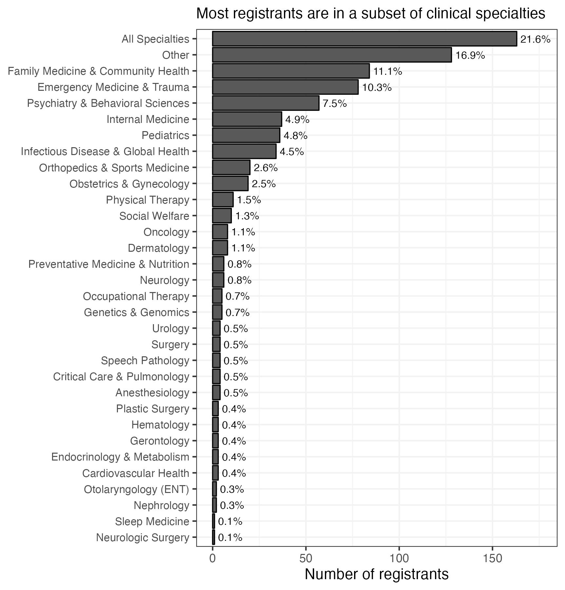
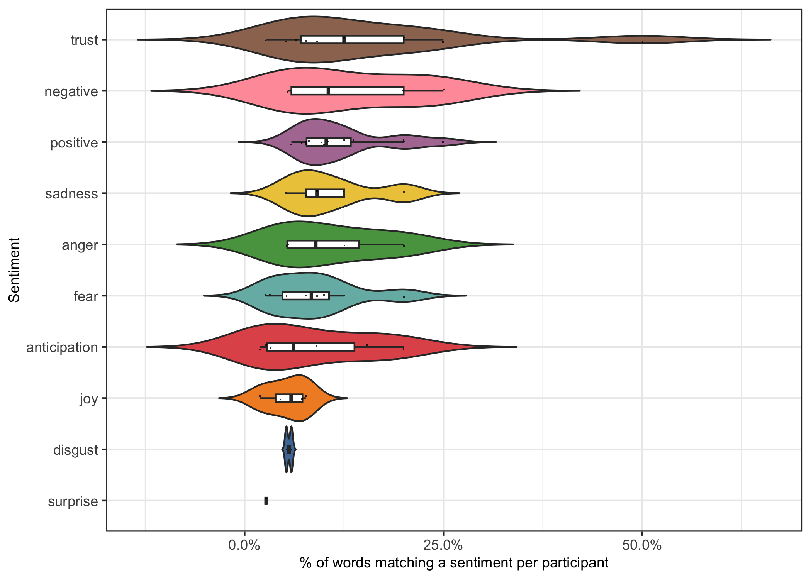

Teaching LGBTQ+ Health Data analysis
================
2023-03-23

- <a href="#setup" id="toc-setup">Setup</a>
- <a href="#read-in-data" id="toc-read-in-data">Read in data</a>
  - <a href="#registrants" id="toc-registrants">Registrants</a>
  - <a href="#metadata" id="toc-metadata">Metadata</a>
  - <a href="#assessments" id="toc-assessments">Assessments</a>
  - <a href="#free-text-case-reflections"
    id="toc-free-text-case-reflections">Free-text case reflections</a>
  - <a href="#cme-surveys" id="toc-cme-surveys">CME surveys</a>
- <a href="#analysis" id="toc-analysis">Analysis</a>
  - <a href="#demographics" id="toc-demographics">demographics</a>
  - <a href="#course-completion" id="toc-course-completion">course
    completion</a>
  - <a href="#pre--and-post-test-assessments"
    id="toc-pre--and-post-test-assessments">Pre- and Post-test
    Assessments</a>
  - <a href="#preprocessing" id="toc-preprocessing">Preprocessing</a>
    - <a
      href="#detour-a-how-many-learners-passed-the-pre-test-on-their-first-try"
      id="toc-detour-a-how-many-learners-passed-the-pre-test-on-their-first-try">Detour
      A: How many learners passed the pre-test on their first try?</a>
    - <a
      href="#detour-b-how-many-times-did-learners-attempt-the-post-test-on-average"
      id="toc-detour-b-how-many-times-did-learners-attempt-the-post-test-on-average">Detour
      B: How many times did learners attempt the post-test (on average)?</a>
    - <a href="#number-of-passes-on-first-attempt-for-post-test"
      id="toc-number-of-passes-on-first-attempt-for-post-test">Number of
      passes on first attempt for post-test</a>
  - <a href="#statistical-analysis-pre--vs-post-test-improvement"
    id="toc-statistical-analysis-pre--vs-post-test-improvement">Statistical
    Analysis: Pre- vs. Post-test Improvement</a>
  - <a href="#cme-surveys-1" id="toc-cme-surveys-1">CME surveys</a>
    - <a href="#quantitative-variables"
      id="toc-quantitative-variables">Quantitative variables</a>
    - <a href="#likert-variables" id="toc-likert-variables">Likert
      variables</a>
    - <a href="#text-comments---sentiment-analysis"
      id="toc-text-comments---sentiment-analysis">Text comments - Sentiment
      analysis</a>
- <a href="#case-sentiment-analysis" id="toc-case-sentiment-analysis">Case
  sentiment analysis</a>
  - <a href="#teddy" id="toc-teddy">Teddy</a>
  - <a href="#carla" id="toc-carla">Carla</a>
  - <a href="#jesse" id="toc-jesse">Jesse</a>

# Setup

``` r
# libraries
library(tidyverse)
library(pdftools)
library(lubridate)
library(ggalluvial)
library(tidytext)

# paths 
registrant_path <- # Not updated yet
  here::here("data-raw", "cme", "registrants.csv")

metadata_path <- 
  here::here("data-raw", "cme_2023", "registration_metadata.pdf")

new_pretest_path <- 
  here::here("data-raw", "cme_2023", "pre-test_percentage-based_results.xlsx")

new_posttest_path <- 
  here::here("data-raw", "cme_2023", "post-test_percentage-based_results.xlsx")

teddy_path <- 
  here::here("data-raw", "cme_2023", "teddy_text_responses.pdf")

carla_path <- 
  here::here("data-raw", "cme_2023", "carla_text_responses.pdf")

jesse_path <- 
  here::here("data-raw", "cme_2023", "jesse_text_responses.pdf")

cme_path <- 
  here::here("data-raw", "cme_2023", "cme_evals.xlsx")

# old paths

test_path <- 
  here::here("data-raw", "cme", "tests.csv")

teddy_path <- 
  here::here("data-raw", "cme", "teddy_text_responses.pdf")

carla_path <- 
  here::here("data-raw", "cme", "carla_text_responses.pdf")

jesse_path <- 
  here::here("data-raw", "cme", "jesse_text_responses.pdf")


# globals

launch_date <- lubridate::dmy("27-03-2021")

course_team <- 
  c(
    "Deila Bumgardner", "Stanford CME", "Michael Gisondi", 
    "Shana Zucker", "Timothy Keyes", "William Bottini"
  )

our_title <- "Teaching LGBTQ+ Health"

teddy_stem <- 
  "Teddy Teaching Strategies : Entry # [:digit:]+\n\nPlease share your ideas in the text box below before advancing to the next module. We recommend that you copy and paste your entry into\na separate file for later use before submitting.\n\n"

jesse_stem <- 
  "Jesse Teaching Strategies : Entry # [:digit:]+\n\nPlease share your ideas in the text box below before advancing to the next module. We recommend that you copy and paste your entry into\na separate file for later use before submitting.\n\n"

carla_stem <- 
  "Carla Teaching Strategies : Entry # [:digit:]+\n\nPlease share your ideas in the text box below before advancing to the next module. We recommend that you copy and paste your entry into\na separate file for later use before submitting."

passing_score <- 8L
```

# Read in data

## Registrants

``` r
registrants <- 
  registrant_path %>% 
  read_csv() %>% 
  janitor::clean_names() %>% 
  filter(!(name %in% course_team))

colnames(registrants)
```

    ##  [1] "user_id"             "name"                "email"              
    ##  [4] "course_id"           "course_title"        "total_steps"        
    ##  [7] "completed_steps"     "course_completed"    "completion_date"    
    ## [10] "lessons_completed_1" "lessons_completed_2" "lessons_completed_3"
    ## [13] "lessons_completed_4"

``` r
nrow(registrants)
```

    ## [1] 1501

## Metadata

``` r
metadata_string <- 
  metadata_path %>% 
  pdf_text()

metadata <- 
  tibble(
    name = 
      str_extract(metadata_string, pattern = "Name\n\n.+") %>% 
      str_remove(pattern = "Name\n\n") %>% 
      str_trim(),
    profession = 
      str_extract(metadata_string, pattern = "Healthcare role\n\n.+") %>% 
      str_remove(pattern = "Healthcare role\n\n") %>% 
      str_trim(), 
    area_of_practice = 
      str_extract(
        metadata_string, 
        pattern = "Area of Clinical Practice\n\n.+"
      ) %>% 
      str_remove("Area of Clinical Practice\n\n") %>% 
      str_trim(), 
    experience = 
      str_extract(metadata_string, pattern = "completion of training\n\n.+") %>% 
      str_remove("completion of training\n\n") %>% 
      str_trim(), 
    email =
      str_extract(metadata_string, pattern = "Email\n\n.+") %>% 
      str_remove(pattern = "Email\n\n") %>% 
      str_trim()
  )

colnames(metadata)
```

    ## [1] "name"             "profession"       "area_of_practice" "experience"      
    ## [5] "email"

``` r
nrow(metadata)
```

    ## [1] 756

## Assessments

``` r
# old format 
tests <- 
  test_path %>% 
  read_csv() %>% 
  janitor::clean_names() %>%
  filter(course_title == our_title) %>% 
  mutate(
    quiz_title = 
      str_remove(quiz_title, pattern = "Teaching LGBTQ\\+ Health:?[:space:]")
  )
```

``` r
# new format
pre <- 
  new_pretest_path |> 
  readxl::read_excel() |> 
  drop_na() |> 
  janitor::clean_names() |> 
  mutate(
    results = as.integer(str_extract(correct, "^[:digit:]"))
  )

post <- 
  new_posttest_path |> 
  readxl::read_excel() |> 
  drop_na() |> 
  janitor::clean_names() |> 
  mutate(
    results = as.integer(str_extract(correct, "^[:digit:]"))
  )
```

## Free-text case reflections

``` r
teddy_string <- 
  teddy_path %>% 
  pdf_text() %>% 
  str_flatten()

# a list in which each entry is a string (a single reflection on Teddy's case")
teddy_responses <- 
  teddy_string %>% 
  str_split(pattern = teddy_stem) %>% 
  pluck(1) |> 
  #list_flatten() %>% 
  map_chr(.f = str_trim) %>% 
  map_chr(.f = str_remove_all, pattern = "\n") %>% 
  map_chr(
    .f = str_replace_all, 
    pattern = "[:blank:]+", 
    replacement = " "
  ) |> 
  str_subset(
    pattern = regex("decline", ignore_case = TRUE), 
    negate = TRUE
  )
```

``` r
jesse_string <- 
  jesse_path %>% 
  pdf_text() %>% 
  str_flatten()

# a list in which each entry is a string (a single reflection on Jesse's case")
jesse_responses <- 
  jesse_string %>% 
  str_split(pattern = jesse_stem) %>% 
  pluck(1) |> 
  #list_flatten() %>% 
  map_chr(.f = str_trim) %>% 
  map_chr(.f = str_remove_all, pattern = "\n") %>% 
  map_chr(
    .f = str_replace_all, 
    pattern = "[:blank:]+", 
    replacement = " "
  ) |> 
  str_subset(
    pattern = regex("decline", ignore_case = TRUE), 
    negate = TRUE
  )

head(jesse_responses, n = 3L)
```

    ## [1] ""                                                                                                                                                                                    
    ## [2] "Having students practice taking a sexual history while being sure to be gender neutral to prevent offending any patients or causing them to be uncomfortable while in your practice."
    ## [3] "Offering PreP and talking about U=U is very important for LGBQTIA+ patients."

``` r
carla_string <- 
  carla_path %>% 
  pdf_text() %>% 
  str_flatten()

# a list in which each entry is a string (a single reflection on Carla's case")
carla_responses <- 
  carla_string %>% 
  str_split(pattern = carla_stem) %>% 
  pluck(1) |> 
  #list_flatten() %>% 
  map_chr(.f = str_trim) %>% 
  map_chr(.f = str_remove_all, pattern = "\n") %>% 
  map_chr(
    .f = str_replace_all, 
    pattern = "[:blank:]+", 
    replacement = " "
  ) |> 
  str_subset(
    pattern = regex("decline", ignore_case = TRUE), 
    negate = TRUE
  )

head(carla_responses, n = 3L)
```

    ## [1] ""                                                                                                                                                                                                                                                                                                                                                                              
    ## [2] "The importance of discussing an advanced directive with all patients is very important to ensure that their wishes are being met in any case of medical emergency or when patient is unable to make their own medical decision. In the schools curriculum, it will be important to discuss the important social determinants of health facing members of the LGBTQ+ community."
    ## [3] "It's important to provide to queer people a safe clinical environment where they can feel heard and not discriminated. Being a part of SGM is crucial in health on all levels (physical, mental, social, etc). Intersecting more social determinants helps to see the full picture, related to the privileges and risks."

## CME surveys

``` r
cme <- 
  cme_path |> 
  readxl::read_excel() |> 
  janitor::clean_names() |> 
  rename(
    was_relevant_to_my_current_practice = was_relevant_to_my_current_scope_of_pra, 
    what_changes_do_you_intend_to_make = what_changes_do_you_intend_to_make_in_yo, 
    this_cme_activity_improved_my_knowledge = this_cecme_activity_improved_my_know2, 
    delivery_and_effectiveness_of_content = delivery_and_effectiveness_of_conten, 
    what_specific_topics_in_this_subject = what_specific_topics_in_this_subject_a, 
    contributed_to_my_professional_growth = contributed_to_my_professional_growt
  )

head(cme)
```

    ## # A tibble: 6 × 50
    ##   form_submiss…¹ created             creat…² last_changed        membe…³ full_…⁴
    ##   <chr>          <dttm>              <chr>   <dttm>              <chr>   <chr>  
    ## 1 317220         2021-06-30 19:24:44 6/30/2… 2021-06-30 19:24:44 W27968  Jaime …
    ## 2 267477         2021-03-29 17:57:02 3/29/2… 2021-03-29 17:57:02 0       Angel …
    ## 3 270475         2021-04-06 01:23:18 4/6/20… 2021-04-06 01:23:18 0       Miguel…
    ## 4 315659         2021-06-26 09:34:50 6/26/2… 2021-06-26 09:34:50 0       MOHAMM…
    ## 5 278159         2021-04-23 11:02:23 4/23/2… 2021-04-23 11:02:23 0       Jennif…
    ## 6 311534         2021-06-16 08:23:56 6/16/2… 2021-06-16 08:23:56 0       Evange…
    ## # … with 44 more variables: first_name <chr>, last_name <chr>,
    ## #   last_first <chr>, professions <chr>, professional_title <chr>,
    ## #   form_id <chr>, event_id <chr>, email <chr>, note_to_designer <chr>,
    ## #   evaluationtitle <chr>, end_of_controls3 <chr>, credit_conflict <chr>,
    ## #   physician_type <chr>, hours_claimed <chr>, hours_ok <lgl>,
    ## #   activitymaxhours <chr>, end_of_controls <chr>,
    ## #   i_attest_that_i_have_completed_the_abov <chr>, max_credits <chr>, …

``` r
rating_variables <- 
  c(
    "quality_of_content", 
    "quality_of_content", 
    "delivery_and_effectiveness_of_content", 
    "value_of_topic", 
    "overall_rating"
  )

likert_variables <- 
  c(
    "this_cme_activity_improved_my_knowledge", 
    "covered_content_useful_to_my_practice", 
    "contributed_to_my_professional_growth",  
    "was_relevant_to_my_current_practice", 
    "was_engaging_and_interactive"  
  )

text_variables <- 
  c(
    "what_attitudes_strategies_or_skills_d", 
    "do_you_have_specific_suggestions_as_to", 
    "what_specific_topics_in_this_subject"
  )


colnames(cme)
```

    ##  [1] "form_submission_id"                     
    ##  [2] "created"                                
    ##  [3] "created_short_date"                     
    ##  [4] "last_changed"                           
    ##  [5] "member_id"                              
    ##  [6] "full_name"                              
    ##  [7] "first_name"                             
    ##  [8] "last_name"                              
    ##  [9] "last_first"                             
    ## [10] "professions"                            
    ## [11] "professional_title"                     
    ## [12] "form_id"                                
    ## [13] "event_id"                               
    ## [14] "email"                                  
    ## [15] "note_to_designer"                       
    ## [16] "evaluationtitle"                        
    ## [17] "end_of_controls3"                       
    ## [18] "credit_conflict"                        
    ## [19] "physician_type"                         
    ## [20] "hours_claimed"                          
    ## [21] "hours_ok"                               
    ## [22] "activitymaxhours"                       
    ## [23] "end_of_controls"                        
    ## [24] "i_attest_that_i_have_completed_the_abov"
    ## [25] "max_credits"                            
    ## [26] "overall_activity_rating2"               
    ## [27] "covered_content_useful_to_my_practice"  
    ## [28] "contributed_to_my_professional_growth"  
    ## [29] "was_relevant_to_my_current_practice"    
    ## [30] "was_engaging_and_interactive"           
    ## [31] "what_changes_do_you_intend_to_make"     
    ## [32] "was_the_information_material_present"   
    ## [33] "disclosure_further"                     
    ## [34] "activity_content"                       
    ## [35] "please_rate_the_activity_content"       
    ## [36] "quality_of_content"                     
    ## [37] "delivery_and_effectiveness_of_content"  
    ## [38] "value_of_topic"                         
    ## [39] "overall_rating"                         
    ## [40] "this_cme_activity_improved_my_knowledge"
    ## [41] "what_attitudes_strategies_or_skills_d"  
    ## [42] "do_you_have_specific_suggestions_as_to" 
    ## [43] "what_specific_topics_in_this_subject"   
    ## [44] "blank4"                                 
    ## [45] "date_completed"                         
    ## [46] "userid"                                 
    ## [47] "presentationid"                         
    ## [48] "usertype"                               
    ## [49] "redirect_to_url"                        
    ## [50] "locked"

# Analysis

## demographics

``` r
# a useful function
plot_metadata_1d <- 
  function(my_metadata = metadata, my_var, subtitle, perc_size = 3.5, nudge = 2) { 
    plot_tib <- 
      my_metadata %>% 
      count({{my_var}}, sort = TRUE) %>% 
      mutate(my_factor = fct_reorder({{my_var}}, n)) %>% 
      drop_na(my_factor) |> 
      mutate(
        prop = n / sum(n), 
        perc = scales::label_percent(accuracy = 0.1)(prop)
      ) |> 
      select(-prop)
    
    max_value <- max(plot_tib$n)
    
    plot_tib %>% 
      ggplot(aes(y = my_factor, x = n)) + 
      geom_col(size = 0.4, color = "black") + 
      geom_text(
        mapping = aes(label = perc), 
        hjust = 0, 
        nudge_x = nudge, 
        size = perc_size
      ) + 
      scale_x_continuous(limits = c(0, max_value * 1.08)) + 
      theme_bw() + 
      labs(
        subtitle = subtitle, 
        x = "Number of registrants", 
        y = NULL
      )
  }
```

``` r
profession_plot_path <- here::here("figures", "cme", "profession_plot.jpg")

profession_plot <- 
  plot_metadata_1d(
  my_var = profession, 
  subtitle = "Most course registrants are physicians, students, and educators"
  ) + 
  theme(
    panel.grid.major = element_line(color = "gray95"), 
    panel.grid.minor = element_line(color = "gray95")
  )

ggsave(
  filename = profession_plot_path, 
  device = "jpg", 
  width = 6, 
  height = 3.75
)

knitr::include_graphics(profession_plot_path)
```


``` r
specialty_plot_path <- here::here("figures", "cme", "specialty_plot.jpg")

specialty_plot <- 
  plot_metadata_1d(
    my_var = area_of_practice, 
    subtitle = "Most registrants are in a subset of clinical specialties", 
    perc_size = 2.75
  ) + 
  theme(
    axis.text.y = element_text(size = 8),
    panel.grid.major = element_line(color = "gray95"), 
    panel.grid.minor = element_line(color = "gray95")
  )

ggsave(
  filename = specialty_plot_path, 
  device = "jpg", 
  width = 5.75, 
  height = 6
)

knitr::include_graphics(specialty_plot_path)
```



``` r
# what does "all specialties" mean?
metadata |> 
  filter(area_of_practice == "All Specialties") |> 
  count(profession, sort = TRUE)
```

    ## # A tibble: 14 × 2
    ##    profession                   n
    ##    <chr>                    <int>
    ##  1 Student                    122
    ##  2 Health Educator              8
    ##  3 Physician                    8
    ##  4 Healthcare Administrator     4
    ##  5 Other                        4
    ##  6 Non-healthcare               3
    ##  7 Nurse                        3
    ##  8 Psychologist                 3
    ##  9 Researcher                   3
    ## 10 Nurse practitioner           1
    ## 11 Other hospital Staff         1
    ## 12 Pharmacist                   1
    ## 13 Physician assistant          1
    ## 14 Social Worker                1

So we can see that the “All specialties” category is mostly students. So
we might be interested in asking the same question for only physicians
(the main target audience):

``` r
physician_specialty_plot_path <- 
  here::here("figures", "cme", "physician_specialty_plot.jpg")

physician_specialty_plot <- 
  metadata |> 
  filter(profession == "Physician") |> 
  plot_metadata_1d(
    my_var = area_of_practice, 
    subtitle = str_wrap(
      "Most registrants are emergency, family, and internal medicine physicians",
      width = 60
    ), 
    perc_size = 2.75, 
    nudge = 0.75
  ) + 
  theme(
    axis.text.y = element_text(size = 8),
    panel.grid.major = element_line(color = "gray95"), 
    panel.grid.minor = element_line(color = "gray95")
  )

ggsave(
  filename = physician_specialty_plot_path, 
  device = "jpg", 
  width = 5.75, 
  height = 4.75
)

knitr::include_graphics(physician_specialty_plot_path)
```


``` r
time_since_training_plot_path <- 
  here::here("figures", "cme", "time_since_training_plot.jpg")
  
time_since_training_plot <- 
  plot_metadata_1d(
  my_var = experience, 
  subtitle = "Registration is inversely proportional to time since training was completed"
  ) + 
  theme(
    axis.text.y = element_text(size = 10),
    panel.grid.major = element_line(color = "gray95"), 
    panel.grid.minor = element_line(color = "gray95")
  ) + 
  labs(y = "Time since learner completed training")

ggsave(
  filename = time_since_training_plot_path,
  plot = time_since_training_plot, 
  device = "jpg", 
  width = 6.25, 
  height = 3
)

knitr::include_graphics(time_since_training_plot_path)
```


## course completion

``` r
registrants %>% 
  count(completed_steps) %>% 
  ggplot(aes(x = completed_steps, y = n)) + 
  geom_line(color = "gray60") + 
  geom_point() + 
  theme_bw() + 
  labs(
    subtitle = "Most registrants actually haven't started the course!",
    x = "Number of complete course \"steps\"", 
    y = "Number of registrants"
  )
```

<!-- -->

Number of “complete” courses:

``` r
registrants %>% 
  count(course_completed)
```

    ## # A tibble: 2 × 2
    ##   course_completed     n
    ##   <chr>            <int>
    ## 1 NO                1336
    ## 2 YES                165

Relatively few people are marking the course “completed” at the very
end, so we will probably have to figure out a way to mark “completeness”
for the people who took most of the course but didn’t click the final
button.

Maybe the number of people who took the post-test?

``` r
num_unique_posttest_users <- 
  tests %>% 
  count(user_id, quiz_title) %>% 
  filter(str_detect(quiz_title, pattern = "Post")) %>% 
  nrow()

num_unique_posttest_users
```

    ## [1] 388

We can see that the number of people who took the post-test was 388,
which is considerably more than the number of people who marked
“complete” at the end of the course.

``` r
registrants %>% 
  filter(completion_date != "-") %>% 
  mutate(
    completion_date = 
      mdy_hms(completion_date) %>% 
      date()
  ) %>% 
  count(completion_date) %>% 
  arrange(completion_date) %>% 
  mutate(cumulative_n = cumsum(n)) %>% 
  ggplot(aes(x = completion_date, y = cumulative_n)) + 
  geom_line() + 
  theme_bw() + 
  labs(
    subtitle = 
      "Registrants have completed the course at a ~constant rate since launch", 
    x = "Date of course completion", 
    y = "Cumulative number of course completions"
  )
```

<!-- -->

## Pre- and Post-test Assessments

## Preprocessing

We also filter for tests that occur after March 27, 2021 (after our
course team had already taken trial runs of the course).

``` r
pre <- 
  pre |> 
  filter(date > launch_date) 
#   group_by(username) |> 
#   summarize(pre_results = mean(results)) 

post <- 
  post |> 
  filter(date > launch_date)
#   group_by(username) |> 
#   summarize(post_results = mean(results))
```

At this point, we notice that some people filled out multiple pre- and
post-tests. This observation motivates us to ask 3 questions:

- A: How many learners passed the pre-test on their first try?
- B: How many times did learners attempt the post-test?
- C: How many attempts did it take for learners to pass the post-test?

We answer each of those questions below.

### Detour A: How many learners passed the pre-test on their first try?

``` r
pre_filtered <- 
  pre |> 
  group_by(username) |> 
  slice_min(order_by = date, n = 1L) |> 
  ungroup() 

num_first_passes <- 
  pre_filtered |> 
  mutate(pass = results >= passing_score) |> 
  pull(pass) |> 
  sum()

print(num_first_passes)
```

    ## [1] 0

``` r
num_first_passes / nrow(pre_filtered)
```

    ## [1] 0

### Detour B: How many times did learners attempt the post-test (on average)?

``` r
post |> 
  count(username, sort = TRUE) |> 
  pull(n) |> 
  median()
```

    ## [1] 1

### Number of passes on first attempt for post-test

``` r
post_filtered <- 
  post |> 
  group_by(username) |> 
  slice_min(order_by = date, n = 1L) |> 
  ungroup() 

num_first_passes <- 
  post_filtered |> 
  mutate(pass = results >= passing_score) |> 
  pull(pass) |> 
  sum()

print(num_first_passes)
```

    ## [1] 431

``` r
nrow(post_filtered)
```

    ## [1] 643

``` r
num_first_passes / nrow(post_filtered)
```

    ## [1] 0.6702955

At this point, we want to derive a single pre-test and a
single-post-test score for each person in order to compare individuals’
performance before and after taking the course. To do so, we average the
scores over all of their attempts of the pre- and post-test.

``` r
pre <- 
  pre |> 
  group_by(username) |>
  summarize(pre_results = mean(results))

post <- 
  post |> 
  group_by(username) |>
  summarize(post_results = mean(results))
```

## Statistical Analysis: Pre- vs. Post-test Improvement

We can then combine the pre- and post-test datasets in order to analyze
people who took both.

``` r
test_tibble <- 
  full_join(pre, post, by = "username") |> 
  drop_na() |> 
  mutate(diff = post_results - pre_results)

# perform t-test and extract needed statistics
pre_post_t_test <- 
  t.test(
  x = test_tibble$post_results, 
  y = test_tibble$pre_results, 
  paired = TRUE
)

pre_post_t <- 
  pre_post_t_test$statistic |> 
  round(2)
pre_post_df <- pre_post_t_test$parameter
pre_post_p_val <- 
  paste0("p", 
         pre_post_t_test$p.value |> 
           scales::pvalue()
  )

pre_post_annotation <- 
  str_glue("t({pre_post_df}) = {pre_post_t}; {pre_post_p_val}")

# perform wilcox rank sum test just to be sure 
wilcox.test(
  x = test_tibble$post_results, 
  y = test_tibble$pre_results, 
  paired = TRUE
) |> 
  broom::tidy()
```

    ## # A tibble: 1 × 4
    ##   statistic  p.value method                                              alter…¹
    ##       <dbl>    <dbl> <chr>                                               <chr>  
    ## 1    158158 3.57e-50 Wilcoxon signed rank test with continuity correcti… two.si…
    ## # … with abbreviated variable name ¹​alternative

``` r
my_caption <- 
  "The black vertical line represents a pre/post change of 0 (the null hypothesis); the red vertical line represents the observed median change across all learners." |> 
  str_wrap(width = 82)

pre_post_plot <- 
  test_tibble |> 
  ggplot(aes(x = diff)) + 
  geom_vline(
    xintercept = 0, 
    linetype = "dashed", 
    linewidth = 0.45, 
    color = "gray40"
  ) + 
  geom_histogram(bins = 25, color = "black", size = 0.2) + 
  geom_vline(
    xintercept = median(test_tibble$diff), 
    linetype = "dashed", 
    linewidth = 0.45, 
    color = "red"
  ) + 
  annotate(
    geom = "label", 
    x = -6, 
    y = 200,
    label = pre_post_annotation, 
    hjust = 0, 
    label.r = unit(0, units = "lines"), 
    size = 3.5
  ) + 
   annotate(
    geom = "label", 
    x = 0.05, 
    y = 230,
    label = " Median Improvement→", 
    hjust = 0, 
    vjust = 1, 
    size = 2.05, 
    label.size = NA, 
    label.r = unit(0, "lines"), 
    label.padding = unit(0, "lines")
   ) + 
  theme_minimal() + 
  theme(plot.caption = element_text(size = 7.5)) + 
  labs(
    x = "Difference in pre- and post-test scores", 
    y = "Number of learners", 
    caption = my_caption
  ) 

ggsave(
  filename = here::here("figures", "cme", "pre_post_plot.jpg"), 
  plot = pre_post_plot, 
  device = "jpg",
  width = 4.5, 
  height = 3
)

knitr::include_graphics(here::here("figures", "cme", "pre_post_plot.jpg"))
```


We can also analyze the improvement across subgroups of learners:

``` r
subgroup_tibble <- 
  test_tibble %>% 
  transmute(
    user_id = 
      username |> 
      str_remove("\\(.+\\)") |> 
      str_trim(), 
    email = user_id, 
    pre_test = pre_results, 
    post_test = post_results, 
    improvement = diff
  ) |> 
  left_join(select(metadata, -name)) |> 
  mutate(across(any_of(colnames(metadata)), replace_na, replace = "Unknown"))

test_tibble_emails <- 
  test_tibble %>% 
  transmute(
    user_id = 
      username |> 
      str_remove("\\(.+\\)") |> 
      str_trim()
  ) |> 
  pull(user_id)

metadata |>
  mutate(email_present = email %in% test_tibble_emails) |> 
  count(email_present)
```

    ## # A tibble: 2 × 2
    ##   email_present     n
    ##   <lgl>         <int>
    ## 1 FALSE           583
    ## 2 TRUE            173

``` r
subgroup_plot <- 
  subgroup_tibble |> 
  add_count(profession) |> 
  filter(n >= 5) |> 
  mutate(
    profession = 
      recode(
        profession, 
        "Nurse practitioner" = "Nurse", 
        "Other" = "Unknown", 
        "Researcher" = NA_character_
      ), 
    profession = str_to_title(profession), 
    #  profession = fct_reorder(profession, n)
  ) |> 
  drop_na(profession) |> 
  ggplot(aes(x = improvement)) + 
  geom_vline(xintercept = 0, linetype = "dashed", color = "gray40") + 
  geom_histogram(binwidth = 1, color = "black", size = 0.3) + 
  facet_wrap(facets = vars(profession), scales = "free_y") + 
  scale_x_continuous(labels = scales::label_number(accuracy = 1), minor_breaks = NULL) + 
  scale_y_continuous(labels = scales::label_number(accuracy = 1), minor_breaks = NULL) + 
  theme_minimal() +
  labs(
    subtitle = "Across professions, most learners' scores improve from pre-test to post-test", 
    x = "Difference in pre- and post-test scores", 
    y = "Number of learners", 
  )


ggsave(
  filename = here::here("figures", "cme", "subgroup_plot.jpg"), 
  plot = subgroup_plot, 
  device = "jpg",
  width = 6, 
  height = 4
)

knitr::include_graphics(here::here("figures", "cme", "subgroup_plot.jpg"))
```


## CME surveys

### Quantitative variables

``` r
rating_plot_path <- here::here("figures", "cme", "rating_plot.jpg")

rating_tibble <- 
  cme |> 
  select(any_of(rating_variables)) |> 
  pivot_longer(
    cols = everything(), 
    names_to = "context", 
    values_to = "rating"
  ) |> 
  mutate(context = as.factor(context), rating = as.factor(rating)) |> 
  count(context, rating, .drop = FALSE) |> 
  group_by(context) |> 
  mutate(
    prop = n / sum(n), 
    percentage = scales::label_percent(accuracy = 0.1)(prop), 
    context = 
      context |> 
      str_replace_all("_", " ") |> 
      str_replace("^.", str_to_upper(str_sub(context, start = 1L, end = 1L)))
  ) |> 
  ungroup() 

rating_plot <-
  rating_tibble |> 
  mutate(context = fct_reorder(context, n, max, .desc = TRUE)) |> 
  ggplot(aes(x = rating, y = n)) + 
  geom_col() + 
  geom_text(aes(x = rating, y = n + 2, label = percentage), size = 3.75, vjust = 0) + 
  scale_y_continuous(limits = c(NA, max(rating_tibble$n + 5))) + 
  facet_wrap(facets = vars(context), nrow = 2) + 
  theme_bw() + 
  labs(
    subtitle = "Rate the each component of the course on a 1-5 scale", 
    y = "Number of CME survey respondents", 
    x = "Numeric rating"
  )

ggsave(
  filename = rating_plot_path, 
  plot = rating_plot,
  device = "jpg", 
  width = 6, 
  height = 6
)

knitr::include_graphics(rating_plot_path)
```


### Likert variables

``` r
likert_plot_path <- here::here("figures", "cme", "likert_plot.jpg")

likert_levels <- 
  c("Strongly Disagree", "Disagree", "Neutral", "Agree", "Strongly Agree")

likert_tibble <- 
  cme |> 
  select(any_of(likert_variables)) |> 
  pivot_longer(
    cols = everything(), 
    names_to = "context", 
    values_to = "rating"
  ) |> 
  mutate(context = as.factor(context), rating = factor(rating, likert_levels)) |> 
  count(context, rating, .drop = FALSE) |> 
  group_by(context) |> 
  mutate(
    prop = n / sum(n), 
    percentage = scales::label_percent(accuracy = 0.1)(prop), 
    context = 
      context |> 
      str_replace_all("_", " ") |> 
      #str_replace("^.", str_to_upper(str_sub(context, start = 1L, end = 1L))) |> 
      str_replace("this cme activity i", "i") |> 
      (\(x) str_c("...", x))()
  ) |> 
  ungroup() 

likert_plot <-
  likert_tibble |> 
  mutate(context = fct_reorder(context, n, max, .desc = TRUE)) |> 
  ggplot(aes(x = rating, y = n)) + 
  geom_col() + 
  geom_text(aes(x = rating, y = n + 4, label = percentage), size = 3.75, hjust = 0) + 
  scale_y_continuous(limits = c(NA, max(likert_tibble$n + 45))) + 
  coord_flip() +
  facet_wrap(facets = vars(context), nrow = 2) + 
  theme_bw() + 
  labs(
    subtitle = "How much do you agree with the following statement: \"This CME activity...\"?", 
    y = "Number of CME survey respondents", 
    x = "Response"
  )

ggsave(
  filename = likert_plot_path, 
  plot = likert_plot,
  device = "jpg", 
  width = 8.5, 
  height = 4
)

knitr::include_graphics(likert_plot_path)
```


### Text comments - Sentiment analysis

``` r
sentiment_analysis <- function(input_data, token_col, id_col) { 
  lexicon <- get_sentiments("nrc")
  
  
  sentiment_words <- 
    input_data |> 
    drop_na({{ token_col }}) |> 
    select({{ token_col }}, {{ id_col }}) |> 
    unnest_tokens(output = "word", input = {{ token_col }}) |> 
    left_join(lexicon)
  
  sentiments <- 
    sentiment_words |>
    count({{ id_col }}, sentiment) |> 
    group_by({{ id_col }}) |> 
    mutate(
      prop = n / sum(n), 
      #perc = scales::label_percent(accuracy = 0.1)(prop), 
      sentiment = replace_na(sentiment, "none")
    ) |> 
    ungroup()
  
  sentiments_plot <- 
    sentiments |> 
    mutate(sentiment = fct_reorder(sentiment, prop)) |> 
    filter(sentiment != "none") |> 
    filter(prop < 0.95) |> 
    ggplot(aes(y = sentiment, x = prop)) +
    geom_violin(aes(fill = sentiment), trim = FALSE, scale = "width") + 
    geom_boxplot(width = 0.15, outlier.color = NA) + 
    geom_jitter(shape = ".", height = 0.05, size = 1, alpha = 0.8) + 
    ggthemes::scale_fill_tableau() +
    scale_x_continuous(labels = scales::label_percent(accuracy = 0.1)) + 
    theme_bw() + 
    theme(axis.title = element_text(size = 9)) + 
    theme(legend.position = "none") + 
    labs(
      x = "% of words matching a sentiment per participant" |> 
        str_wrap(width = 60),
      y = "Sentiment"
    )

  
  sentiments_mean_plot <- 
    sentiments |>
    group_by(sentiment) |>
    summarize(
      prop = mean(prop), 
      perc = scales::label_percent(accuracy = 0.1)(prop)
    ) |>
    ungroup() |>
    mutate(sentiment = fct_reorder(sentiment, prop)) |>
    filter(sentiment != "none") |>
    ggplot(aes(y = sentiment, x = prop)) +
    geom_col() +
    scale_x_continuous(labels = scales::label_percent(accuracy = 0.1)) + 
    theme_bw() + 
    theme(axis.title = element_text(size = 9)) + 
    labs(
      x = 
        "% of words matching a sentiment per participant (mean)" |> 
        str_wrap(width = 60), 
      y = "Sentiment"
    )
  
  result <- 
    list(
      sentiments_plot = sentiments_plot, 
      sentiments_mean_plot = sentiments_mean_plot, 
      sentiment_words = sentiment_words
    )
  
  return(result)
}
```

``` r
cme_text <- 
  cme |> 
  select(any_of(text_variables), form_submission_id)

sentiments_plots <- 
  cme_text |> 
  sentiment_analysis(
    token_col = what_attitudes_strategies_or_skills_d, 
    id_col = form_submission_id
  )

attitudes_strategies_plot <- sentiments_plots$sentiments_plot

attitudes_strategies_mean_plot <- sentiments_plots$sentiments_mean_plot

attitudes_strategies_plot_path <- 
  here::here("figures", "cme", "attitudes_strategies.jpg")

attitudes_strategies_mean_plot_path <- 
  here::here("figures", "cme", "attitudes_strategies_mean.jpg")

ggsave(
  filename = attitudes_strategies_plot_path, 
  plot = attitudes_strategies_plot, 
  width = 4, 
  height = 3
)

knitr::include_graphics(attitudes_strategies_plot_path)
```


``` r
ggsave(
  filename = attitudes_strategies_mean_plot_path, 
  plot = attitudes_strategies_mean_plot, 
  width = 4, 
  height = 3
)

knitr::include_graphics(attitudes_strategies_mean_plot_path)
```


``` r
sentiments_plots$sentiment_words |> 
  drop_na() |> 
  arrange(sentiment) |> 
  count(sentiment, word) |> 
  group_by(sentiment) |> 
  slice_max(order_by = n, n = 2, with_ties = FALSE) |> 
  ungroup()
```

    ## # A tibble: 20 × 3
    ##    sentiment    word              n
    ##    <chr>        <chr>         <int>
    ##  1 anger        bias              4
    ##  2 anger        armed             1
    ##  3 anticipation patient          10
    ##  4 anticipation medical           8
    ##  5 disgust      honest            1
    ##  6 disgust      intolerant        1
    ##  7 fear         medical           8
    ##  8 fear         case              6
    ##  9 joy          teach             9
    ## 10 joy          good              7
    ## 11 negative     case              6
    ## 12 negative     bias              4
    ## 13 positive     inclusive        36
    ## 14 positive     understanding    15
    ## 15 sadness      case              6
    ## 16 sadness      inter             4
    ## 17 surprise     teach             9
    ## 18 surprise     good              7
    ## 19 trust        understanding    15
    ## 20 trust        team             11

``` r
sentiment_plot_list <- 
  map(
    .x = text_variables, 
    .f = 
      \(x) { sentiment_analysis(
        input_data = cme_text, 
        token_col = any_of(x), 
        id_col = form_submission_id)
      }
  ) |> 
  set_names(nm = text_variables)

walk(sentiment_plot_list, print)
```

    ## $sentiments_plot

<!-- -->

    ## 
    ## $sentiments_mean_plot

<!-- -->

    ## 
    ## $sentiment_words
    ## # A tibble: 2,986 × 4
    ##    what_attitudes_strategies_or_skills_d                   form_…¹ word  senti…²
    ##    <chr>                                                   <chr>   <chr> <chr>  
    ##  1 Differents                                              317220  diff… <NA>   
    ##  2 proper health history                                   267477  prop… positi…
    ##  3 proper health history                                   267477  heal… <NA>   
    ##  4 proper health history                                   267477  hist… <NA>   
    ##  5 I will be able to teach these types of topics as well … 270475  i     <NA>   
    ##  6 I will be able to teach these types of topics as well … 270475  will  <NA>   
    ##  7 I will be able to teach these types of topics as well … 270475  be    <NA>   
    ##  8 I will be able to teach these types of topics as well … 270475  able  <NA>   
    ##  9 I will be able to teach these types of topics as well … 270475  to    <NA>   
    ## 10 I will be able to teach these types of topics as well … 270475  teach joy    
    ## # … with 2,976 more rows, and abbreviated variable names ¹​form_submission_id,
    ## #   ²​sentiment
    ## 
    ## $sentiments_plot

<!-- -->

    ## 
    ## $sentiments_mean_plot

<!-- -->

    ## 
    ## $sentiment_words
    ## # A tibble: 851 × 4
    ##    do_you_have_specific_suggestions_as_to form_submission_id word        senti…¹
    ##    <chr>                                  <chr>              <chr>       <chr>  
    ##  1 Yea the test                           317220             yea         <NA>   
    ##  2 Yea the test                           317220             the         <NA>   
    ##  3 Yea the test                           317220             test        <NA>   
    ##  4 documentation                          267477             documentat… <NA>   
    ##  5 Yes CME Activity might be improved     315659             yes         <NA>   
    ##  6 Yes CME Activity might be improved     315659             cme         <NA>   
    ##  7 Yes CME Activity might be improved     315659             activity    <NA>   
    ##  8 Yes CME Activity might be improved     315659             might       <NA>   
    ##  9 Yes CME Activity might be improved     315659             be          <NA>   
    ## 10 Yes CME Activity might be improved     315659             improved    positi…
    ## # … with 841 more rows, and abbreviated variable name ¹​sentiment
    ## 
    ## $sentiments_plot

<!-- -->

    ## 
    ## $sentiments_mean_plot

<!-- -->

    ## 
    ## $sentiment_words
    ## # A tibble: 487 × 4
    ##    what_specific_topics_in_this_subject form_submission_id word          senti…¹
    ##    <chr>                                <chr>              <chr>         <chr>  
    ##  1 "\r\n\r\n\r\n\r\nNo"                 317220             no            <NA>   
    ##  2 "documentation"                      267477             documentation <NA>   
    ##  3 "All the topics are covered."        315659             all           <NA>   
    ##  4 "All the topics are covered."        315659             the           <NA>   
    ##  5 "All the topics are covered."        315659             topics        <NA>   
    ##  6 "All the topics are covered."        315659             are           <NA>   
    ##  7 "All the topics are covered."        315659             covered       <NA>   
    ##  8 "n/a"                                293493             n             <NA>   
    ##  9 "n/a"                                293493             a             <NA>   
    ## 10 "The whole course is useful."        506613             the           <NA>   
    ## # … with 477 more rows, and abbreviated variable name ¹​sentiment

# Case sentiment analysis

## Teddy

``` r
# teddy
teddy_tibble <- 
  tibble(
    response_id = 1:length(teddy_responses), 
    response = teddy_responses
  ) 

teddy_sentiments <- 
  teddy_tibble |> 
  sentiment_analysis(
    token_col = response, 
    id_col = response_id
  )

print(teddy_sentiments)
```

    ## $sentiments_plot

<!-- -->

    ## 
    ## $sentiments_mean_plot

<!-- -->

    ## 
    ## $sentiment_words
    ## # A tibble: 4,983 × 3
    ##    response_id word     sentiment
    ##          <int> <chr>    <chr>    
    ##  1           2 i        <NA>     
    ##  2           2 think    <NA>     
    ##  3           2 that     <NA>     
    ##  4           2 changing <NA>     
    ##  5           2 one      <NA>     
    ##  6           2 of       <NA>     
    ##  7           2 the      <NA>     
    ##  8           2 courses  <NA>     
    ##  9           2 women's  <NA>     
    ## 10           2 health   <NA>     
    ## # … with 4,973 more rows

## Carla

``` r
# carla
carla_tibble <- 
  tibble(
    response_id = 1:length(carla_responses), 
    response = carla_responses
  ) 

carla_sentiments <- 
  carla_tibble |> 
  sentiment_analysis(
    token_col = response, 
    id_col = response_id
  )

print(carla_sentiments)
```

    ## $sentiments_plot

<!-- -->

    ## 
    ## $sentiments_mean_plot

<!-- -->

    ## 
    ## $sentiment_words
    ## # A tibble: 6,748 × 3
    ##    response_id word       sentiment   
    ##          <int> <chr>      <chr>       
    ##  1           2 the        <NA>        
    ##  2           2 importance anticipation
    ##  3           2 importance positive    
    ##  4           2 of         <NA>        
    ##  5           2 discussing <NA>        
    ##  6           2 an         <NA>        
    ##  7           2 advanced   positive    
    ##  8           2 directive  <NA>        
    ##  9           2 with       <NA>        
    ## 10           2 all        <NA>        
    ## # … with 6,738 more rows

## Jesse

``` r
# jesse
jesse_tibble <- 
  tibble(
    response_id = 1:length(jesse_responses), 
    response = jesse_responses
  ) 

jesse_sentiments <- 
  jesse_tibble |> 
  sentiment_analysis(
    token_col = response, 
    id_col = response_id
  )

print(jesse_sentiments)
```

    ## $sentiments_plot

<!-- -->

    ## 
    ## $sentiments_mean_plot

<!-- -->

    ## 
    ## $sentiment_words
    ## # A tibble: 5,657 × 3
    ##    response_id word     sentiment
    ##          <int> <chr>    <chr>    
    ##  1           2 having   <NA>     
    ##  2           2 students <NA>     
    ##  3           2 practice positive 
    ##  4           2 taking   <NA>     
    ##  5           2 a        <NA>     
    ##  6           2 sexual   <NA>     
    ##  7           2 history  <NA>     
    ##  8           2 while    <NA>     
    ##  9           2 being    <NA>     
    ## 10           2 sure     <NA>     
    ## # … with 5,647 more rows
