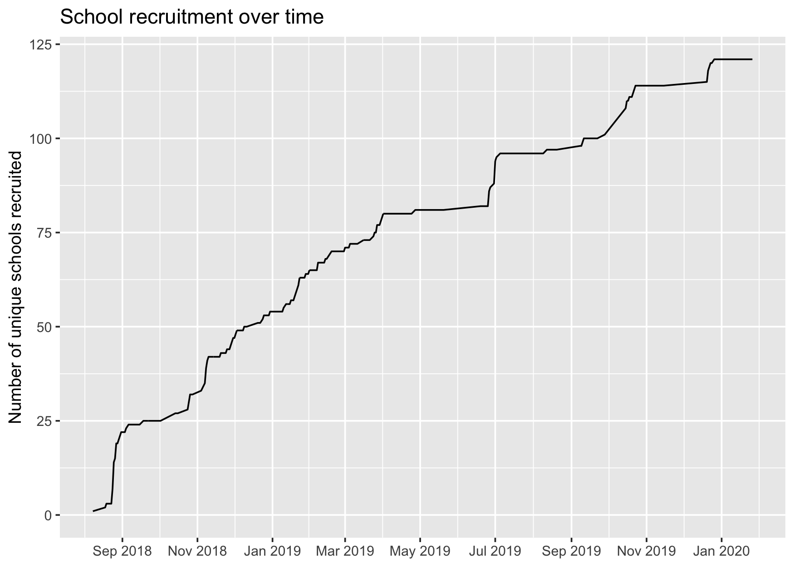
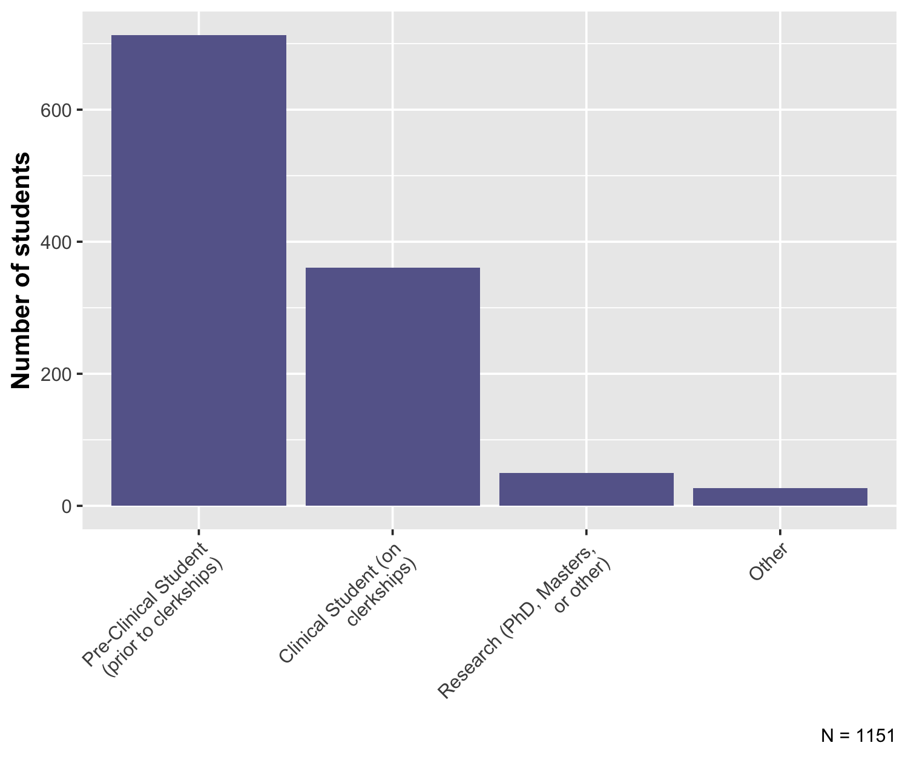
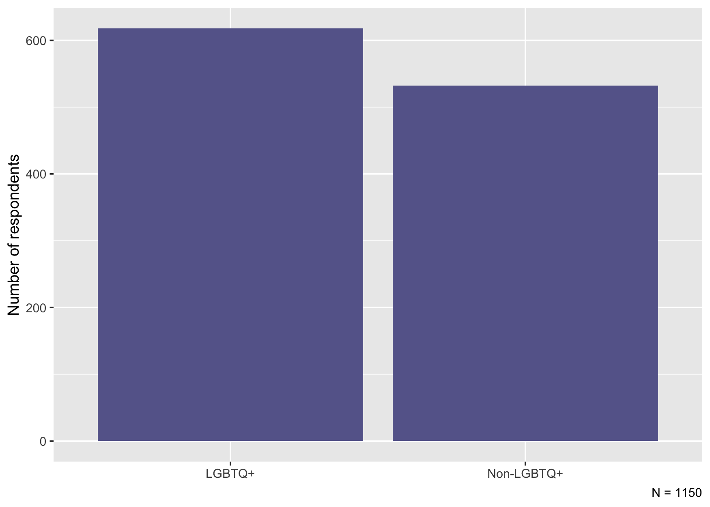
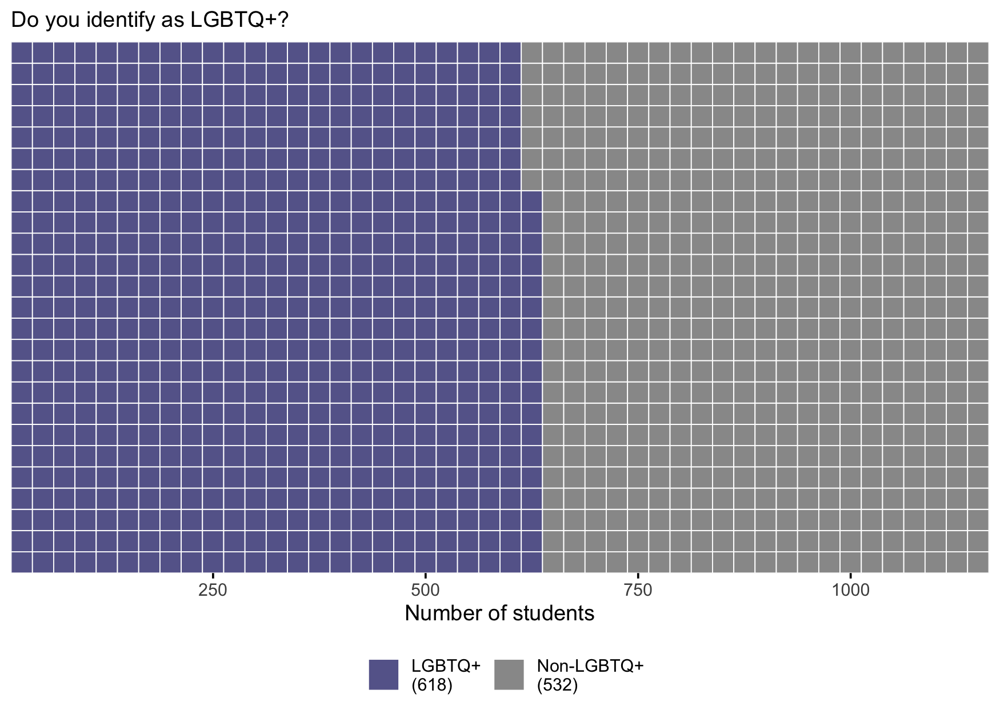
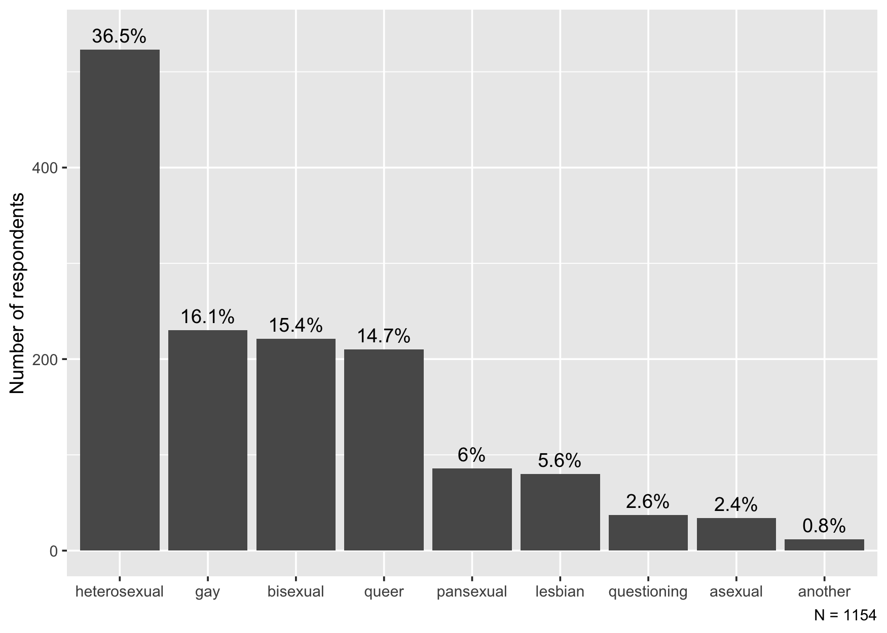
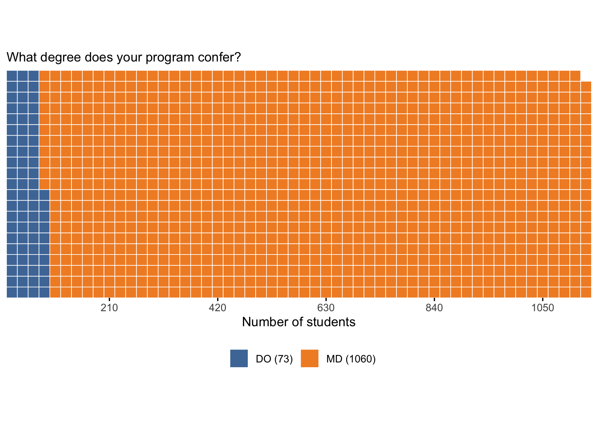
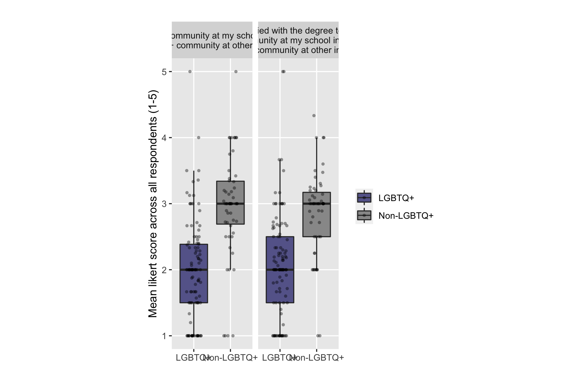

Needs Assessment Report
================
Timothy Keyes
2020-03-26

  - [Broad data and recruitment
    summary](#broad-data-and-recruitment-summary)
  - [Wrangling](#wrangling)
  - [Univariate Demographics report](#univariate-demographics-report)
      - [What school do you attend?](#what-school-do-you-attend)
      - [What year of medical school are you
        in?](#what-year-of-medical-school-are-you-in)
      - [Do you identify as LGBTQ+?](#do-you-identify-as-lgbtq)
      - [What is your sex assigned at
        birth?](#what-is-your-sex-assigned-at-birth)
      - [What is your gender identity?](#what-is-your-gender-identity)
      - [What is your sexual
        orientation?](#what-is-your-sexual-orientation)
      - [What is your racial/ethnic
        background?](#what-is-your-racialethnic-background)
      - [Program type](#program-type)
  - [Number of unique medical
    schools](#number-of-unique-medical-schools)
  - [Do medical students think MSPA is a good
    idea?](#do-medical-students-think-mspa-is-a-good-idea)
      - [Intercollegiate engagement of LGBTQ+ affinity
        organizations](#intercollegiate-engagement-of-lgbtq-affinity-organizations)
      - [Perceived benefit from a national LGBTQ+ affinity organization
        for medical
        students](#perceived-benefit-from-a-national-lgbtq-affinity-organization-for-medical-students)
      - [Which of your school’s activities would be enhanced by a
        national LGBTQ+ medical student
        organization?](#which-of-your-schools-activities-would-be-enhanced-by-a-national-lgbtq-medical-student-organization)
  - [Current-state assessment of local LGBTQ+
    organizations](#current-state-assessment-of-local-lgbtq-organizations)
      - [Does your school have a medical student LGBTQ+ affinity
        organization?](#does-your-school-have-a-medical-student-lgbtq-affinity-organization)

``` r
# Libraries
library(tidyverse)
library(lubridate)

# Parameters
input_path <- here::here("data", "mspa_na_data.rds")
metadata_path <- here::here("data-raw", "school_metadata.csv")

total_md <- 153
total_do <- 36

likert_colors <- c("darkgreen","green","orange","red","darkred")

likert_labels <- 
  c(
    "Strongly disagree",
    "Somewhat disagree", 
    "Neither agree nor disagree", 
    "Somewhat agree", 
    "Strongly agree"
  )

my_theme <- 
  theme(
    axis.text.y = element_text(size = 9),
    axis.text.x = element_text(size = 9, angle = 45, hjust = 1),
    axis.title.y = element_text(size = 12, face = "bold"), 
    axis.title.x = element_text(size = 12, face = "bold")
  ) 

#===============================================================================

# read in data
na_data <- 
  input_path %>% 
  read_rds()

metadata <- 
  metadata_path %>% 
  read_csv() %>% 
  drop_na()
```

## Broad data and recruitment summary

First, we want to see if we were able to obtain consent from everyone
who took the survey:

``` r
na_data %>% 
  count(consent)
```

    ## # A tibble: 2 x 2
    ##   consent     n
    ##   <chr>   <int>
    ## 1 no         32
    ## 2 yes      1148

Thus, we can see that there are 32 people who didn’t actually check the
“consent” box. They will need to be removed from the analysis.

We can also look, for our own purposes, of the number of responses over
the time window that the survey was open.

``` r
na_data %>% 
  count(date = lubridate::as_date(timestamp), name = "responses") %>% 
  ggplot(aes(x = date, y = responses)) + 
  geom_line() + 
  scale_x_date(
    breaks = scales::breaks_width(width = "2 months"), 
    labels = scales::label_date(format = "%b %Y")
  ) + 
  labs(
    title = "Number of responses to the N-A survey by date", 
    x = NULL, 
    y = "Responses (# of students per day)"
  )
```

<!-- -->

From this, we can see that recruitment tends to happen in a punctuated
fashion rather than by trickle-in over time. Each of the peaks
corresponds to pushes coordinated by our team to send the survey to
additional schools.

For a cumulative plot…

``` r
num_students <- function(date) { 
  na_data %>% 
    mutate(my_date = as_date(timestamp)) %>% 
    filter(my_date <= date) %>% 
    count() %>% 
    pull(n)
}

na_data %>% 
  transmute(
    my_date = as_date(timestamp), 
    unique_students = 
      map_int(my_date, num_students)
  ) %>% 
  ggplot(aes(x = my_date, y = unique_students)) + 
  geom_line() + 
  scale_x_date(
    breaks = scales::breaks_width(width = "2 months"), 
    labels = scales::label_date(format = "%b %Y")
  ) + 
  labs(
    title = "Respondent recruitment over time", 
    x = NULL, 
    y = "Number of unique students"
  )
```

<!-- -->

We can also look at our recruitment of unique schools over time:

``` r
num_schools <- function(date) { 
  na_data %>% 
    mutate(my_date = as_date(timestamp)) %>% 
    filter(my_date <= date) %>% 
    pull(school_attend) %>% 
    n_distinct()
}


na_data %>% 
  transmute(
    my_date = as_date(timestamp), 
    unique_schools = 
      map_int(my_date, num_schools)
  ) %>% 
  ggplot(aes(x = my_date, y = unique_schools)) + 
  geom_line() + 
  scale_x_date(
    breaks = scales::breaks_width(width = "2 months"), 
    labels = scales::label_date(format = "%b %Y")
  ) + 
  labs(
    title = "School recruitment over time", 
    x = NULL, 
    y = "Number of unique schools recruited"
  )
```

<!-- -->

Together, these plots indicate that, in general, having a survey link
passively open over time does not really lead to the steady “trickling
in” of responses over time. Rather, it seems that coordinated pushes of
survey instruments to specific schools (with wide desemination) yield
the most responses, Thus, one strategic recommendation for MSPA might be
to build its survey instrument distribution infrastructure (either
through a portal, an app that MSPA members can have on their phones, or
some other architecture that leverages our campus network).

## Wrangling

I’ve already done some data cleaning in previous scripts, but there are
still a few tweaks that we probably want to make so that everything is
human-readable and so that only useful information is carried forward.

First, we want to remove people who did not consent to the survey, since
we can’t use their information anyway.

``` r
na_data <- 
  na_data %>% 
  filter(consent == "yes")
```

And then we can filter out some variables that we don’t need.

``` r
na_data <- 
  na_data %>% 
  select(-survey_id, -consent, -complete)
```

And create a few variables that we’ll need later:

``` r
na_data <- 
  na_data %>% 
  mutate(
    sex = 
      case_when(
        sab_is_male == "yes"   ~ "male", 
        sab_is_female == "yes" ~ "female", 
        TRUE                   ~ NA_character_
      )
  ) %>% 
  left_join(metadata, by = c("school_attend" = "name"))
```

## Univariate Demographics report

The first section of the survey asked questions about respondents’
demographic identifiers, including the following:

  - What school they attend
  - What year of medical school they’re in
  - Whether or not they identify as LGBTQ+
  - What sex they were assigned at birth
  - What their current gender identity is
  - What they current sexual orientation is
  - Their race/ethnicity

Below, we report the breakdown of our survey respondents by each of
these demographics.

### What school do you attend?

Schools are arranged in order of decreasing number of responses.

``` r
na_data %>%
  count(school_attend, name = "Number of responses") %>% 
  mutate(
    `Percentage of total responses` = 
      ((`Number of responses` / sum(`Number of responses`)) * 100) %>% 
      round(digits = 1)
  ) %>% 
  rename(School = school_attend) %>% 
  arrange(desc(`Number of responses`)) %>% 
  knitr::kable()
```

| School                                                                                | Number of responses | Percentage of total responses |
| :------------------------------------------------------------------------------------ | ------------------: | ----------------------------: |
| Temple University School of Medicine                                                  |                  84 |                           7.3 |
| University of Louisville School of Medicine                                           |                  62 |                           5.4 |
| University of Oklahoma College of Medicine                                            |                  57 |                           4.9 |
| Geisinger Commonwealth School of Medicine                                             |                  44 |                           3.8 |
| Stanford University School of Medicine                                                |                  40 |                           3.5 |
| University of Pittsburgh School of Medicine                                           |                  39 |                           3.4 |
| University of New Mexico School of Medicine                                           |                  37 |                           3.2 |
| Saint Louis University School of Medicine                                             |                  34 |                           2.9 |
| University of Alabama School of Medicine                                              |                  34 |                           2.9 |
| University of Arkansas for Medical Sciences/UAMS College of Medicine                  |                  34 |                           2.9 |
| Johns Hopkins University School of Medicine                                           |                  32 |                           2.8 |
| University of Michigan Medical School                                                 |                  32 |                           2.8 |
| Western Michigan University Homer Stryker M.D. School of Medicine                     |                  30 |                           2.6 |
| Dell Medical School at The University of Texas at Austin                              |                  28 |                           2.4 |
| Chicago Medical School of Rosalind Franklin University of Medicine and Science        |                  26 |                           2.3 |
| Touro University California College of Osteopathic Medicine                           |                  23 |                           2.0 |
| University of Wisconsin School of Medicine and Public Health                          |                  23 |                           2.0 |
| Georgetown University School of Medicine                                              |                  22 |                           1.9 |
| Tulane University School of Medicine                                                  |                  22 |                           1.9 |
| Jacobs School of Medicine and Biomedical Sciences, University at Buffalo              |                  21 |                           1.8 |
| Rutgers New Jersey Medical School                                                     |                  18 |                           1.6 |
| University of Texas Southwestern Medical School at Dallas                             |                  17 |                           1.5 |
| Harvard Medical School                                                                |                  15 |                           1.3 |
| Columbia University Roy and Diana Vagelos College of Physicians and Surgeons          |                  14 |                           1.2 |
| Washington University School of Medicine                                              |                  14 |                           1.2 |
| Weill Cornell Medical College                                                         |                  14 |                           1.2 |
| NA                                                                                    |                  14 |                           1.2 |
| Albert Einstein College of Medicine                                                   |                  13 |                           1.1 |
| Alpert Medical School at Brown University                                             |                  13 |                           1.1 |
| University of California, Irvine School of Medicine                                   |                  13 |                           1.1 |
| University of Texas School of Medicine at San Antonio                                 |                  11 |                           1.0 |
| University of Vermont College of Medicine                                             |                  11 |                           1.0 |
| Cooper Medical School of Rowan University                                             |                  10 |                           0.9 |
| University of Iowa Roy J. and Lucille A. Carver College of Medicine                   |                   9 |                           0.8 |
| Vanderbilt University School of Medicine                                              |                   9 |                           0.8 |
| West Virginia University School of Medicine                                           |                   9 |                           0.8 |
| Edward Via College of Osteopathic Medicine                                            |                   8 |                           0.7 |
| Keck School of Medicine of University of Southern California                          |                   8 |                           0.7 |
| University of North Texas Health Science Center Texas College of Osteopathic Medicine |                   8 |                           0.7 |
| Baylor College of Medicine                                                            |                   7 |                           0.6 |
| New York University School of Medicine                                                |                   7 |                           0.6 |
| Philadelphia College of Osteopathic Medicine - Georgia Campus                         |                   7 |                           0.6 |
| State University of New York Downstate Medical Center College of Medicine             |                   7 |                           0.6 |
| University of South Alabama College of Medicine                                       |                   7 |                           0.6 |
| International                                                                         |                   6 |                           0.5 |
| Michigan State University College of Human Medicine                                   |                   6 |                           0.5 |
| University of California, San Fransisco School of Medicine                            |                   6 |                           0.5 |
| Yale School of Medicine                                                               |                   6 |                           0.5 |
| David Geffen School of Medicine at UCLA                                               |                   5 |                           0.4 |
| Northwestern University Feinberg School of Medicine                                   |                   5 |                           0.4 |
| University of California, Davis School of Medicine                                    |                   5 |                           0.4 |
| University of Florida College of Medicine                                             |                   5 |                           0.4 |
| Pennsylvania State University College of Medicine                                     |                   4 |                           0.3 |
| Perelman School of Medicine at the University of Pennsylvania                         |                   4 |                           0.3 |
| Philadelphia College of Osteopathic Medicine                                          |                   4 |                           0.3 |
| Touro College of Osteopathic Medicine                                                 |                   4 |                           0.3 |
| University of Utah School of Medicine                                                 |                   4 |                           0.3 |
| University of Washington School of Medicine                                           |                   4 |                           0.3 |
| Medical College of Wisconsin                                                          |                   3 |                           0.3 |
| Oklahoma State University Center for Health Sciences College of Osteopathic Medicine  |                   3 |                           0.3 |
| Sidney Kimmel Medical College at Thomas Jefferson University                          |                   3 |                           0.3 |
| Tufts University School of Medicine                                                   |                   3 |                           0.3 |
| University of Chicago Pritzker School of Medicine                                     |                   3 |                           0.3 |
| University of Texas Medical School at Houston                                         |                   3 |                           0.3 |
| A. T. Still University Kirksville College of Osteopathic Medicine                     |                   2 |                           0.2 |
| Dartmouth College Geisel School of Medicine                                           |                   2 |                           0.2 |
| Des Moines University College of Osteopathic Medicine                                 |                   2 |                           0.2 |
| Emory University School of Medicine                                                   |                   2 |                           0.2 |
| Hackensack Meridian School of Medicine                                                |                   2 |                           0.2 |
| Icahn School of Medicine at Mount Sinai                                               |                   2 |                           0.2 |
| Indiana University School of Medicine                                                 |                   2 |                           0.2 |
| Loma Linda University School of Medicine                                              |                   2 |                           0.2 |
| Ohio University Heritage College of Osteopathic Medicine                              |                   2 |                           0.2 |
| Oregon Health & Science University School of Medicine                                 |                   2 |                           0.2 |
| Rowan University School of Osteopathic Medicine                                       |                   2 |                           0.2 |
| Rutgers Robert Wood Johnson Medical School                                            |                   2 |                           0.2 |
| Sanford School of Medicine of the University of South Dakota                          |                   2 |                           0.2 |
| Stony Brook University School of Medicine                                             |                   2 |                           0.2 |
| Texas Tech University Health Sciences Center School of Medicine                       |                   2 |                           0.2 |
| Touro University Nevada College of Osteopathic Medicine                               |                   2 |                           0.2 |
| University of Arizona College of Medicine - Phoenix                                   |                   2 |                           0.2 |
| University of Illinois at Urbana-Champaign Carle Illinois College of Medicine         |                   2 |                           0.2 |
| University of Illinois College of Medicine                                            |                   2 |                           0.2 |
| University of Massachusetts Medical School                                            |                   2 |                           0.2 |
| University of Nebraska College of Medicine                                            |                   2 |                           0.2 |
| University of Rochester School of Medicine and Dentistry                              |                   2 |                           0.2 |
| University of Toledo College of Medicine                                              |                   2 |                           0.2 |
| Wayne State University School of Medicine                                             |                   2 |                           0.2 |
| Boonshoft School of Medicine at Wright State University                               |                   1 |                           0.1 |
| Boston University School of Medicine                                                  |                   1 |                           0.1 |
| Burrell College of Osteopathic Medicine at New Mexico State University                |                   1 |                           0.1 |
| Campbell University School of Osteopathic Medicine                                    |                   1 |                           0.1 |
| Charles R. Drew University of Medicine and Science                                    |                   1 |                           0.1 |
| Creighton University School of Medicine                                               |                   1 |                           0.1 |
| Donald and Barbara Zucker School of Medicine at Hofstra/Northwell                     |                   1 |                           0.1 |
| Drexel University College of Medicine                                                 |                   1 |                           0.1 |
| Duke University School of Medicine                                                    |                   1 |                           0.1 |
| Edward Via College of Osteopathic Medicine- Carolinas Campus                          |                   1 |                           0.1 |
| Florida Atlantic University Charles E. Schmidt College of Medicine                    |                   1 |                           0.1 |
| Marian University College of Osteopathic Medicine                                     |                   1 |                           0.1 |
| Mayo Clinic College of Medicine                                                       |                   1 |                           0.1 |
| Meharry Medical College School of Medicine                                            |                   1 |                           0.1 |
| Nova Southeastern University College of Osteopathic Medicine                          |                   1 |                           0.1 |
| Oakland University William Beaumont School of Medicine                                |                   1 |                           0.1 |
| Ross University School of Medicine & Veterinary Medicine                              |                   1 |                           0.1 |
| Rush Medical College                                                                  |                   1 |                           0.1 |
| San Juan Bautista School of Medicine                                                  |                   1 |                           0.1 |
| Southern Illinois University School of Medicine                                       |                   1 |                           0.1 |
| State University of New York Upstate Medical University                               |                   1 |                           0.1 |
| The Ohio State University College of Medicine                                         |                   1 |                           0.1 |
| University of Colorado School of Medicine                                             |                   1 |                           0.1 |
| University of Kansas School of Medicine                                               |                   1 |                           0.1 |
| University of Kentucky College of Medicine                                            |                   1 |                           0.1 |
| University of Maryland School of Medicine                                             |                   1 |                           0.1 |
| University of Minnesota Medical School                                                |                   1 |                           0.1 |
| University of Nevada, Las Vegas School of Medicine                                    |                   1 |                           0.1 |
| University of North Carolina School of Medicine                                       |                   1 |                           0.1 |
| University of Texas Medical Branch School of Medicine                                 |                   1 |                           0.1 |
| University of Virginia School of Medicine                                             |                   1 |                           0.1 |
| Washington State University Elson S. Floyd College of Medicine                        |                   1 |                           0.1 |
| West Virginia School of Osteopathic Medicine                                          |                   1 |                           0.1 |

### What year of medical school are you in?

``` r
n <- 
  na_data %>% 
  filter(!is.na(med_school_year)) %>% 
  count() %>% 
  pull(n)

na_data %>% 
  drop_na(med_school_year) %>% 
  mutate(
    med_school_year = fct_infreq(med_school_year %>% str_wrap(width = 25))
  ) %>% 
  ggplot(aes(x = med_school_year)) + 
  geom_bar() + 
  my_theme + 
  labs(
    x = NULL, 
    y = "Number of students", 
    caption = str_glue("N = ", {n})
  )
```

<!-- -->

### Do you identify as LGBTQ+?

``` r
n <- 
  na_data %>% 
  filter(!is.na(is_lgbtq)) %>% 
  count() %>% 
  pull(n)

na_data %>% 
  drop_na(is_lgbtq) %>% 
  ggplot(aes(x = is_lgbtq)) + 
  geom_bar() + 
  labs(
    x = NULL, 
    y = "Number of respondents", 
    caption = str_glue("N = {n}")
  )
```

<!-- -->

### What is your sex assigned at birth?

``` r
n <- 
  na_data %>% 
  filter(!is.na(sex)) %>% 
  count() %>% 
  pull(n)

na_data %>% 
  drop_na(sex) %>% 
  ggplot(aes(x = sex)) + 
  geom_bar() + 
  theme(
    axis.text = element_text(size = 12), 
    axis.title = element_text(size = 16)
  ) + 
  labs(
    x = NULL, 
    y = "Number of students", 
    caption = str_glue("N = {n}")
  )
```

<!-- -->

### What is your gender identity?

``` r
n <- 
  na_data %>% 
  filter_at(
    .vars = vars(starts_with("gender_")), 
    .vars_predicate = any_vars(!is.na(.))
  ) %>% 
  count() %>% 
  pull(n)

na_data %>% 
  summarize_at(
    .vars = vars(starts_with("gender")), 
    ~ sum(. == "yes")
  ) %>% 
  select(-gender_another_description) %>% 
  pivot_longer(
    cols = everything(), 
    names_to = "gender", 
    values_to = "Number of respondents", 
    names_prefix = "gender_"
  ) %>% 
  mutate(
    gender = fct_reorder(gender, desc(`Number of respondents`)), 
    percentage = (`Number of respondents` / sum(`Number of respondents`)) * 100
  ) %>% 
  ggplot(aes(x = gender, y = `Number of respondents`)) + 
  geom_col() + 
  geom_text(
    aes(
      y = `Number of respondents` + 15, 
      label = str_c(percentage %>% round(digits = 1), "%")
    )
  ) + 
  labs(
    x = NULL, 
    caption = str_glue("N = {n}")
  )
```

<!-- -->

### What is your sexual orientation?

``` r
n <- 
  na_data %>% 
  filter_at(
    .vars = vars(starts_with("so_")), 
    .vars_predicate = any_vars(!is.na(.))
  ) %>% 
  count() %>% 
  pull(n)

na_data %>% 
  summarize_at(
    .vars = vars(starts_with("so_")), 
    ~ sum(. == "yes")
  ) %>% 
  select(-so_another_description) %>% 
  pivot_longer(
    cols = everything(), 
    names_to = "sexual_orientation", 
    values_to = "Number of respondents", 
    names_prefix = "so_"
  ) %>% 
  mutate(
    sexual_orientation = fct_reorder(sexual_orientation, desc(`Number of respondents`)), 
    percentage = (`Number of respondents` / sum(`Number of respondents`)) * 100
  ) %>% 
  ggplot(aes(x = sexual_orientation, y = `Number of respondents`)) + 
  geom_col() + 
  geom_text(
    aes(
      y = `Number of respondents` + 15, 
      label = str_c(percentage %>% round(digits = 1), "%")
    )
  ) + 
  labs(
    x = NULL, 
    caption = str_glue("N = {n}")
  )
```

<!-- -->

### What is your racial/ethnic background?

``` r
n <- 
  na_data %>% 
  filter_at(
    .vars = vars(starts_with("race_")), 
    .vars_predicate = any_vars(!is.na(.))
  ) %>% 
  count() %>% 
  pull(n)

na_data %>% 
  summarize_at(
    .vars = vars(starts_with("race_")), 
    ~ sum(. == "yes")
  ) %>% 
  select(-race_another_explanation) %>% 
  pivot_longer(
    cols = everything(), 
    names_to = "race", 
    values_to = "Number of respondents", 
    names_prefix = "race_"
  ) %>% 
  mutate(
    race = fct_reorder(race, desc(`Number of respondents`)), 
    #this is wrong -> denominator should be n, not the sum
    percentage = (`Number of respondents` / sum(`Number of respondents`)) * 100
  ) %>% 
  ggplot(aes(x = race, y = `Number of respondents`)) + 
  geom_col() + 
  geom_text(
    aes(
      y = `Number of respondents` + 15, 
      label = str_c(percentage %>% round(digits = 1), "%")
    )
  ) + 
  scale_x_discrete(
    labels = 
      c("White", "Asian", "Hispanic", 
        "Black", "Another", "Native", 
        "Pacific Islander")
  ) + 
  labs(
    x = NULL, 
    caption = str_glue("N = {n}")
  )
```

<!-- -->

So we can see that most of the respondents are white, a group that
accounts for about 2/3 of the total responses. There are a smaller
percentage of Asian, Hispanic, and Black respondents, with Native,
Pacific Islander, and “Other” groups corresponding to around 1% of the
responses, each.

### Program type

With merged data about the school that each student attends, we can also
compare the number of MD and the number of DO students who responded to
the survey:

``` r
n <- 
  na_data %>% 
  filter(!is.na(Degree)) %>% 
  count() %>%
  pull(n)

na_data %>% 
  drop_na(Degree) %>% 
  count(Degree, name = "Number of respondents") %>% 
  mutate(
    Degree = fct_reorder(Degree, desc(`Number of respondents`)), 
    percentage = (`Number of respondents` / sum(`Number of respondents`)) * 100
  ) %>% 
  ggplot(aes(x = Degree, y = `Number of respondents`)) + 
  geom_col() + 
  geom_text(
    aes(
      y = `Number of respondents` + 20, 
      label = str_c(percentage %>% round(digits = 1), "%")
    )
  ) + 
  labs(
    title = "Number of responses from MD- and DO-granting programs", 
    x = NULL, 
    caption = str_glue("N = {n}")
  )
```

<!-- -->

Thus, we can see that the number of DO student responses is relatively
small relative to the number of MD students.

## Number of unique medical schools

According to the Association of American Medical Colleges, there are
[153 accredited MD-granting programs in the United
States](https://www.aamc.org/data-reports/students-residents/interactive-data/2019-facts-applicants-and-matriculants-data);
likewise, the American Association of Colleges of Osteopathic Medicine
(AACOM) [accredits 36 DO-granting
programs](https://www.aacom.org/become-a-doctor/u-s-colleges-of-osteopathic-medicine)
in the United States.

So, we can compute the number of unique MD and unique DO schools (as
well as their percentage of the national numbers).

``` r
totals <- tibble(Degree = c("DO", "MD"), total = c(total_do, total_md))

na_data %>% 
  select(school_attend, Degree) %>%
  drop_na() %>% 
  distinct() %>%
  count(Degree) %>% 
  left_join(totals, by = "Degree") %>% 
  mutate(proportion = n / total) %>% 
  knitr::kable()
```

| Degree |   n | total | proportion |
| :----- | --: | ----: | ---------: |
| DO     |  18 |    36 |  0.5000000 |
| MD     | 100 |   153 |  0.6535948 |

So, we can see that we have 100 MD schools (65% of total schools), and
18 DO schools (50% of total).

However, we remember from our response plots above that most of the
schools from which we have responses only have a few (\<5) students who
responded…this is a problem we will either have to solve or something
that we will have to wordsmith around.

## Do medical students think MSPA is a good idea?

In the second section of the needs-assessment survey, we asked questions
about intercollegiate LGBTQ+ affinity group engagement and whether or
not students felt that a national LGBTQ+ affinity organization would
enhance their school’s LGBTQ+ diversity/inclusion climate.

Here’s a generally useful function for plotting likert scale data that
we’ll use throughout this section:

``` r
## description: plots a stacked bar plot between LGBTQ+ and non-LGBTQ+ individuals when the likert scale is 
##              encoded by the variable my_var. Will provide the plot with the title `title` and the caption 
##              N = `n`. 
likert_plot <- function(my_var = NULL, title = NULL, n = NULL) { 
  na_data %>% 
    drop_na({{my_var}}, is_lgbtq) %>% 
    group_by(is_lgbtq, {{my_var}}) %>% 
    summarize(number = n()) %>% 
    mutate(proportion = number / sum(number)) %>% 
    ggplot(
      aes(
        x = is_lgbtq, 
        y = proportion, 
        fill = factor({{my_var}}, levels = as.character(5:1))
      )
    ) + 
    geom_hline(yintercept = 0.5, color = "black") + 
    geom_col() + 
    scale_y_continuous(labels = scales::label_percent(accuracy = 1)) + 
    scale_fill_brewer(
      labels = rev(likert_labels), 
      type = "div",
      palette = "RdYlGn", 
      aesthetics = "fill", 
      direction = -1, 
      guide = guide_legend(reverse = TRUE)
    ) + 
    coord_flip() + 
    theme(
      legend.title = element_text(size = 9),
      aspect.ratio = 0.4, 
      legend.position = "bottom"
    ) +  
    labs(
      subtitle = title,
      x = NULL,
      y = "Percentage of respondents", 
      fill = NULL,
      caption = str_glue("N = {n}")
    )
}
```

### Intercollegiate engagement of LGBTQ+ affinity organizations

**By individual - each person is a point**

``` r
#agree
n <- 
  na_data %>% 
  drop_na(interaction_agree, is_lgbtq) %>% 
  count() %>% 
  pull(n)

likert_plot(
  my_var = interaction_agree, 
  title = 
    "\"The LGBTQ+ community at my school interacts with the LGBTQ+ community at other institutions\"",
  n = n
)
```

<!-- -->

``` r
#satisfied
n <- 
  na_data %>% 
  drop_na(interaction_satisfaction, is_lgbtq) %>% 
  count() %>% 
  pull(n)

likert_plot(
  my_var = interaction_satisfaction, 
  title = 
    "\"I am satisfied with the degree to which the LGBTQ+ community at my school interacts with the LGBTQ+ community at other institutions\"",
  n = n
)
```

<!-- -->

In the above plots, note that we put a black reference line at 50% in
order to indicate that the majority of LGBTQ-identifying medical
students both disagree with the statement that their local LGBTQ+
affinity organization interacts with the larger LGBTQ+ community *and*
that they are not satisfied with the level of intercollegiate
interaction that they do have.

**By school - each school is a point**

If we take each unique school and average the likert scale ratings, we
can make box-and-whisker plots to summarize the data in a slightly
different way.

``` r
var_labels <- 
  setNames(
    object = , 
      c(
        "\"The LGBTQ+ community at my school interacts with the LGBTQ+ community at other institutions\"" %>% 
          str_wrap(width = 50), 
        "\"I am satisfied with the degree to which the LGBTQ+ community at my school interacts with the LGBTQ+ community at other institutions\"" %>% 
          str_wrap(width = 50)
      ), 
    nm = c("agree", "satisfaction")
  )

na_data %>% 
  drop_na(Degree, is_lgbtq) %>% 
  group_by(school_attend, is_lgbtq) %>% 
  summarize_at(
    vars(starts_with("interaction_")), 
    mean, 
    na.rm = TRUE
  ) %>% 
  pivot_longer(
    cols = starts_with("interaction_"), 
    names_to = "variable", 
    values_to = "value", 
    names_prefix = "interaction_"
  ) %>% 
  ggplot(aes(x = is_lgbtq, y = value, fill = is_lgbtq)) + 
  geom_boxplot(outlier.shape = NA) +
  geom_jitter(width = 0.2, alpha = 0.4, stroke = 0, color = "black") + 
  facet_wrap(vars(variable), labeller = labeller(variable = var_labels)) + 
  scale_y_continuous(minor_breaks = NULL) + 
  labs(
    subtitle = "", 
    x = NULL, 
    y = "Mean likert score across all respondents (1-5)", 
    fill = NULL
  )
```

<!-- -->

### Perceived benefit from a national LGBTQ+ affinity organization for medical students

**Personal Benefit**

On an individual level…

``` r
n <- 
  na_data %>% 
  drop_na(is_lgbtq, personal_benefit_mspa) %>% 
  count() %>% 
  pull(n)

likert_plot(
  my_var = personal_benefit_mspa, 
  title = "I would personally benefit from a national LGBTQ+ affinity organization", 
  n = n
)
```

<!-- -->

So, it’s clear that the majority of LGBTQ+-identifying students feel
that they would personally benefit from the existence of an organization
like MSPA, with nearly 50% strongly agreeing with this statement. By
contrast, most non-LGBTQ+ students didn’t feel that they would
necessarily benefit from such an organization personally.

**Community benefit:**

On an individual level…

``` r
n <- 
  na_data %>% 
  drop_na(is_lgbtq, community_benefit_mspa) %>% 
  count() %>% 
  pull(n)

likert_plot(
  my_var = community_benefit_mspa, 
  title = 
    "My community would  benefit from a national LGBTQ+ affinity organization", 
  n = n
)
```

<!-- -->

Here, we see that over 50% of all LGBTQ+ students feel that the
existence of an organization such as MSPA would benefit their overall
community (even if it doesn’t benefit them personally), with over 80%
indicating some degree of agreement.

In addition, this plot shows us that most non-LGBTQ+ students **also**
agree that the existence of an organization like MSPA would benefit the
community, even if they themselves won’t necessarily benefit from the
org’s existence personally.

### Which of your school’s activities would be enhanced by a national LGBTQ+ medical student organization?

``` r
affinity_recode <- 
  c(
    "lgbtq_meded" = "LGBTQ+ health education",
    "social" = "LGBTQ+ social events", 
    "di_training" = "Health care provider diversity/inclusion training",
    "discrim_bias_reduction" = "Discrimination and bias reduction", 
    "mentorship" = "Physician mentorship for LGBTQ+ students",
    "advocacy" = "LGBTQ+ political/social advocacy",
    "global_health" = "LGBTQ+ Global Health",
    "other" = "Other"
  )

n <- 
  na_data %>% 
 filter_at(
    .vars = vars(starts_with("enhanced_activity")), 
    .vars_predicate = any_vars(!is.na(.))
  ) %>% 
  drop_na(is_lgbtq) %>% 
  count() %>% 
  pull(n)
  

na_data %>% 
 filter_at(
    .vars = vars(starts_with("enhanced_activity")), 
    .vars_predicate = any_vars(!is.na(.))
  ) %>% 
  drop_na(is_lgbtq) %>% 
  summarize_at(
    vars(starts_with("enhanced_activity")), 
    ~ sum(. == "yes")
  ) %>% 
  select(-enhanced_activity_mspa_other_explanation) %>% 
  pivot_longer(
    cols = starts_with("enhanced_activity"), 
    names_to = "activity", 
    values_to = "Number of respondents", 
    names_prefix = "enhanced_activity_mspa_"
  ) %>% 
  mutate(
    activity = 
      fct_reorder(activity, desc(`Number of respondents`)) %>% 
      dplyr::recode(!!! affinity_recode),
    percentage = (`Number of respondents` / n) * 100
  ) %>% 
  ggplot(aes(x = activity, y = `Number of respondents`)) + 
  geom_col() + 
  geom_text(
    aes(
      y = `Number of respondents` + 50, 
      label = str_c(percentage %>% round(digits = 1), "%")
    )
  ) +
  scale_x_discrete(labels = function(x) str_wrap(x, width = 30)) + 
  coord_flip() + 
  labs(
    subtitle = "Students feel that a national LGBTQ+ org will most enhance medical\neducation, advocacy, diversity & inclusion training, and LGBTQ+ mentorship", 
    x = NULL, 
    caption = str_glue("N = {n}")
  )
```

<!-- -->

The plot above shows that the number 1 item that students felt would be
enhanced by an organization like MSPA existing would be LGBTQ+ health
education and curriculur design.

But we can also see that 2.3% felt that “other” activities would be
enhanced. What were those?

``` r
na_data %>% 
  select(enhanced_activity_mspa_other_explanation) %>%
  distinct() %>% 
  knitr::kable()
```

| enhanced\_activity\_mspa\_other\_explanation |
| :------------------------------------------- |
| NA                                           |

Funnily enough, no one provided any text in the free text box\! Oh well.

Of course, the data about are aggregated - the question still remains:
did SGM and non-SGM feel differently about what activities would be
enhanced by MSPA?

``` r
ns <- 
  na_data %>% 
  filter_at(
    .vars = vars(starts_with("enhanced_activity")), 
    .vars_predicate = any_vars(!is.na(.))
  ) %>% 
  drop_na(is_lgbtq) %>% 
  count(is_lgbtq)
  
na_data %>% 
  filter_at(
    .vars = vars(starts_with("enhanced_activity")), 
    .vars_predicate = any_vars(!is.na(.))
  ) %>% 
  drop_na(is_lgbtq) %>% 
  group_by(is_lgbtq) %>% 
  summarize_at(
    vars(starts_with("enhanced_activity")), 
    ~ sum(. == "yes")
  ) %>% 
  select(-enhanced_activity_mspa_other_explanation) %>% 
  pivot_longer(
    cols = starts_with("enhanced_activity"), 
    names_to = "activity", 
    values_to = "Number of respondents", 
    names_prefix = "enhanced_activity_mspa_"
  ) %>% 
  left_join(ns, by = "is_lgbtq") %>% 
  mutate(
    activity = 
      fct_reorder2(activity, desc(is_lgbtq), desc(`Number of respondents`)) %>% 
      dplyr::recode(!!! affinity_recode),
    percentage = (`Number of respondents` / n) * 100, 
    is_lgbtq = fct_relevel(is_lgbtq, "Non-LGBTQ+", "LGBTQ+")
  ) %>% 
  ggplot(aes(x = activity, y = `Number of respondents`, fill = is_lgbtq)) + 
  geom_col(position = "dodge") + 
  geom_text(
    aes(
      y = `Number of respondents` + 35, 
      label = str_c(percentage %>% round(digits = 1), "%")
    ), 
    position = position_dodge(width = 0.8)
  ) +
  scale_x_discrete(labels = function(x) str_wrap(x, width = 30)) + 
  scale_y_continuous(limits = c(NA, 570)) + 
  scale_fill_manual(values = c("#00BFC4", "#F8766D")) + 
  coord_flip() + 
  labs(
    subtitle = "LGBTQ+ students feel that a national LGBTQ+ org will most enhance medical\neducation, advocacy, mentorship, and social evente", 
    x = NULL, 
    fill = NULL, 
    caption = ""
  )
```

<!-- -->

These data tell a slightly different story: LGBTQ+ students still think
MSPA’s greatest strength will be in enhancing LGBTQ+ medical education
and political/social advocacy, but they tend to think mentorship and
social events will be more enhanced than non-LGBTQ+ students do.

## Current-state assessment of local LGBTQ+ organizations

Our needs assessment also included several questions about what
students’ local affinity organizations were like. The variables we
measured included the following:

  - Does your school have a medical student LGBTQ+ organization of some
    kind?
  - If no, do you think this is something you would benefit from?
  - If yes, are you involved in that organization in some way? If not,
    why not?
  - Which of the following student group activies do you engage in?

### Does your school have a medical student LGBTQ+ affinity organization?

``` r
n <- 
  na_data %>% 
  drop_na(Degree, school_affinity_group_exist) %>% 
  pull(school_attend) %>% 
  n_distinct()

percentage_schools <- 
  na_data %>% 
  drop_na(Degree, school_affinity_group_exist) %>% 
  group_by(school_attend) %>% 
  count(school_affinity_group_exist) %>% 
  filter(n == max(n)) %>% 
  pull(school_affinity_group_exist) %>% 
  `==`("yes") %>% 
  mean() * 
  100
```

Thus, we can see that 90.8% of our 118 schools have a local affinity
LGBTQ+ affinity organization.

The schools that don’t are as follows:

``` r
na_data %>% 
  drop_na(Degree, school_affinity_group_exist) %>% 
  group_by(school_attend) %>% 
  count(school_affinity_group_exist) %>% 
  filter(n == max(n)) %>% 
  filter(school_affinity_group_exist == "no") %>% 
  select(school_attend) %>% 
  rename(
    `Medical schools without LGBTQ+ affinity organizations` = school_attend
  ) %>% 
  knitr::kable()
```

| Medical schools without LGBTQ+ affinity organizations                         |
| :---------------------------------------------------------------------------- |
| Creighton University School of Medicine                                       |
| Edward Via College of Osteopathic Medicine                                    |
| Loma Linda University School of Medicine                                      |
| Marian University College of Osteopathic Medicine                             |
| Meharry Medical College School of Medicine                                    |
| Ohio University Heritage College of Osteopathic Medicine                      |
| Sanford School of Medicine of the University of South Dakota                  |
| Southern Illinois University School of Medicine                               |
| University of Illinois at Urbana-Champaign Carle Illinois College of Medicine |
| University of Nebraska College of Medicine                                    |
| Washington State University Elson S. Floyd College of Medicine                |

So, for the students at these schools, do they think it’d be beneficial
to have one?

``` r
ns <- 
  na_data %>% 
  filter(school_affinity_group_exist == "no") %>% 
  count(is_lgbtq)

na_data %>% 
  filter(school_affinity_group_exist == "no") %>% 
  group_by(is_lgbtq) %>% 
  summarize(
    number = sum(school_affinity_group_benefit == 1, na.rm = TRUE), 
    total = n(),
    prop = number / total
  ) %>% 
  ggplot(aes(x = is_lgbtq, y = prop, fill = is_lgbtq)) + 
  geom_col() + 
  scale_y_continuous(
    breaks = scales::breaks_width(width = 0.2), 
    labels = scales::label_percent(accuracy = 1)
  ) + 
  coord_fixed(2) + 
  theme(legend.position = "none") + 
  labs(
    subtitle = "\"Do you feel that an LGBTQ+ affinity organization is something you would benefit from?\"",
    x = NULL, 
    y = "Percentage of respondents who answered \"yes\"", 
    fill = NULL, 
    caption = str_c("N(LGBTQ+) = ", ns$n[[1]], "\nN(non-LGBTQ+) = ", ns$n[[2]])
  ) 
```

<!-- -->

So, we can see that over 80% of LGBTQ+ students do feel that it’s
something they would benefit from, but there’s not a ton of strong
allyship going on (clearly).
