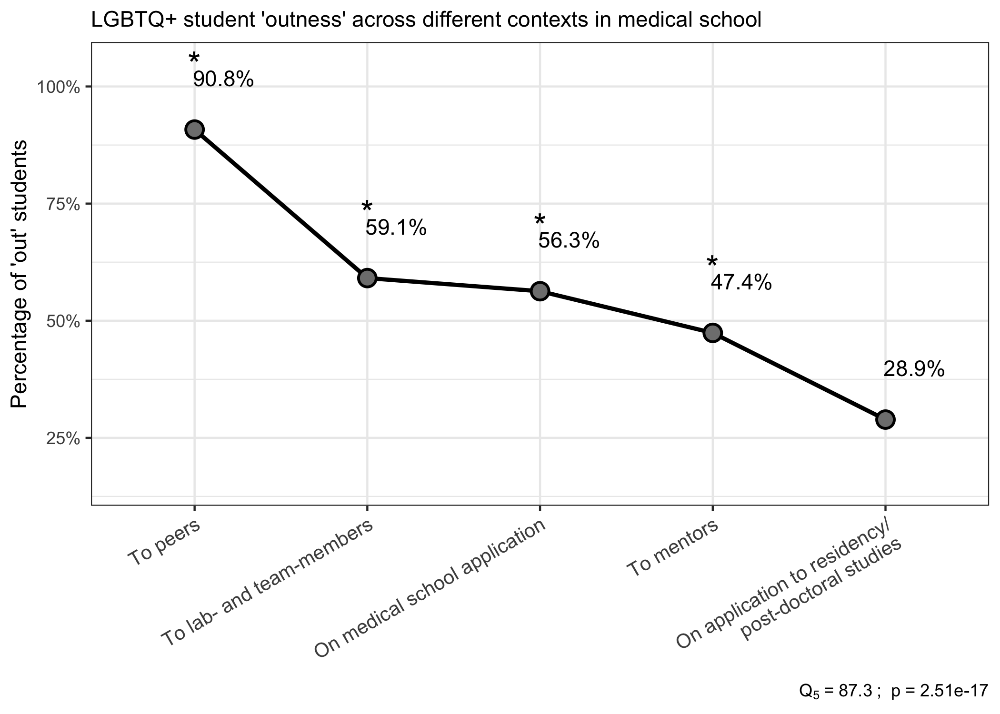
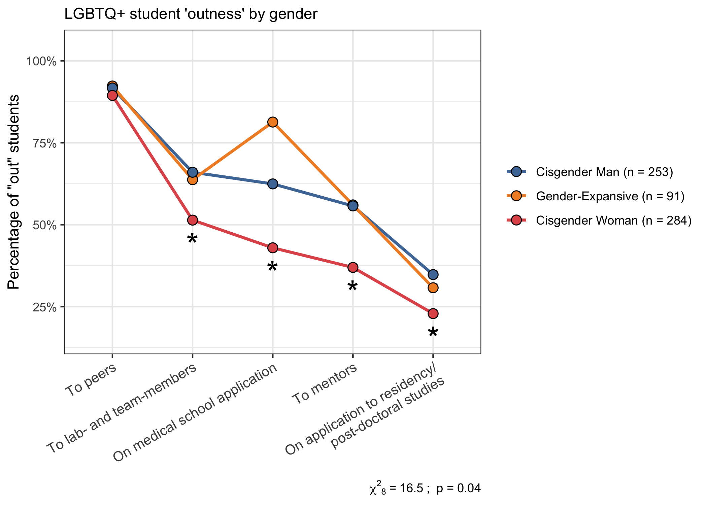
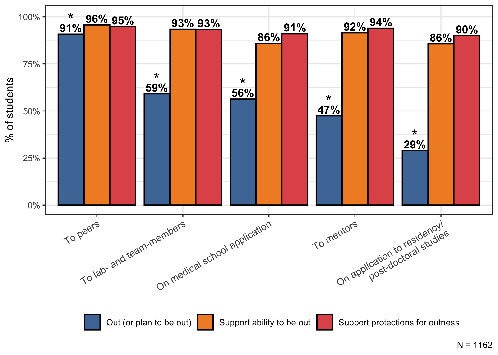
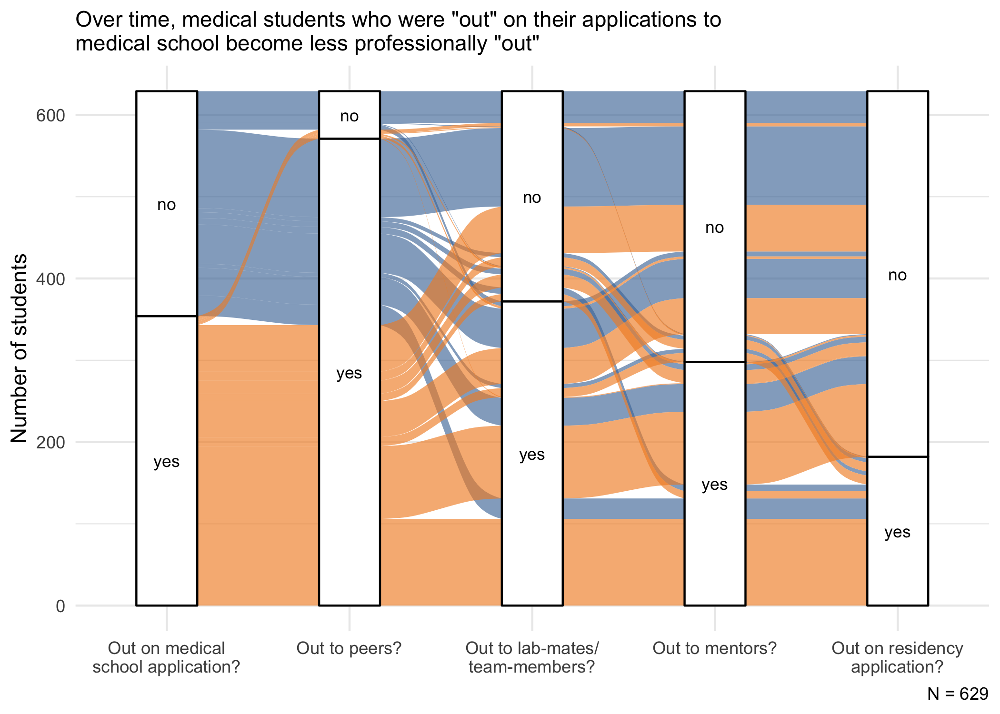

Outness report
================
Timothy Keyes
2020-12-04

  - [Data quality and cleaning](#data-quality-and-cleaning)
  - [Univariate Demographics report](#univariate-demographics-report)
      - [What school do you attend?](#what-school-do-you-attend)
      - [All other demographic
        variables](#all-other-demographic-variables)
  - [Who is “out” - some
    visualizations](#who-is-out---some-visualizations)
      - [All of our data in one plot](#all-of-our-data-in-one-plot)
      - [Outness overall](#outness-overall)
      - [A bit more wrangling](#a-bit-more-wrangling)
      - [Outness by sexual orientation](#outness-by-sexual-orientation)
      - [Outness across gender
        identities](#outness-across-gender-identities)
      - [Outness by Race/ethnicity](#outness-by-raceethnicity)
      - [MD vs. DO outness](#md-vs.-do-outness)
      - [Outness by year of training](#outness-by-year-of-training)
  - [Do medical students support their (and their peers’) ability to be
    “out” if they want to
    be?](#do-medical-students-support-their-and-their-peers-ability-to-be-out-if-they-want-to-be)
  - [What’s the difference between medical school applications and
    residency
    applications?](#whats-the-difference-between-medical-school-applications-and-residency-applications)
  - [Putting our plots together using
    {patchwork}](#putting-our-plots-together-using-patchwork)
      - [Figure 1](#figure-1)
      - [Supplementary figure 1](#supplementary-figure-1)
      - [Figure 2](#figure-2)
      - [Table 1](#table-1)
  - [Some qualitative thoughts on
    “outness”](#some-qualitative-thoughts-on-outness)

First, I’ll load the libraries I want and set up a few parameters that
will make data cleaning easier in later steps.

``` r
# Libraries
library(tidyverse)
library(kableExtra)
library(ggthemes)
library(ggalluvial)
library(broom)
library(patchwork)
library(latex2exp)
library(DescTools)

# Parameters
input_path <- here::here("data", "mspa_na_data.rds")
metadata_path <- here::here("data-raw", "school_metadata.csv")
figure_out_path <- file.path("~", "Desktop", "jgme_final", "Figures")

likert_colors <- c("darkgreen","green","orange","red","darkred")

likert_labels <- 
  c(
    "Strongly disagree",
    "Somewhat disagree", 
    "Neither agree nor disagree", 
    "Somewhat agree", 
    "Strongly agree"
  )

interest_labels <- 
  c(
    "Not at all interested",
    "Less interested", 
    "Undecided", 
    "Somewhat interested", 
    "Very interested"
  )

recode_values <- 
  c(
    "gender_woman" = "Cisgender Woman", 
    "gender_man" = "Cisgender Man", 
    "gender_genderqueer" = "Genderqueer/Gender non-conforming", 
    "gender_gender-expansive" = "Gender-expansive", 
    "gender_transman" = "Transgender Man", 
    "gender_agender" = "Agender", 
    "gender_another" = "Another Gender Identity", 
    "gender_transwoman" = "Transgender Woman",
    "so_heterosexual" = "Straight/Heterosexual", 
    "so_gay" = "Gay", 
    "so_bisexual" = "Bisexual", 
    "so_queer" = "Queer", 
    "so_pansexual" = "Pansexual", 
    "so_lesbian" = "Lesbian", 
    "so_questioning" = "Questioning", 
    "so_asexual" = "Asexual",
    "so_another" = "Another Sexual Orientation", 
    "race_white" = "White/Caucasian", 
    "race_asian" = "Asian", 
    "race_hispanic" = "Latino or Hispanic",
    "race_black" = "Black or African American", 
    "race_another" = "Another Race", 
    "race_native" = "American Indian or Alaska Native", 
    "race_pi" = "Native Hawaiian or Other Pacific Islander"
  )

context_recode <- 
  c(
    "classmates_peers" = "To peers", 
    "labmates_coworkers_team" = "To lab-mates or team members", 
    "mentors" = "To mentors", 
    "medical_school_app" = "On medical school application", 
    "residency_app" = "On application to residency/post-doctoral studies"
  )

mspa_hex <- "#666699"
```

Then, I’ll read in the data (which has already been cleaned a bit in
previous scripts). The data are structured as follows:

  - `na_data`: All data from the MSPA needs assessment. Each row
    represents one student; each column represents that student’s
    responses to each of the questions that we asked in our survey.
  - `metadata`: Metadata about each school in `na_data`. Each row
    represents a school; each column represents information about the
    school (i.e. does it grant MD or DO degrees? Which state is the
    school located in?).

<!-- end list -->

``` r
# read in data
na_data <- 
  input_path %>% 
  read_rds()

metadata <- 
  metadata_path %>% 
  read_csv() %>% 
  drop_na() %>% 
  janitor::clean_names()
```

## Data quality and cleaning

I’ve already done some data cleaning in previous scripts, but there are
still a few tweaks that we probably want to make so that everything is
human-readable and so that only useful information is carried forward.

First, we want to remove people who did not consent to the survey, since
we can’t use their information anyway. We will also remove students who
are not in schools within the U.S. or who did not provide the name of
the school that they attend.

``` r
na_data <- 
  na_data %>% 
  filter(consent == "yes", school_attend != "International") %>% 
  drop_na(school_attend)
```

And then we can select out some variables that we don’t need.

``` r
na_data <- 
  na_data %>% 
  select(-survey_id, -consent, -complete)
```

We can then create a few variables that we’ll use later:

``` r
na_data <- 
  na_data %>% 
  mutate(
    # create a variable representing sex assigned at birth
    sex = 
      case_when(
        sab_is_male == "yes"   ~ "male", 
        sab_is_female == "yes" ~ "female", 
        TRUE                   ~ NA_character_
      ), 
    # create a variable representing if the student meets the AAMC definition of URM
    is_urm = 
      case_when(
        race_black  == "yes"      ~ "yes", 
        race_native  == "yes"     ~ "yes", 
        race_hispanic  == "yes"   ~ "yes",
        TRUE                      ~ "no"
      ),   
    # create a variable representing if the student is a gender minority (not cisgender)
    `gender_gender-expansive` = 
      case_when(
        gender_agender == "yes"     ~ "yes", 
        gender_genderqueer == "yes" ~ "yes", 
        gender_transman == "yes"    ~ "yes", 
        gender_transwoman == "yes"  ~ "yes", 
        gender_another == "yes"     ~ "yes", 
        TRUE ~ "no"
      ), 
    gender_man = 
      if_else(gender_man == "yes" & `gender_gender-expansive` == "no", "yes", "no"), 
    gender_woman = 
      if_else(gender_woman == "yes" & `gender_gender-expansive` == "no", "yes", "no")
  ) %>% 
  # rename(
  #   `gender_cisgender man` = gender_man,
  #   `gender_cisgender woman` = gender_woman
  # ) %>% 
  # join in metadata for each student
  left_join(metadata, by = c("school_attend" = "name")) %>% 
  # some minor adjustments to variables that we'll use a lot 
  mutate(
    degree_type = 
      factor(degree, levels = c("MD", "DO")) %>% 
      fct_recode("allopathic" = "MD", "osteopathic" = "DO"), 
    med_school_year = str_remove(med_school_year, pattern = "\\(.+\\)")
  ) %>% 
  select(-degree) %>% 
  drop_na(degree_type)
```

After all of our preprocessing, we get a dataframe that looks like this:

``` r
na_data %>% 
  glimpse()
```

    ## Rows: 1,162
    ## Columns: 115
    ## $ participant_id                                <dbl> 1, 2, 3, 4, 6, 8, 9, 10…
    ## $ timestamp                                     <chr> "2018-08-08 09:32:26", …
    ## $ school_attend                                 <chr> "Stanford University Sc…
    ## $ med_school_year                               <chr> "Pre-Clinical Student "…
    ## $ med_school_year_other                         <chr> NA, NA, NA, NA, NA, NA,…
    ## $ is_lgbtq                                      <chr> "LGBTQ+", "LGBTQ+", "LG…
    ## $ sab_is_male                                   <chr> "no", "no", "no", "no",…
    ## $ sab_is_female                                 <chr> "no", "no", "no", "no",…
    ## $ gender_man                                    <chr> "no", "yes", "no", "yes…
    ## $ gender_woman                                  <chr> "yes", "no", "no", "no"…
    ## $ gender_agender                                <chr> "no", "no", "no", "no",…
    ## $ gender_genderqueer                            <chr> "no", "no", "yes", "no"…
    ## $ gender_transman                               <chr> "no", "no", "no", "no",…
    ## $ gender_transwoman                             <chr> "no", "no", "no", "no",…
    ## $ gender_another                                <chr> "no", "no", "no", "no",…
    ## $ gender_another_description                    <chr> NA, NA, NA, NA, NA, NA,…
    ## $ so_asexual                                    <chr> "no", "no", "no", "no",…
    ## $ so_bisexual                                   <chr> "yes", "no", "no", "no"…
    ## $ so_gay                                        <chr> "yes", "yes", "yes", "y…
    ## $ so_lesbian                                    <chr> "no", "no", "no", "no",…
    ## $ so_pansexual                                  <chr> "yes", "no", "no", "no"…
    ## $ so_queer                                      <chr> "yes", "no", "no", "yes…
    ## $ so_questioning                                <chr> "no", "no", "no", "no",…
    ## $ so_heterosexual                               <chr> "no", "no", "no", "no",…
    ## $ so_another                                    <chr> "no", "no", "no", "no",…
    ## $ so_another_description                        <chr> NA, NA, NA, NA, NA, NA,…
    ## $ race_native                                   <chr> "no", "no", "no", "no",…
    ## $ race_asian                                    <chr> "no", "no", "no", "no",…
    ## $ race_black                                    <chr> "no", "no", "no", "no",…
    ## $ race_pi                                       <chr> "no", "no", "no", "no",…
    ## $ race_white                                    <chr> "yes", "no", "yes", "ye…
    ## $ race_hispanic                                 <chr> "no", "yes", "yes", "ye…
    ## $ race_another                                  <chr> "no", "no", "no", "no",…
    ## $ race_another_explanation                      <chr> NA, NA, NA, NA, NA, NA,…
    ## $ interaction_agree                             <dbl> 2, 2, 2, 2, 4, 4, 4, 3,…
    ## $ interaction_satisfaction                      <dbl> 2, 2, 2, 1, 4, 4, 4, 2,…
    ## $ personal_benefit_mspa                         <dbl> 5, 5, 5, 5, 5, 1, 5, 5,…
    ## $ community_benefit_mspa                        <dbl> 5, 5, 5, 5, 5, 2, 5, 5,…
    ## $ enhanced_activity_mspa_lgbtq_meded            <chr> "yes", "yes", "yes", "y…
    ## $ enhanced_activity_mspa_social                 <chr> "yes", "yes", "yes", "y…
    ## $ enhanced_activity_mspa_di_training            <chr> "no", "yes", "yes", "ye…
    ## $ enhanced_activity_mspa_discrim_bias_reduction <chr> "no", "yes", "yes", "ye…
    ## $ enhanced_activity_mspa_mentorship             <chr> "yes", "yes", "yes", "y…
    ## $ enhanced_activity_mspa_advocacy               <chr> "yes", "yes", "yes", "y…
    ## $ enhanced_activity_mspa_global_health          <chr> "no", "yes", "yes", "ye…
    ## $ enhanced_activity_mspa_other                  <chr> "no", "no", "no", "no",…
    ## $ enhanced_activity_mspa_other_explanation      <chr> NA, NA, NA, NA, NA, NA,…
    ## $ school_affinity_group_exist                   <chr> "yes", "yes", "yes", "y…
    ## $ school_affinity_group_benefit                 <dbl> NA, NA, NA, NA, NA, NA,…
    ## $ school_affinity_group_involved                <chr> "yes", "yes", "yes", "y…
    ## $ why_not_involved_time                         <chr> "no", "no", "no", "no",…
    ## $ why_not_involved_value                        <chr> "no", "no", "no", "no",…
    ## $ why_not_involved_opportunities                <chr> "no", "no", "no", "no",…
    ## $ why_not_involved_uninterested                 <chr> "no", "no", "no", "no",…
    ## $ why_not_involved_not_queer                    <chr> "no", "no", "no", "no",…
    ## $ why_not_involved_another                      <chr> "no", "no", "no", "no",…
    ## $ why_not_involved_another_explanation          <chr> NA, NA, NA, NA, NA, "I …
    ## $ school_activities_advocacy                    <chr> "yes", "yes", "yes", "n…
    ## $ school_activities_social                      <chr> "yes", "yes", "yes", "y…
    ## $ school_activities_mentorship                  <chr> "no", "no", "yes", "no"…
    ## $ school_activities_educational                 <chr> "yes", "yes", "yes", "y…
    ## $ school_activities_research                    <chr> "yes", "yes", "yes", "n…
    ## $ school_activities_intercollegiate             <chr> "no", "no", "no", "no",…
    ## $ school_activities_other                       <chr> "no", "no", "no", "no",…
    ## $ school_activities_other_explanation           <chr> NA, NA, NA, NA, NA, NA,…
    ## $ school_affinity_group_mission                 <dbl> 4, 4, 4, 2, 5, 2, 5, 5,…
    ## $ school_affinity_group_supported               <dbl> 5, 4, 4, 4, 5, 1, 5, 4,…
    ## $ school_affinity_group_identify                <dbl> 4, 3, 4, 2, 4, 1, 5, 4,…
    ## $ interest_lgbtq_meded                          <dbl> 5, 5, 4, 5, 5, 4, 5, 5,…
    ## $ interest_lgbtq_social                         <dbl> 3, 4, 4, 3, 5, 2, 4, 5,…
    ## $ interest_lgbtq_bias_training                  <dbl> 4, 5, 4, 5, 5, 3, 5, 5,…
    ## $ interest_lgbtq_advocacy                       <dbl> 5, 5, 5, 5, 5, 4, 5, 5,…
    ## $ interest_lgbtq_global_health                  <dbl> 3, 3, 2, 5, 4, 2, 4, 5,…
    ## $ interest_lgbtq_other                          <chr> NA, NA, NA, NA, NA, "LG…
    ## $ importance_lgbtq_meded                        <chr> "yes", "yes", "yes", "y…
    ## $ importance_lgbtq_social                       <chr> "no", "yes", "yes", "no…
    ## $ importance_lgbtq_bias_training                <chr> "no", "yes", "yes", "ye…
    ## $ importance_lgbtq_mentorship                   <chr> "yes", "yes", "yes", "y…
    ## $ importance_lgbtq_advocacy                     <chr> "yes", "yes", "yes", "y…
    ## $ importance_lgbtq_global_health                <chr> "no", "yes", "no", "yes…
    ## $ satisfaction_lgbtq_meded                      <dbl> 5, 5, 3, 1, 4, 2, 3, 3,…
    ## $ satisfaction_lgbtq_social                     <dbl> 8, 6, 4, 4, 5, 1, 3, 3,…
    ## $ satisfaction_bias_training                    <dbl> 4, 3, 2, 2, 3, 2, 3, 3,…
    ## $ satisfaction_lgbtq_mentorship                 <dbl> 4, 2, 2, 2, 4, 2, 4, 3,…
    ## $ satisfaction_lgbtq_advocacy                   <dbl> 7, 6, 4, 2, 4, 2, 4, 3,…
    ## $ satisfaction_lgbtq_global_health              <dbl> 1, 1, 2, 1, 3, 3, 3, 2,…
    ## $ out_classmates_peers                          <chr> "yes", "yes", "yes", "y…
    ## $ out_labmates_coworkers_team                   <chr> "yes", "yes", "yes", "y…
    ## $ out_mentors                                   <chr> "yes", "yes", "yes", "y…
    ## $ out_medical_school_app                        <chr> "yes", "yes", "yes", "y…
    ## $ out_residency_app                             <chr> "no", "yes", "no", "yes…
    ## $ out_other                                     <chr> "no", "yes", "no", "no"…
    ## $ out_other_explanation                         <chr> NA, "on an outlist", NA…
    ## $ ability_out_classmates_peers                  <chr> "yes", "yes", "yes", "y…
    ## $ ability_out_labmates_coworkers_team           <chr> "yes", "yes", "yes", "y…
    ## $ ability_out_mentors                           <chr> "yes", "yes", "yes", "y…
    ## $ ability_out_medical_school_app                <chr> "yes", "yes", "yes", "y…
    ## $ ability_out_residency_app                     <chr> "yes", "yes", "yes", "y…
    ## $ ability_out_other                             <chr> "no", "yes", "no", "no"…
    ## $ ability_out_other_explanation                 <chr> NA, "on an outlist", NA…
    ## $ protections_out_classmates_peers              <chr> "yes", "yes", "yes", "y…
    ## $ protections_out_labmates_coworkers_team       <chr> "yes", "yes", "yes", "y…
    ## $ protections_out_mentors                       <chr> "yes", "yes", "yes", "y…
    ## $ protections_out_medical_school_app            <chr> "yes", "yes", "yes", "y…
    ## $ protections_out_residency_app                 <chr> "yes", "yes", "yes", "y…
    ## $ protections_out_other                         <chr> "no", "yes", "no", "no"…
    ## $ protections_out_other_explanation             <chr> NA, "on an outlist", NA…
    ## $ intersectionality                             <chr> NA, "intersectionality …
    ## $ sex                                           <chr> NA, NA, NA, NA, NA, NA,…
    ## $ is_urm                                        <chr> "no", "yes", "yes", "ye…
    ## $ `gender_gender-expansive`                     <chr> "no", "no", "yes", "no"…
    ## $ state                                         <chr> "California", "Californ…
    ## $ state_abbr                                    <chr> "CA", "CA", "CA", "MD",…
    ## $ city                                          <chr> "Palo Alto & San Franci…
    ## $ degree_type                                   <fct> allopathic, allopathic,…

In our analyses here, we’ll actually ignore most of these variables and
focus on just a couple. Specifically, we’re interested in analyzing
LGBTQ+ medical students’ patterns of “outness” - or disclosing their
membership to the LGBTQ+ community - in different contexts during
medical school. We’ll be looking at this data overall and as a function
of several demographic variables like race, gender, sexual orientation,
etc.

As a side note, all of this data was derived from a survey conducted by
the [Medical Student Pride Alliance (MSPA)](https://www.medpride.org/),
a nonprofit organization that works with medical students who identify
as LGBTQ+.

## Univariate Demographics report

The first section of the survey asked questions about respondents’
demographic identifiers, including the following:

  - What school they attend (`school_attend`)
  - What year of medical school they’re in (`med_school_year`)
  - Whether or not they identify as LGBTQ+ (`is_lgbtq`)
  - What their current gender identity is (variables that start with
    `gender_`)
  - What their current sexual orientation is (variables that start with
    `so_`)
  - Their race/ethnicity (variables that start with `race_`)
  - If they attend an MD or a DO program (`degree_type`)

Note that working with the columns starting with `gender_`, `so_`, and
`race_` is a little tricky because none of the categories are
mutually-exclusive (someone can identify as both “gay” and “lesbian”,
for instance). So, even though we can describe variables encoding
gender, sexual orientation, and race as categorical, we have to be
careful when we compare them (it’s not as easy as just setting up a
single factor variable for gender, sexual orientation, and race\!).

Below, we look into the breakdown of our survey respondents by each of
these demographics.

### What school do you attend?

We can count the number of students who responded from each medical
school represented in the dataset. Schools are arranged in order of
decreasing number of responses.

``` r
na_data %>%
  count(school_attend, name = "Number of responses") %>% 
  mutate(
    `Percentage of total responses` = 
      ((`Number of responses` / sum(`Number of responses`)) * 100) %>% 
      round(digits = 1)
  ) %>% 
  rename(School = school_attend) %>% 
  arrange(desc(`Number of responses`)) %>% 
  knitr::kable()
```

<table>

<thead>

<tr>

<th style="text-align:left;">

School

</th>

<th style="text-align:right;">

Number of responses

</th>

<th style="text-align:right;">

Percentage of total responses

</th>

</tr>

</thead>

<tbody>

<tr>

<td style="text-align:left;">

Temple University School of Medicine

</td>

<td style="text-align:right;">

84

</td>

<td style="text-align:right;">

7.2

</td>

</tr>

<tr>

<td style="text-align:left;">

University of Louisville School of Medicine

</td>

<td style="text-align:right;">

62

</td>

<td style="text-align:right;">

5.3

</td>

</tr>

<tr>

<td style="text-align:left;">

University of Oklahoma College of Medicine

</td>

<td style="text-align:right;">

57

</td>

<td style="text-align:right;">

4.9

</td>

</tr>

<tr>

<td style="text-align:left;">

Geisinger Commonwealth School of Medicine

</td>

<td style="text-align:right;">

44

</td>

<td style="text-align:right;">

3.8

</td>

</tr>

<tr>

<td style="text-align:left;">

Stanford University School of Medicine

</td>

<td style="text-align:right;">

40

</td>

<td style="text-align:right;">

3.4

</td>

</tr>

<tr>

<td style="text-align:left;">

University of Pittsburgh School of Medicine

</td>

<td style="text-align:right;">

39

</td>

<td style="text-align:right;">

3.4

</td>

</tr>

<tr>

<td style="text-align:left;">

University of New Mexico School of Medicine

</td>

<td style="text-align:right;">

37

</td>

<td style="text-align:right;">

3.2

</td>

</tr>

<tr>

<td style="text-align:left;">

Saint Louis University School of Medicine

</td>

<td style="text-align:right;">

34

</td>

<td style="text-align:right;">

2.9

</td>

</tr>

<tr>

<td style="text-align:left;">

University of Alabama School of Medicine

</td>

<td style="text-align:right;">

34

</td>

<td style="text-align:right;">

2.9

</td>

</tr>

<tr>

<td style="text-align:left;">

University of Arkansas for Medical Sciences/UAMS College of Medicine

</td>

<td style="text-align:right;">

34

</td>

<td style="text-align:right;">

2.9

</td>

</tr>

<tr>

<td style="text-align:left;">

Johns Hopkins University School of Medicine

</td>

<td style="text-align:right;">

32

</td>

<td style="text-align:right;">

2.8

</td>

</tr>

<tr>

<td style="text-align:left;">

University of Michigan Medical School

</td>

<td style="text-align:right;">

32

</td>

<td style="text-align:right;">

2.8

</td>

</tr>

<tr>

<td style="text-align:left;">

Western Michigan University Homer Stryker M.D. School of Medicine

</td>

<td style="text-align:right;">

30

</td>

<td style="text-align:right;">

2.6

</td>

</tr>

<tr>

<td style="text-align:left;">

Dell Medical School at The University of Texas at Austin

</td>

<td style="text-align:right;">

28

</td>

<td style="text-align:right;">

2.4

</td>

</tr>

<tr>

<td style="text-align:left;">

Chicago Medical School of Rosalind Franklin University of Medicine and
Science

</td>

<td style="text-align:right;">

26

</td>

<td style="text-align:right;">

2.2

</td>

</tr>

<tr>

<td style="text-align:left;">

Touro University California College of Osteopathic Medicine

</td>

<td style="text-align:right;">

23

</td>

<td style="text-align:right;">

2.0

</td>

</tr>

<tr>

<td style="text-align:left;">

University of Wisconsin School of Medicine and Public Health

</td>

<td style="text-align:right;">

23

</td>

<td style="text-align:right;">

2.0

</td>

</tr>

<tr>

<td style="text-align:left;">

Georgetown University School of Medicine

</td>

<td style="text-align:right;">

22

</td>

<td style="text-align:right;">

1.9

</td>

</tr>

<tr>

<td style="text-align:left;">

Tulane University School of Medicine

</td>

<td style="text-align:right;">

22

</td>

<td style="text-align:right;">

1.9

</td>

</tr>

<tr>

<td style="text-align:left;">

Jacobs School of Medicine and Biomedical Sciences, University at Buffalo

</td>

<td style="text-align:right;">

21

</td>

<td style="text-align:right;">

1.8

</td>

</tr>

<tr>

<td style="text-align:left;">

Rutgers New Jersey Medical School

</td>

<td style="text-align:right;">

18

</td>

<td style="text-align:right;">

1.5

</td>

</tr>

<tr>

<td style="text-align:left;">

University of Texas Southwestern Medical School at Dallas

</td>

<td style="text-align:right;">

17

</td>

<td style="text-align:right;">

1.5

</td>

</tr>

<tr>

<td style="text-align:left;">

Harvard Medical School

</td>

<td style="text-align:right;">

15

</td>

<td style="text-align:right;">

1.3

</td>

</tr>

<tr>

<td style="text-align:left;">

Columbia University Roy and Diana Vagelos College of Physicians and
Surgeons

</td>

<td style="text-align:right;">

14

</td>

<td style="text-align:right;">

1.2

</td>

</tr>

<tr>

<td style="text-align:left;">

Washington University School of Medicine

</td>

<td style="text-align:right;">

14

</td>

<td style="text-align:right;">

1.2

</td>

</tr>

<tr>

<td style="text-align:left;">

Weill Cornell Medical College

</td>

<td style="text-align:right;">

14

</td>

<td style="text-align:right;">

1.2

</td>

</tr>

<tr>

<td style="text-align:left;">

Albert Einstein College of Medicine

</td>

<td style="text-align:right;">

13

</td>

<td style="text-align:right;">

1.1

</td>

</tr>

<tr>

<td style="text-align:left;">

Alpert Medical School at Brown University

</td>

<td style="text-align:right;">

13

</td>

<td style="text-align:right;">

1.1

</td>

</tr>

<tr>

<td style="text-align:left;">

University of California, Irvine School of Medicine

</td>

<td style="text-align:right;">

13

</td>

<td style="text-align:right;">

1.1

</td>

</tr>

<tr>

<td style="text-align:left;">

University of Texas School of Medicine at San Antonio

</td>

<td style="text-align:right;">

11

</td>

<td style="text-align:right;">

0.9

</td>

</tr>

<tr>

<td style="text-align:left;">

University of Vermont College of Medicine

</td>

<td style="text-align:right;">

11

</td>

<td style="text-align:right;">

0.9

</td>

</tr>

<tr>

<td style="text-align:left;">

Cooper Medical School of Rowan University

</td>

<td style="text-align:right;">

10

</td>

<td style="text-align:right;">

0.9

</td>

</tr>

<tr>

<td style="text-align:left;">

University of Iowa Roy J. and Lucille A. Carver College of Medicine

</td>

<td style="text-align:right;">

9

</td>

<td style="text-align:right;">

0.8

</td>

</tr>

<tr>

<td style="text-align:left;">

University of Kansas School of Medicine

</td>

<td style="text-align:right;">

9

</td>

<td style="text-align:right;">

0.8

</td>

</tr>

<tr>

<td style="text-align:left;">

Vanderbilt University School of Medicine

</td>

<td style="text-align:right;">

9

</td>

<td style="text-align:right;">

0.8

</td>

</tr>

<tr>

<td style="text-align:left;">

West Virginia University School of Medicine

</td>

<td style="text-align:right;">

9

</td>

<td style="text-align:right;">

0.8

</td>

</tr>

<tr>

<td style="text-align:left;">

Edward Via College of Osteopathic Medicine

</td>

<td style="text-align:right;">

8

</td>

<td style="text-align:right;">

0.7

</td>

</tr>

<tr>

<td style="text-align:left;">

Keck School of Medicine of University of Southern California

</td>

<td style="text-align:right;">

8

</td>

<td style="text-align:right;">

0.7

</td>

</tr>

<tr>

<td style="text-align:left;">

University of North Texas Health Science Center Texas College of
Osteopathic Medicine

</td>

<td style="text-align:right;">

8

</td>

<td style="text-align:right;">

0.7

</td>

</tr>

<tr>

<td style="text-align:left;">

Baylor College of Medicine

</td>

<td style="text-align:right;">

7

</td>

<td style="text-align:right;">

0.6

</td>

</tr>

<tr>

<td style="text-align:left;">

New York University School of Medicine

</td>

<td style="text-align:right;">

7

</td>

<td style="text-align:right;">

0.6

</td>

</tr>

<tr>

<td style="text-align:left;">

Philadelphia College of Osteopathic Medicine - Georgia Campus

</td>

<td style="text-align:right;">

7

</td>

<td style="text-align:right;">

0.6

</td>

</tr>

<tr>

<td style="text-align:left;">

State University of New York Downstate Medical Center College of
Medicine

</td>

<td style="text-align:right;">

7

</td>

<td style="text-align:right;">

0.6

</td>

</tr>

<tr>

<td style="text-align:left;">

University of South Alabama College of Medicine

</td>

<td style="text-align:right;">

7

</td>

<td style="text-align:right;">

0.6

</td>

</tr>

<tr>

<td style="text-align:left;">

Michigan State University College of Human Medicine

</td>

<td style="text-align:right;">

6

</td>

<td style="text-align:right;">

0.5

</td>

</tr>

<tr>

<td style="text-align:left;">

University of California, San Fransisco School of Medicine

</td>

<td style="text-align:right;">

6

</td>

<td style="text-align:right;">

0.5

</td>

</tr>

<tr>

<td style="text-align:left;">

Yale School of Medicine

</td>

<td style="text-align:right;">

6

</td>

<td style="text-align:right;">

0.5

</td>

</tr>

<tr>

<td style="text-align:left;">

David Geffen School of Medicine at UCLA

</td>

<td style="text-align:right;">

5

</td>

<td style="text-align:right;">

0.4

</td>

</tr>

<tr>

<td style="text-align:left;">

Northwestern University Feinberg School of Medicine

</td>

<td style="text-align:right;">

5

</td>

<td style="text-align:right;">

0.4

</td>

</tr>

<tr>

<td style="text-align:left;">

University of Arizona College of Medicine - Phoenix

</td>

<td style="text-align:right;">

5

</td>

<td style="text-align:right;">

0.4

</td>

</tr>

<tr>

<td style="text-align:left;">

University of California, Davis School of Medicine

</td>

<td style="text-align:right;">

5

</td>

<td style="text-align:right;">

0.4

</td>

</tr>

<tr>

<td style="text-align:left;">

University of Florida College of Medicine

</td>

<td style="text-align:right;">

5

</td>

<td style="text-align:right;">

0.4

</td>

</tr>

<tr>

<td style="text-align:left;">

Lake Erie College of Osteopathic Medicine

</td>

<td style="text-align:right;">

4

</td>

<td style="text-align:right;">

0.3

</td>

</tr>

<tr>

<td style="text-align:left;">

Meharry Medical College School of Medicine

</td>

<td style="text-align:right;">

4

</td>

<td style="text-align:right;">

0.3

</td>

</tr>

<tr>

<td style="text-align:left;">

Pennsylvania State University College of Medicine

</td>

<td style="text-align:right;">

4

</td>

<td style="text-align:right;">

0.3

</td>

</tr>

<tr>

<td style="text-align:left;">

Perelman School of Medicine at the University of Pennsylvania

</td>

<td style="text-align:right;">

4

</td>

<td style="text-align:right;">

0.3

</td>

</tr>

<tr>

<td style="text-align:left;">

Philadelphia College of Osteopathic Medicine

</td>

<td style="text-align:right;">

4

</td>

<td style="text-align:right;">

0.3

</td>

</tr>

<tr>

<td style="text-align:left;">

Touro College of Osteopathic Medicine

</td>

<td style="text-align:right;">

4

</td>

<td style="text-align:right;">

0.3

</td>

</tr>

<tr>

<td style="text-align:left;">

University of Utah School of Medicine

</td>

<td style="text-align:right;">

4

</td>

<td style="text-align:right;">

0.3

</td>

</tr>

<tr>

<td style="text-align:left;">

University of Washington School of Medicine

</td>

<td style="text-align:right;">

4

</td>

<td style="text-align:right;">

0.3

</td>

</tr>

<tr>

<td style="text-align:left;">

Des Moines University College of Osteopathic Medicine

</td>

<td style="text-align:right;">

3

</td>

<td style="text-align:right;">

0.3

</td>

</tr>

<tr>

<td style="text-align:left;">

Indiana University School of Medicine

</td>

<td style="text-align:right;">

3

</td>

<td style="text-align:right;">

0.3

</td>

</tr>

<tr>

<td style="text-align:left;">

Medical College of Wisconsin

</td>

<td style="text-align:right;">

3

</td>

<td style="text-align:right;">

0.3

</td>

</tr>

<tr>

<td style="text-align:left;">

Oklahoma State University Center for Health Sciences College of
Osteopathic Medicine

</td>

<td style="text-align:right;">

3

</td>

<td style="text-align:right;">

0.3

</td>

</tr>

<tr>

<td style="text-align:left;">

Sidney Kimmel Medical College at Thomas Jefferson University

</td>

<td style="text-align:right;">

3

</td>

<td style="text-align:right;">

0.3

</td>

</tr>

<tr>

<td style="text-align:left;">

Stony Brook University School of Medicine

</td>

<td style="text-align:right;">

3

</td>

<td style="text-align:right;">

0.3

</td>

</tr>

<tr>

<td style="text-align:left;">

Tufts University School of Medicine

</td>

<td style="text-align:right;">

3

</td>

<td style="text-align:right;">

0.3

</td>

</tr>

<tr>

<td style="text-align:left;">

University of Chicago Pritzker School of Medicine

</td>

<td style="text-align:right;">

3

</td>

<td style="text-align:right;">

0.3

</td>

</tr>

<tr>

<td style="text-align:left;">

University of Texas Medical School at Houston

</td>

<td style="text-align:right;">

3

</td>

<td style="text-align:right;">

0.3

</td>

</tr>

<tr>

<td style="text-align:left;">

A. T. Still University Kirksville College of Osteopathic Medicine

</td>

<td style="text-align:right;">

2

</td>

<td style="text-align:right;">

0.2

</td>

</tr>

<tr>

<td style="text-align:left;">

Dartmouth College Geisel School of Medicine

</td>

<td style="text-align:right;">

2

</td>

<td style="text-align:right;">

0.2

</td>

</tr>

<tr>

<td style="text-align:left;">

Edward Via College of Osteopathic Medicine- Carolinas Campus

</td>

<td style="text-align:right;">

2

</td>

<td style="text-align:right;">

0.2

</td>

</tr>

<tr>

<td style="text-align:left;">

Emory University School of Medicine

</td>

<td style="text-align:right;">

2

</td>

<td style="text-align:right;">

0.2

</td>

</tr>

<tr>

<td style="text-align:left;">

Hackensack Meridian School of Medicine

</td>

<td style="text-align:right;">

2

</td>

<td style="text-align:right;">

0.2

</td>

</tr>

<tr>

<td style="text-align:left;">

Icahn School of Medicine at Mount Sinai

</td>

<td style="text-align:right;">

2

</td>

<td style="text-align:right;">

0.2

</td>

</tr>

<tr>

<td style="text-align:left;">

Loma Linda University School of Medicine

</td>

<td style="text-align:right;">

2

</td>

<td style="text-align:right;">

0.2

</td>

</tr>

<tr>

<td style="text-align:left;">

Ohio University Heritage College of Osteopathic Medicine

</td>

<td style="text-align:right;">

2

</td>

<td style="text-align:right;">

0.2

</td>

</tr>

<tr>

<td style="text-align:left;">

Oregon Health & Science University School of Medicine

</td>

<td style="text-align:right;">

2

</td>

<td style="text-align:right;">

0.2

</td>

</tr>

<tr>

<td style="text-align:left;">

Rowan University School of Osteopathic Medicine

</td>

<td style="text-align:right;">

2

</td>

<td style="text-align:right;">

0.2

</td>

</tr>

<tr>

<td style="text-align:left;">

Rutgers Robert Wood Johnson Medical School

</td>

<td style="text-align:right;">

2

</td>

<td style="text-align:right;">

0.2

</td>

</tr>

<tr>

<td style="text-align:left;">

Sanford School of Medicine of the University of South Dakota

</td>

<td style="text-align:right;">

2

</td>

<td style="text-align:right;">

0.2

</td>

</tr>

<tr>

<td style="text-align:left;">

Texas Tech University Health Sciences Center School of Medicine

</td>

<td style="text-align:right;">

2

</td>

<td style="text-align:right;">

0.2

</td>

</tr>

<tr>

<td style="text-align:left;">

Touro University Nevada College of Osteopathic Medicine

</td>

<td style="text-align:right;">

2

</td>

<td style="text-align:right;">

0.2

</td>

</tr>

<tr>

<td style="text-align:left;">

University of Illinois at Urbana-Champaign Carle Illinois College of
Medicine

</td>

<td style="text-align:right;">

2

</td>

<td style="text-align:right;">

0.2

</td>

</tr>

<tr>

<td style="text-align:left;">

University of Illinois College of Medicine

</td>

<td style="text-align:right;">

2

</td>

<td style="text-align:right;">

0.2

</td>

</tr>

<tr>

<td style="text-align:left;">

University of Massachusetts Medical School

</td>

<td style="text-align:right;">

2

</td>

<td style="text-align:right;">

0.2

</td>

</tr>

<tr>

<td style="text-align:left;">

University of Nebraska College of Medicine

</td>

<td style="text-align:right;">

2

</td>

<td style="text-align:right;">

0.2

</td>

</tr>

<tr>

<td style="text-align:left;">

University of Rochester School of Medicine and Dentistry

</td>

<td style="text-align:right;">

2

</td>

<td style="text-align:right;">

0.2

</td>

</tr>

<tr>

<td style="text-align:left;">

University of South Carolina School of Medicine

</td>

<td style="text-align:right;">

2

</td>

<td style="text-align:right;">

0.2

</td>

</tr>

<tr>

<td style="text-align:left;">

University of Toledo College of Medicine

</td>

<td style="text-align:right;">

2

</td>

<td style="text-align:right;">

0.2

</td>

</tr>

<tr>

<td style="text-align:left;">

Wayne State University School of Medicine

</td>

<td style="text-align:right;">

2

</td>

<td style="text-align:right;">

0.2

</td>

</tr>

<tr>

<td style="text-align:left;">

Boonshoft School of Medicine at Wright State University

</td>

<td style="text-align:right;">

1

</td>

<td style="text-align:right;">

0.1

</td>

</tr>

<tr>

<td style="text-align:left;">

Boston University School of Medicine

</td>

<td style="text-align:right;">

1

</td>

<td style="text-align:right;">

0.1

</td>

</tr>

<tr>

<td style="text-align:left;">

Burrell College of Osteopathic Medicine at New Mexico State University

</td>

<td style="text-align:right;">

1

</td>

<td style="text-align:right;">

0.1

</td>

</tr>

<tr>

<td style="text-align:left;">

Campbell University School of Osteopathic Medicine

</td>

<td style="text-align:right;">

1

</td>

<td style="text-align:right;">

0.1

</td>

</tr>

<tr>

<td style="text-align:left;">

Central Michigan University College of Medicine

</td>

<td style="text-align:right;">

1

</td>

<td style="text-align:right;">

0.1

</td>

</tr>

<tr>

<td style="text-align:left;">

Charles R. Drew University of Medicine and Science

</td>

<td style="text-align:right;">

1

</td>

<td style="text-align:right;">

0.1

</td>

</tr>

<tr>

<td style="text-align:left;">

Creighton University School of Medicine

</td>

<td style="text-align:right;">

1

</td>

<td style="text-align:right;">

0.1

</td>

</tr>

<tr>

<td style="text-align:left;">

Donald and Barbara Zucker School of Medicine at Hofstra/Northwell

</td>

<td style="text-align:right;">

1

</td>

<td style="text-align:right;">

0.1

</td>

</tr>

<tr>

<td style="text-align:left;">

Drexel University College of Medicine

</td>

<td style="text-align:right;">

1

</td>

<td style="text-align:right;">

0.1

</td>

</tr>

<tr>

<td style="text-align:left;">

Duke University School of Medicine

</td>

<td style="text-align:right;">

1

</td>

<td style="text-align:right;">

0.1

</td>

</tr>

<tr>

<td style="text-align:left;">

Eastern Virginia Medical School

</td>

<td style="text-align:right;">

1

</td>

<td style="text-align:right;">

0.1

</td>

</tr>

<tr>

<td style="text-align:left;">

Florida Atlantic University Charles E. Schmidt College of Medicine

</td>

<td style="text-align:right;">

1

</td>

<td style="text-align:right;">

0.1

</td>

</tr>

<tr>

<td style="text-align:left;">

Florida State University College of Medicine

</td>

<td style="text-align:right;">

1

</td>

<td style="text-align:right;">

0.1

</td>

</tr>

<tr>

<td style="text-align:left;">

Frank H. Netter M.D. School of Medicine at Quinnipiac University

</td>

<td style="text-align:right;">

1

</td>

<td style="text-align:right;">

0.1

</td>

</tr>

<tr>

<td style="text-align:left;">

Marian University College of Osteopathic Medicine

</td>

<td style="text-align:right;">

1

</td>

<td style="text-align:right;">

0.1

</td>

</tr>

<tr>

<td style="text-align:left;">

Mayo Clinic College of Medicine

</td>

<td style="text-align:right;">

1

</td>

<td style="text-align:right;">

0.1

</td>

</tr>

<tr>

<td style="text-align:left;">

Michigan State University College of Osteopathic Medicine

</td>

<td style="text-align:right;">

1

</td>

<td style="text-align:right;">

0.1

</td>

</tr>

<tr>

<td style="text-align:left;">

Nova Southeastern University College of Osteopathic Medicine

</td>

<td style="text-align:right;">

1

</td>

<td style="text-align:right;">

0.1

</td>

</tr>

<tr>

<td style="text-align:left;">

Oakland University William Beaumont School of Medicine

</td>

<td style="text-align:right;">

1

</td>

<td style="text-align:right;">

0.1

</td>

</tr>

<tr>

<td style="text-align:left;">

Rush Medical College

</td>

<td style="text-align:right;">

1

</td>

<td style="text-align:right;">

0.1

</td>

</tr>

<tr>

<td style="text-align:left;">

San Juan Bautista School of Medicine

</td>

<td style="text-align:right;">

1

</td>

<td style="text-align:right;">

0.1

</td>

</tr>

<tr>

<td style="text-align:left;">

Southern Illinois University School of Medicine

</td>

<td style="text-align:right;">

1

</td>

<td style="text-align:right;">

0.1

</td>

</tr>

<tr>

<td style="text-align:left;">

State University of New York Upstate Medical University

</td>

<td style="text-align:right;">

1

</td>

<td style="text-align:right;">

0.1

</td>

</tr>

<tr>

<td style="text-align:left;">

The Ohio State University College of Medicine

</td>

<td style="text-align:right;">

1

</td>

<td style="text-align:right;">

0.1

</td>

</tr>

<tr>

<td style="text-align:left;">

University of Colorado School of Medicine

</td>

<td style="text-align:right;">

1

</td>

<td style="text-align:right;">

0.1

</td>

</tr>

<tr>

<td style="text-align:left;">

University of Kentucky College of Medicine

</td>

<td style="text-align:right;">

1

</td>

<td style="text-align:right;">

0.1

</td>

</tr>

<tr>

<td style="text-align:left;">

University of Maryland School of Medicine

</td>

<td style="text-align:right;">

1

</td>

<td style="text-align:right;">

0.1

</td>

</tr>

<tr>

<td style="text-align:left;">

University of Minnesota Medical School

</td>

<td style="text-align:right;">

1

</td>

<td style="text-align:right;">

0.1

</td>

</tr>

<tr>

<td style="text-align:left;">

University of Nevada, Las Vegas School of Medicine

</td>

<td style="text-align:right;">

1

</td>

<td style="text-align:right;">

0.1

</td>

</tr>

<tr>

<td style="text-align:left;">

University of North Carolina School of Medicine

</td>

<td style="text-align:right;">

1

</td>

<td style="text-align:right;">

0.1

</td>

</tr>

<tr>

<td style="text-align:left;">

University of Texas Medical Branch School of Medicine

</td>

<td style="text-align:right;">

1

</td>

<td style="text-align:right;">

0.1

</td>

</tr>

<tr>

<td style="text-align:left;">

University of Virginia School of Medicine

</td>

<td style="text-align:right;">

1

</td>

<td style="text-align:right;">

0.1

</td>

</tr>

<tr>

<td style="text-align:left;">

Washington State University Elson S. Floyd College of Medicine

</td>

<td style="text-align:right;">

1

</td>

<td style="text-align:right;">

0.1

</td>

</tr>

<tr>

<td style="text-align:left;">

West Virginia School of Osteopathic Medicine

</td>

<td style="text-align:right;">

1

</td>

<td style="text-align:right;">

0.1

</td>

</tr>

</tbody>

</table>

From this, we can see that we’re working with a “convenience sample” -
it looks like the survey was distributed to pretty much whoever MSPA
could reach, with some schools responding quite a bit more than others.
So, our observations here are potentially interesting, but we should
consider this study (even with an N \> 1000) to be on the exploratory
side.

### All other demographic variables

Now, we can summarize all of our other demographic variables as a table,
including…

  - Gender
  - Sexual Orientation
  - Race/Ethnicity
  - Year in training (pre-clinical, clinical, etc.)

My strategy for this will be to make a giant table using the
`{KableExtra}` package, breaking up each of the variables above by MD
vs. DO.

First, I have to create a data structure that summarizes each
demographic variable by degree type. This can be done in 3 parts.

Part 1 is computing the total number of students (as well as the MD
vs. DO breakdown) in the overall sample, which I save in the tibble
`demo_overall`

``` r
demo_overall <- 
  na_data %>% 
  count(degree_type, name = "count") %>% 
  mutate(percentage = (count / sum(count) * 100) %>% round(1)) %>% 
  # bind the MD vs. DO summaries with rows that summarize the non-broken-up values
  bind_rows(
    na_data %>% 
      count(name = "count") %>% 
      mutate(
        percentage = 100,
        degree_type = "Full Sample"
      )
  ) %>% 
  pivot_longer(
    cols = c(count, percentage), 
    names_to = "variable", 
    values_to = "values"
  ) %>% 
  pivot_wider(
    names_from = c(degree_type, variable), 
    values_from = values
  ) %>% 
  mutate(variable = "Overall")
```

Step 2 is summarizing how many MD and DO students of different sexual
orientations, genders, and races there are in the data set. I save these
values in `demo_breakdown`.

``` r
demo_breakdown <- 
  na_data %>% 
  group_by(degree_type) %>% 
  select(
    starts_with("so_"), 
    starts_with("gender_"), 
    starts_with("race_"), 
    -contains("description"), 
    -contains("explanation")
  ) %>% 
  summarize_all(
    .funs = function(x) sum(x == "yes")
  ) %>% 
  pivot_longer(
    cols = -degree_type,
    names_to = "variable", 
    values_to = "count"
  ) %>% 
  group_by(
    variable_type = 
      str_extract(variable, ".+_") %>% 
      str_sub(end = -2L)
  ) %>% 
  mutate(percentage = (count / sum(count) * 100) %>% round(1)) %>% 
  bind_rows(
    na_data %>% 
    select(
      starts_with("so_"), 
      starts_with("gender_"), 
      starts_with("race_"), 
      -contains("description"), 
      -contains("explanation")
    ) %>% 
      summarize_all(
        .funs = function(x) sum(x == "yes")
      ) %>% 
      pivot_longer(
        cols = everything(),
        names_to = "variable", 
        values_to = "count"
      ) %>% 
      group_by(
        variable_type = 
          str_extract(variable, ".+_") %>% 
          str_sub(end = -2L)
      ) %>% 
      mutate(
        percentage = (count / sum(count) * 100) %>% round(1), 
        degree_type = "Full Sample"
      )
  )
```

Third, I can summarize how many MD vs. DO students are in each stage of
their degree (pre-clinical vs. clinical. vs. research), which I’ll save
in `demo_year`.

``` r
demo_year <- 
  na_data %>% 
  group_by(degree_type) %>% 
  select(med_school_year) %>% 
  count(med_school_year, name = "count") %>% 
  drop_na() %>% 
  ungroup() %>% 
  mutate(percentage = (count / sum(count) * 100) %>% round(1)) %>% 
  bind_rows(
    na_data %>%
      count(med_school_year, name = "count") %>% 
      drop_na() %>% 
      mutate(
        percentage = (count / sum(count) * 100) %>% round(1),
        degree_type = "Full Sample"
      )
  ) %>% 
  transmute(
    degree_type,
    variable = med_school_year, 
    variable_type = "med_school_year",
    count, 
    percentage
  )
```

Finally, we can combine the 2 tibbles above and make our table using
`kable()` with some styling options. Note that in the following table,
all percentages are reported as the percentage of the **total** sample
(all respondents). Categories in the same heading should not add up to
100% due to the overlapping nature of a lot of the terminology we’re
using here.

``` r
demo_combined <- 
  bind_rows(demo_breakdown, demo_year) %>% 
  pivot_longer(
    cols = c(count, percentage), 
    names_to = "my_variable", 
    values_to = "my_value"
  ) %>% 
  pivot_wider(
    names_from = c(degree_type, my_variable), 
    values_from = my_value
  ) %>% 
  ungroup() %>% 
  mutate(
    variable_type = 
      factor(
        variable_type, 
        levels = c("gender", "so", "race", "med_school_year")
      )
  ) %>% 
  arrange(variable_type, desc(allopathic_count)) %>% 
  select(-variable_type)

demo_table <- 
  demo_overall %>% 
  bind_rows(demo_combined) %>%
  transmute(
    recode(variable, !!! recode_values),  
    `Full Sample` = str_glue("{`Full Sample_count`} ({`Full Sample_percentage`}%)"), 
    `Allopathic (MD)` = str_glue("{allopathic_count} ({allopathic_percentage}%)"), 
    `Osteopathic (DO)` = str_glue("{osteopathic_count} ({osteopathic_percentage}%)"), 
  ) %>% 
  kable(col.names = c(" ", colnames(.)[-1])) %>% 
  kable_styling(
    bootstrap_options = c("striped", "condensed"),
    full_width = F
  ) %>%
  row_spec(1, bold = T) %>% 
  pack_rows("Gender", 2, 9, label_row_css = "background-color: #666; color: #fff;") %>%
  pack_rows("Sexual Orientation", 10, 18, label_row_css = "background-color: #666; color: #fff;") %>% 
  pack_rows("Race/Ethnicity", 19, 25, label_row_css = "background-color: #666; color: #fff;") %>% 
  pack_rows("Year in School", 26, 29, label_row_css = "background-color: #666; color: #fff;")

demo_table
```

<table class="table table-striped table-condensed" style="width: auto !important; margin-left: auto; margin-right: auto;">

<thead>

<tr>

<th style="text-align:left;">

</th>

<th style="text-align:left;">

Full Sample

</th>

<th style="text-align:left;">

Allopathic (MD)

</th>

<th style="text-align:left;">

Osteopathic (DO)

</th>

</tr>

</thead>

<tbody>

<tr>

<td style="text-align:left;font-weight: bold;">

Overall

</td>

<td style="text-align:left;font-weight: bold;">

1162 (100%)

</td>

<td style="text-align:left;font-weight: bold;">

1082 (93.1%)

</td>

<td style="text-align:left;font-weight: bold;">

80 (6.9%)

</td>

</tr>

<tr grouplength="8">

<td colspan="4" style="background-color: #666; color: #fff;">

<strong>Gender</strong>

</td>

</tr>

<tr>

<td style="text-align:left; padding-left:  2em;" indentlevel="1">

Cisgender Woman

</td>

<td style="text-align:left;">

652 (51.5%)

</td>

<td style="text-align:left;">

598 (47.2%)

</td>

<td style="text-align:left;">

54 (4.3%)

</td>

</tr>

<tr>

<td style="text-align:left; padding-left:  2em;" indentlevel="1">

Cisgender Man

</td>

<td style="text-align:left;">

413 (32.6%)

</td>

<td style="text-align:left;">

393 (31%)

</td>

<td style="text-align:left;">

20 (1.6%)

</td>

</tr>

<tr>

<td style="text-align:left; padding-left:  2em;" indentlevel="1">

Gender-expansive

</td>

<td style="text-align:left;">

96 (7.6%)

</td>

<td style="text-align:left;">

90 (7.1%)

</td>

<td style="text-align:left;">

6 (0.5%)

</td>

</tr>

<tr>

<td style="text-align:left; padding-left:  2em;" indentlevel="1">

Genderqueer/Gender non-conforming

</td>

<td style="text-align:left;">

72 (5.7%)

</td>

<td style="text-align:left;">

67 (5.3%)

</td>

<td style="text-align:left;">

5 (0.4%)

</td>

</tr>

<tr>

<td style="text-align:left; padding-left:  2em;" indentlevel="1">

Transgender Man

</td>

<td style="text-align:left;">

13 (1%)

</td>

<td style="text-align:left;">

13 (1%)

</td>

<td style="text-align:left;">

0 (0%)

</td>

</tr>

<tr>

<td style="text-align:left; padding-left:  2em;" indentlevel="1">

Agender

</td>

<td style="text-align:left;">

11 (0.9%)

</td>

<td style="text-align:left;">

11 (0.9%)

</td>

<td style="text-align:left;">

0 (0%)

</td>

</tr>

<tr>

<td style="text-align:left; padding-left:  2em;" indentlevel="1">

Another Gender Identity

</td>

<td style="text-align:left;">

7 (0.6%)

</td>

<td style="text-align:left;">

6 (0.5%)

</td>

<td style="text-align:left;">

1 (0.1%)

</td>

</tr>

<tr>

<td style="text-align:left; padding-left:  2em;" indentlevel="1">

Transgender Woman

</td>

<td style="text-align:left;">

3 (0.2%)

</td>

<td style="text-align:left;">

3 (0.2%)

</td>

<td style="text-align:left;">

0 (0%)

</td>

</tr>

<tr grouplength="9">

<td colspan="4" style="background-color: #666; color: #fff;">

<strong>Sexual Orientation</strong>

</td>

</tr>

<tr>

<td style="text-align:left; padding-left:  2em;" indentlevel="1">

Straight/Heterosexual

</td>

<td style="text-align:left;">

521 (36%)

</td>

<td style="text-align:left;">

498 (34.4%)

</td>

<td style="text-align:left;">

23 (1.6%)

</td>

</tr>

<tr>

<td style="text-align:left; padding-left:  2em;" indentlevel="1">

Gay

</td>

<td style="text-align:left;">

239 (16.5%)

</td>

<td style="text-align:left;">

221 (15.3%)

</td>

<td style="text-align:left;">

18 (1.2%)

</td>

</tr>

<tr>

<td style="text-align:left; padding-left:  2em;" indentlevel="1">

Bisexual

</td>

<td style="text-align:left;">

224 (15.5%)

</td>

<td style="text-align:left;">

208 (14.4%)

</td>

<td style="text-align:left;">

16 (1.1%)

</td>

</tr>

<tr>

<td style="text-align:left; padding-left:  2em;" indentlevel="1">

Queer

</td>

<td style="text-align:left;">

215 (14.9%)

</td>

<td style="text-align:left;">

200 (13.8%)

</td>

<td style="text-align:left;">

15 (1%)

</td>

</tr>

<tr>

<td style="text-align:left; padding-left:  2em;" indentlevel="1">

Pansexual

</td>

<td style="text-align:left;">

82 (5.7%)

</td>

<td style="text-align:left;">

72 (5%)

</td>

<td style="text-align:left;">

10 (0.7%)

</td>

</tr>

<tr>

<td style="text-align:left; padding-left:  2em;" indentlevel="1">

Lesbian

</td>

<td style="text-align:left;">

82 (5.7%)

</td>

<td style="text-align:left;">

70 (4.8%)

</td>

<td style="text-align:left;">

12 (0.8%)

</td>

</tr>

<tr>

<td style="text-align:left; padding-left:  2em;" indentlevel="1">

Questioning

</td>

<td style="text-align:left;">

37 (2.6%)

</td>

<td style="text-align:left;">

33 (2.3%)

</td>

<td style="text-align:left;">

4 (0.3%)

</td>

</tr>

<tr>

<td style="text-align:left; padding-left:  2em;" indentlevel="1">

Asexual

</td>

<td style="text-align:left;">

34 (2.4%)

</td>

<td style="text-align:left;">

31 (2.1%)

</td>

<td style="text-align:left;">

3 (0.2%)

</td>

</tr>

<tr>

<td style="text-align:left; padding-left:  2em;" indentlevel="1">

Another Sexual Orientation

</td>

<td style="text-align:left;">

12 (0.8%)

</td>

<td style="text-align:left;">

11 (0.8%)

</td>

<td style="text-align:left;">

1 (0.1%)

</td>

</tr>

<tr grouplength="7">

<td colspan="4" style="background-color: #666; color: #fff;">

<strong>Race/Ethnicity</strong>

</td>

</tr>

<tr>

<td style="text-align:left; padding-left:  2em;" indentlevel="1">

White/Caucasian

</td>

<td style="text-align:left;">

870 (67.3%)

</td>

<td style="text-align:left;">

812 (62.8%)

</td>

<td style="text-align:left;">

58 (4.5%)

</td>

</tr>

<tr>

<td style="text-align:left; padding-left:  2em;" indentlevel="1">

Asian

</td>

<td style="text-align:left;">

184 (14.2%)

</td>

<td style="text-align:left;">

169 (13.1%)

</td>

<td style="text-align:left;">

15 (1.2%)

</td>

</tr>

<tr>

<td style="text-align:left; padding-left:  2em;" indentlevel="1">

Latino or Hispanic

</td>

<td style="text-align:left;">

127 (9.8%)

</td>

<td style="text-align:left;">

113 (8.7%)

</td>

<td style="text-align:left;">

14 (1.1%)

</td>

</tr>

<tr>

<td style="text-align:left; padding-left:  2em;" indentlevel="1">

Black or African American

</td>

<td style="text-align:left;">

71 (5.5%)

</td>

<td style="text-align:left;">

71 (5.5%)

</td>

<td style="text-align:left;">

0 (0%)

</td>

</tr>

<tr>

<td style="text-align:left; padding-left:  2em;" indentlevel="1">

Another Race

</td>

<td style="text-align:left;">

18 (1.4%)

</td>

<td style="text-align:left;">

18 (1.4%)

</td>

<td style="text-align:left;">

0 (0%)

</td>

</tr>

<tr>

<td style="text-align:left; padding-left:  2em;" indentlevel="1">

American Indian or Alaska Native

</td>

<td style="text-align:left;">

13 (1%)

</td>

<td style="text-align:left;">

12 (0.9%)

</td>

<td style="text-align:left;">

1 (0.1%)

</td>

</tr>

<tr>

<td style="text-align:left; padding-left:  2em;" indentlevel="1">

Native Hawaiian or Other Pacific Islander

</td>

<td style="text-align:left;">

9 (0.7%)

</td>

<td style="text-align:left;">

4 (0.3%)

</td>

<td style="text-align:left;">

5 (0.4%)

</td>

</tr>

<tr grouplength="4">

<td colspan="4" style="background-color: #666; color: #fff;">

<strong>Year in School</strong>

</td>

</tr>

<tr>

<td style="text-align:left; padding-left:  2em;" indentlevel="1">

Pre-Clinical Student

</td>

<td style="text-align:left;">

711 (61.2%)

</td>

<td style="text-align:left;">

663 (57.1%)

</td>

<td style="text-align:left;">

48 (4.1%)

</td>

</tr>

<tr>

<td style="text-align:left; padding-left:  2em;" indentlevel="1">

Clinical Student

</td>

<td style="text-align:left;">

374 (32.2%)

</td>

<td style="text-align:left;">

344 (29.6%)

</td>

<td style="text-align:left;">

30 (2.6%)

</td>

</tr>

<tr>

<td style="text-align:left; padding-left:  2em;" indentlevel="1">

Research

</td>

<td style="text-align:left;">

50 (4.3%)

</td>

<td style="text-align:left;">

49 (4.2%)

</td>

<td style="text-align:left;">

1 (0.1%)

</td>

</tr>

<tr>

<td style="text-align:left; padding-left:  2em;" indentlevel="1">

Other

</td>

<td style="text-align:left;">

26 (2.2%)

</td>

<td style="text-align:left;">

25 (2.2%)

</td>

<td style="text-align:left;">

1 (0.1%)

</td>

</tr>

</tbody>

</table>

## Who is “out” - some visualizations

With these basics out of the way, we can plot which medical students
report being comfortable being “out” at different stages of medical
training\!

The important variables encoding the information we’re interested in
within `na_data` are as follows:

  - Variables beginning with `out_`: These variables represent if
    students were “out” with regard to their sexual orientation and/or
    gender identity (broadly defined) in a certain “context” during
    medical school. These contexts are represented by the strings that
    come after the `out_` (for instance, `out_classmates_peers` encodes
    if a student reported being “out” to their classmates/peers in
    medical school). For all students who didn’t identify as LGBTQ+,
    these variables are not meaningful.

  - Variables beginning with `ability_out_`: These variables represent
    if respondents support the *ability* of LGBTQ+ students to be “out”
    with regard to their sexual orientation and/or gender identity in a
    certain “context” during medical school (if they so choose). These
    contexts are represented by the strings that come after the
    `ability_out_` as above.

  - Variables beginning with `protections_out_`: These variables
    represent if respondents support explicit *protections* for LGBTQ+
    students who choose to be “out” with regard to their sexual
    orientation and/or gender identity in a certain “context” during
    medical school. These contexts are represented by the strings that
    come after the `protections_out_` as above.

We can do a bit of wrangling to clean this data so that each of the
variables mentioned above is in tidy format…

``` r
# store the total number of students in our study for convenience
n <- 
  na_data %>% 
  drop_na(school_attend, is_lgbtq) %>% 
  nrow()

# process the na_data so that we only keep information about student outness
outness_data <- 
  na_data %>% 
  select(
    starts_with("out_"), 
    starts_with("ability_out_"), 
    starts_with("protections_out"), 
    starts_with("race"), 
    starts_with("gender"), 
    starts_with("so"),
    is_urm, 
    `gender_gender-expansive`,
    school_attend,
    is_lgbtq
  ) %>% 
  # eliminate free-response columns for participants who 
  # selected "another" for race, gender, sexual orientation
  select(
    -contains("explanation"), 
    -contains("other")
  ) %>% 
  drop_na(school_attend, is_lgbtq) %>% 
  pivot_longer(
    cols = 
      c(
        starts_with("out_"), 
        starts_with("ability_out_"), 
        starts_with("protections_out")
      ), 
    names_to = c("variable", "context"), 
    values_to = "is_out", 
    names_sep = "ut_"
  ) %>% 
  mutate(
    variable = 
      recode(
        variable, 
        "o" = "Out (or plan to be out)", 
        "ability_o" = "Support ability to be out", 
        "protections_o" = "Support protections for outness"
      ), 
    context = recode(context, !!!context_recode) 
  )

outness_data
```

    ## # A tibble: 17,400 x 27
    ##    race_native race_asian race_black race_pi race_white race_hispanic gender_man
    ##    <chr>       <chr>      <chr>      <chr>   <chr>      <chr>         <chr>     
    ##  1 no          no         no         no      yes        no            no        
    ##  2 no          no         no         no      yes        no            no        
    ##  3 no          no         no         no      yes        no            no        
    ##  4 no          no         no         no      yes        no            no        
    ##  5 no          no         no         no      yes        no            no        
    ##  6 no          no         no         no      yes        no            no        
    ##  7 no          no         no         no      yes        no            no        
    ##  8 no          no         no         no      yes        no            no        
    ##  9 no          no         no         no      yes        no            no        
    ## 10 no          no         no         no      yes        no            no        
    ## # … with 17,390 more rows, and 20 more variables: gender_woman <chr>,
    ## #   gender_agender <chr>, gender_genderqueer <chr>, gender_transman <chr>,
    ## #   gender_transwoman <chr>, `gender_gender-expansive` <chr>, so_asexual <chr>,
    ## #   so_bisexual <chr>, so_gay <chr>, so_lesbian <chr>, so_pansexual <chr>,
    ## #   so_queer <chr>, so_questioning <chr>, so_heterosexual <chr>, is_urm <chr>,
    ## #   school_attend <chr>, is_lgbtq <chr>, variable <chr>, context <chr>,
    ## #   is_out <chr>

### All of our data in one plot

One strategy for summarizing this data would be to plot the percentage
of medical students who identify as LGBTQ+ vs. non-LGBTQ+ who are
out/support being out as a simple faceted bar graph. It’ll work as a
first quick-and-dirty approach…

``` r
outness_altogether_plot <- 
  outness_data %>% 
  group_by(is_lgbtq, variable, context) %>% 
  summarize(prop = sum(is_out == "yes") / n()) %>% 
  mutate(context = fct_reorder(context, desc(prop))) %>% 
  ggplot(aes(x = context, y = prop, fill = is_lgbtq)) + 
  geom_col(position = "dodge", color = "black") +
  geom_text(
    aes(label = (prop * 100) %>% round(0)), 
    vjust = -0.2, 
    size = 3, 
    position = position_dodge(width = 0.9), 
    fontface = "bold"
  ) + 
  facet_wrap(vars(variable), ncol = 3) + 
  scale_y_continuous(labels = scales::label_percent(accuracy = 1), limits = c(NA, 1.05)) + 
  scale_fill_manual(
    breaks = c("LGBTQ+", "Non-LGBTQ+"), 
    values = c(mspa_hex, "gray60") 
  ) + 
  theme(
    legend.position = "top", 
    axis.text.x = element_text(size = 9, angle = 45, hjust = 1),
    ) + 
  labs(
    x = NULL, 
    y = "% of Students", 
    fill = NULL, 
    caption = str_glue("N = {n}")
  )

outness_altogether_plot 
```

<!-- -->

This plot is okay, but it’s a little busy, and it doesn’t make a super
economical use of space. That being said, it does show some interesting
trends in the data, including the following:

  - Leftmost panel: LGBTQ+ students are most likely to report being out
    in casual, non-evaluative contexts. As contexts become more
    professional (i.e. the application to residency) and evaluative,
    students are less likely to be “out.”
  - Middle panel: In general, the majority of LGBTQ+ students and
    non-LGBTQ+ students alike support their fellow medical students’
    right to be “out” with regard to their sexual orientation and/or
    sexual identity (although this seems slightly lower in applications
    to medical school and residency).
  - Rightmost panel: A similar point to that above.

### Outness overall

Because there’s a conceptual relationship between each of the contexts
in which students reported bring out or not, we can try using a
line-graph to show the change across the different contexts. For
instance, we can look at how LGBTQ+ medical student outness changes
across more informal contexts (like among peers) compared to
applications to medical school or residency, which are more
professional/evaluative.

To do so, first we compute the degree of outness among LGBTQ+ med
students in different contexts.

``` r
# compute outness of all lgbtq+ medical students across med school environments
overall_outness_data <- 
  outness_data %>% 
  filter(is_lgbtq == "LGBTQ+", str_detect(variable, "or plan to be out")) %>% 
  group_by(variable, context) %>%
  summarize(
    total = sum(is_out == "yes"), 
    prop = total / n()
  ) %>%
  mutate(
    environment = fct_reorder(context, desc(prop)), 
    percent_out = (prop * 100) %>% round(1), 
    identity = "overall"
  )
```

In addition, we can perform some basic NHST using [Cochran’s Q
test](https://en.wikipedia.org/wiki/Cochran%27s_Q_test) to see if there
are differences across contexts overall. We can then follow-up on where
the specific differences are using [McNemar’s
test](https://en.wikipedia.org/wiki/McNemar%27s_test) for paired nominal
data. In particular, we’re interested in how “outness” decreases when
students consider applying to residency,

``` r
# Perform Cochran's Q omnibus test 
q_test <- 
  na_data %>% 
  filter(is_lgbtq == "LGBTQ+") %>% 
  select(starts_with("out_")) %>% 
  select(-contains("out_other")) %>% 
  table() %>% 
  as.data.frame() %>% 
  as.matrix() %>% 
  CochranQTest() %>% 
  tidy()

q <- 
  q_test$statistic %>% 
  round(1)

p_value <- 
  q_test$p.value 

p_value <- 
  if_else(p_value < 0.001, formatC(p_value, format = "e", digits = 2), as.character(round(p_value, 2)))

df <- q_test$parameter

# follow up with smaller McNemar's tests for each pair of contexts

my_columns <-
  na_data %>% 
  filter(is_lgbtq == "LGBTQ+") %>% 
  select(starts_with("out_")) %>% 
  select(-contains("out_other"), -contains("residency")) %>% 
  colnames()

# write a function that will compare each context with residency applications
mcnemar_test <- 
  function(test_column) { 
    na_data %>% 
      filter(is_lgbtq == "LGBTQ+") %>% 
      select(all_of(c(test_column, "out_residency_app"))) %>% 
      select(-contains("out_other")) %>% 
      table() %>% 
      mcnemar.test() %>% 
      tidy()
  }

mcnemar_tests <- 
  tibble(tested_column = my_columns) %>% 
  mutate(
    test_results = map(.x = my_columns, .f = mcnemar_test), 
    chi_squared = 
      map_dbl(test_results, ~ pull(.x, statistic)) %>% 
      round(1), 
    p_value = 
      map_dbl(test_results, ~ pull(.x, p.value)) %>% 
      formatC(format = "e", digits = 2), 
    df = map_dbl(test_results, ~ pull(.x, parameter))
  )

mcnemar_tests
```

    ## # A tibble: 4 x 5
    ##   tested_column               test_results     chi_squared p_value     df
    ##   <chr>                       <list>                 <dbl> <chr>    <dbl>
    ## 1 out_classmates_peers        <tibble [1 × 4]>       383.  2.68e-85     1
    ## 2 out_labmates_coworkers_team <tibble [1 × 4]>       137.  9.92e-32     1
    ## 3 out_mentors                 <tibble [1 × 4]>        71.9 2.29e-17     1
    ## 4 out_medical_school_app      <tibble [1 × 4]>       112.  2.83e-26     1

Now that we’ve calculated our statistics, we can make a line plot
summarizing how “out” students are, which will show how student’s degree
of outness (or projected outness) decreases in more professional
contexts.

``` r
overall_outness_plot <- 
  overall_outness_data %>% 
  mutate(
    significant = if_else(str_detect(environment, "residency"), "", "*")
  ) %>% 
  ggplot(aes(x = environment, y = percent_out)) + 
  geom_line(
    mapping = aes(group = 1), 
    color = "black",
    size = 1
  ) +
  geom_point(
    fill = "gray50", 
    shape = 21,
    size = 3.5, 
    stroke = 1
  ) + 
  geom_text(
    aes(label = str_c(percent_out, "%")), 
    nudge_y = 8.5, 
    nudge_x = 0.13
  ) + 
  geom_text(
    aes(label = significant), 
    nudge_y = 12, 
    size = 6
  ) + 
  scale_x_discrete(labels = function(x) str_wrap(x, width = 30)) + 
  scale_y_continuous(
    limits = c(15, 105), 
    labels = scales::label_percent(accuracy = 1, scale = 1)
  ) +   
  theme_bw() + 
  theme(axis.text.x = element_text(size = 10, angle = 30, hjust = 1)) + 
  labs(
    subtitle = "LGBTQ+ student \'outness\' across different contexts in medical school", 
    x = NULL, 
    y = "Percentage of \'out\' students", 
    fill = NULL, 
    color = NULL, 
    caption = bquote("Q"[.(df)] ~ "=" ~ .(q) ~ "; " ~ "p =" ~ .(p_value))
  )

overall_outness_plot
```

<!-- -->

``` r
overall_outness_plot %>% 
  ggsave(
    filename = "overall_outness_plot.pdf", 
    plot = ., 
    device = "pdf", 
    path = figure_out_path, 
    width = 6.5, 
    height = 5,
    units = "in"
  )

# save for later, so that other plots can use the same ordering
environment_levels <- 
  levels(overall_outness_data$environment)
```

### A bit more wrangling

At this point, we want to delve into some subgroup analyses (looking at
medical student outness across various demographic parameters). This is
a bit tricky in our dataset, as some of our demographic characteristics
are non-overlapping (and thus can be representing with a single `factor`
column) whereas other demographic characteristics are overlapping (like
gender), which means they’re best represented using multiple indicator
variables.

To help deal with these different kinds of features, we write a function
`tally_outness` that counts how many students who identify as a
particular non-mutually exclusive demographic identifier are “out” in
various contexts during medical school. Pretty much everything else can
be done with `{dplyr}`.

``` r
# Input: my_identity = the name of a column representing a discrete identity in na_data
#
# Output: a tibble containing information about what percentage of students who identify as  
#         my_identity are out in different med school contexts. In this tibble, 
#         each row represents a context (can be unnested to combine all identities)
tally_outness <- 
  function(my_identity) {
    na_data %>% 
      filter(is_lgbtq == "LGBTQ+") %>% 
      filter(!! sym(my_identity) == "yes") %>% 
      select(starts_with("out_")) %>%
      select(-ends_with("_explanation"), -ends_with("_other")) %>% 
      summarize_all(function(x) sum(x == "yes")) %>% # / length(x) * 100) %>% 
      pivot_longer(
        cols = everything(), 
        names_to = "environment", 
        values_to = "number_out", 
        names_prefix = "out_"
      ) %>% 
      mutate(
        percent_out = number_out / sum(na_data[my_identity] == "yes", na.rm = TRUE)
      )
  }
```

Using this function, we can create two data structures that we will need
in our plotting:

  - `outness_subgroup` = a nested tibble containing the percent of “out”
    students in each demographic group in each med school context..
  - `demographics_n` = a nested tibble containing the total number of
    students in each demographic group, which we will use in the plot
    labels to indicate our group-specific N’s.

<!-- end list -->

``` r
# find all the column names in na_data that refer to demographic identifiers
demographic_vars <- 
  c("so_", "gender_", "race_") %>% 
  map(
    ~ setdiff(
      starts_with(match = ., vars = colnames(na_data)), 
      ends_with(match = c("_description", "_explanation"), vars = colnames(na_data))
    )
  ) %>% 
  unlist() %>% 
  colnames(na_data)[.]

# calculate total number of people in each mutually-exclusive demographic subgroup 
degree_n <- 
  na_data %>% 
  filter(is_lgbtq == "LGBTQ+") %>% 
  count(degree_type) %>% 
  nest() %>% 
  mutate(var_type = "degree")

year_n <- 
  na_data %>% 
  filter(is_lgbtq == "LGBTQ+") %>% 
  count(med_school_year) %>% 
  drop_na() %>% 
  nest() %>% 
  mutate(var_type = "year")

# calculate total number of people in each non-mutually-exclusive demographic subgroup for use in labels
demographics_n <- 
  na_data %>% 
  filter(is_lgbtq == "LGBTQ+") %>% 
  summarize_at(
    .vars = vars(starts_with("so_"), starts_with("gender_"), starts_with("race")), 
    ~ sum(. == "yes")
  ) %>% 
  select(-contains("explanation"), -contains("description")) %>% 
  pivot_longer(
    cols = everything(), 
    names_to = "identity", 
    values_to = "n", 
  ) %>% 
  separate(col = identity, into = c("var_type", "identity"), sep = "_") %>% 
  group_by(var_type) %>% 
  nest() %>% 
  ungroup() %>% 
  mutate(
    data = 
      map(
        .x = data, 
        .f = ~ 
          .x %>% 
          mutate(
            identity = 
              fct_lump(identity, prop = 0.05, w = n, other_level = "another") %>% 
              as.character()
          ) %>% 
          count(identity, wt = n)
      )
  )


### calculate the number of "out" students across contexts broken down by 
### each mutually-exclusive demographic feature.

# degree type (MD vs. DO)
degree_subgroup <- 
  na_data %>% 
  filter(is_lgbtq == "LGBTQ+") %>% 
  group_by(degree_type) %>% 
  select(starts_with("out_")) %>%
  select(-ends_with("_explanation"), -ends_with("_other")) %>% 
  summarize_all(function(x) sum(x == "yes")) %>% 
  pivot_longer(
    cols = -degree_type, 
    names_to = "environment", 
    values_to = "number_out", 
    names_prefix = "out_"
  ) %>% 
  mutate(
    environment = 
      recode(environment, !!!context_recode)
  ) %>% 
  left_join(
    degree_n$data %>% 
      pluck(1)
  ) %>% 
  mutate(
    identity = degree_type,
    percent_out = number_out / n * 100
  ) %>% 
  nest() %>% 
  mutate(var_type = "degree")

# year of training
year_subgroup <- 
  na_data %>% 
  filter(is_lgbtq == "LGBTQ+") %>% 
  group_by(med_school_year) %>% 
  select(starts_with("out_")) %>%
  select(-ends_with("_explanation"), -ends_with("_other")) %>% 
  summarize_all(function(x) sum(x == "yes")) %>% 
  pivot_longer(
    cols = -med_school_year, 
    names_to = "environment", 
    values_to = "number_out", 
    names_prefix = "out_"
  ) %>% 
  mutate(
    environment = 
      recode(environment, !!!context_recode)
  ) %>% 
  left_join(
    year_n$data %>% 
      pluck(1)
  ) %>% 
  mutate(
    percent_out = number_out / n * 100, 
    identity = med_school_year
  ) %>% 
  drop_na() %>% 
  nest() %>% 
  mutate(var_type = "year")


### calculate the number of "out" students across contexts broken down by 
### each non-mutually-exclusive demographic feature.

outness_subgroup <- 
  tibble(identity = demographic_vars) %>% 
  mutate(
    data = map(identity, .f = tally_outness)
  ) %>% 
  unnest() %>% 
  separate(col = identity, into = c("var_type", "identity"), sep = "_") %>% 
  group_by(var_type) %>% 
  nest() %>% 
  ungroup() %>% 
  mutate(
    data = 
      map2(
        .x = demographics_n$data, 
        .y = data, 
        .f = ~
          .y %>% 
          mutate(
            identity = 
                   fct_other(
                     f = identity, 
                     keep = 
                       .x %>% 
                       pull(identity) %>% 
                       unique(), 
                     other_level = "another"
                   )
          ) %>% 
          group_by(environment, identity) %>% 
          summarize(number_out = sum(number_out), .groups = "drop") %>% 
          left_join(.x) %>% 
          mutate(percent_out = number_out / n * 100)
      )
  )
```

Using these pieces,, we can combine all of our wrangled data into a
single nested tibble that can be used for the rest of our analyses. This
nested tibble will be called `outness_subgroup`, and it will have two
columns:

  - `var_type`: A character column indicating which type of demographic
    feature the row represents (i.e sexual orientation, gender, race).
  - `data`: A list-col in which each entry contains a tibble. These
    tibbles contain a row for each identity-environment pair in which
    students could potentially be “out”. Each row also contains the
    number of students of each identity who reported being out in each
    environment as well as what percentage of students of that identity
    were out in each context.

<!-- end list -->

``` r
demographics_n <- 
  demographics_n %>% 
  bind_rows(degree_n) %>% 
  bind_rows(year_n)

outness_subgroup <- 
  outness_subgroup %>% 
  bind_rows(degree_subgroup) %>% 
  bind_rows(year_subgroup)

demographics_n$data[[2]] <- 
  demographics_n$data[[2]] %>% 
  mutate(identity = fct_recode(identity,  "cisgender man"  = "man", "cisgender woman" = "woman"))

outness_subgroup$data[[2]] <- 
  outness_subgroup$data[[2]] %>% 
  mutate(identity = fct_recode(identity,  "cisgender man"  = "man", "cisgender woman" = "woman"))
```

### Outness by sexual orientation

Now we can finally make our plots\!

We can start with writing a generic function that can automatically plot
outness across different med school contexts broken up by a single
demographic variable.

``` r
# function for plotting outness across different demographic variables
#
# Inputs:
#     - my_var_type = character vector representing what "type" of demographic 
#       variable we are plotting, i.e. sexual orientation, gender, race, etc. 
#     - irrelevant_levels = character vector indicating which levels of the 
#       demographic variable should be dropped in the final plot
#     - subtitle = character vector to be used as the subtitle of the plot 
#
# Output: A ggplot object 

plot_outness <- 
  function(my_var_type, irrelevant_levels, subtitle) { 
    
    # create the dataframe that will be used for the plotting
    plot_frame <- 
      outness_subgroup %>% 
      filter(var_type == my_var_type) %>% 
      pull(data) %>% 
      pluck(1) %>% 
      filter(!(identity %in% irrelevant_levels)) %>% 
      mutate(
        environment = 
          recode(environment, !!! context_recode) %>% 
          fct_reorder(percent_out, .fun = mean, .desc = TRUE), 
        identity = fct_reorder2(identity, environment, percent_out)
      )
    
    # do some NHST for good measure and to include with the plot
    chi_frame <- 
      plot_frame %>% 
      select(environment, identity, number_out) %>% 
      pivot_wider(
        names_from = environment, 
        values_from = number_out
      )
    
    chi_matrix <- 
      chi_frame %>% 
      select(-identity) %>% 
      as.matrix()
    
    row.names(chi_matrix) <- chi_frame$identity
    
    chi_test <-
      chi_matrix %>% 
      as.table() %>% 
      chisq.test() %>% 
      tidy()
    
    chi <- 
      chi_test$statistic %>% 
      round(1) %>% 
      as.character() 
    
    if (chi_test$p.value < 0.001) {
      p_value <-
        chi_test$p.value %>% 
        formatC(format = "e", digits = 2)
      
    } else { 
      p_value <- 
        chi_test$p.value %>% 
        round(2) %>% 
        as.character()
    }
    
    
    df <- chi_test$parameter
    
    # create a function that will label the color and fill scales
    label_function <- 
      function(my_labels) {
        my_labels <- as.character(my_labels)
        new_label <-
          str_glue(
            "{title} (n = {number})", 
            title = str_to_title(my_labels), 
            number = 
              plot_frame %>% 
              distinct(identity, n) %>% 
              mutate(identity = factor(identity, levels = my_labels)) %>%
              arrange(identity) %>% 
              pull(n)
          )
        return(new_label)
      }
    
    # actually make the plot! 
    my_plot <- 
      ggplot() + 
      geom_line(
        data = plot_frame, 
        mapping = 
          aes(
            x = environment, 
            y = percent_out, 
            color = identity, 
            group = identity
          ), 
        size = 1
      ) +
      geom_point(
        data = plot_frame, 
        mapping = 
          aes(
            x = environment, 
            y = percent_out, 
            fill = identity 
          ), 
        shape = 21, 
        size = 3
      ) + 
      scale_x_discrete(labels = function(x) str_wrap(x, width = 30)) + 
      scale_y_continuous(
        limits = c(15, 105), 
        labels = scales::label_percent(accuracy = 1, scale = 1)
      ) +   
      scale_fill_tableau(
        breaks = levels(plot_frame$identity), 
        labels = label_function
      ) + 
      scale_color_tableau(
        breaks = levels(plot_frame$identity), 
        labels = label_function
      ) + 
      theme_bw() + 
      theme(
        axis.text.x = element_text(size = 10, angle = 30, hjust = 1)
      ) + 
      labs(
        subtitle = subtitle, 
        x = NULL, 
        y = "Percentage of \"out\" students", 
        fill = NULL, 
        color = NULL, 
        caption = bquote({chi^2} [.(df)] ~ "=" ~ .(chi) ~ "; " ~ "p =" ~ .(p_value))
      )
    
    return(my_plot)
  } 
```

With this function, we can now plot how outness differs across different
sexual orientations.

``` r
so_irrelevant_levels <- c() 
so_subtitle <- "LGBTQ+ student \'outness\' by sexual orientation"

so_plot <- 
  plot_outness(
    my_var_type = "so", 
    irrelevant_levels = so_irrelevant_levels, 
    subtitle = so_subtitle
  )

so_plot
```

<!-- -->

``` r
so_plot %>% 
  ggsave(
    filename = "so_plot.pdf", 
    plot = ., 
    device = "pdf", 
    path = figure_out_path, 
    width = 6.5, 
    height = 5,
    units = "in"
  )
```

We can see that our \(\chi^2\)-test for independence (which we’re using
here as an omnibus test) didn’t detect significant differences across
sexual orientations, and this is probably because the same broad trend
can be seen for most identities (most people are comfortable being “out”
to their peers, but are less so in more professional contexts -
particularly on applications to post-graduate training).

That being said, there are some interesting trends among subgroups - in
general, it seems that people who identify as bisexual are less out in
general than others, as are people who identified as a sexuality not
listed. The “another” category included people who identified as
heterosexual, asexual, demisexual, graysexual, polyamorous, polysexual,
or didn’t label their sexuality.

### Outness across gender identities

We can make the same kind of plot for different genders. Note that in
this case, the “another” gender category includes the least-common
responses

``` r
gender_irrelevant_levels <- c("another", "genderqueer") 
gender_subtitle <- "LGBTQ+ student \'outness\' by gender"

gender_plot <- 
  plot_outness(
    my_var_type = "gender", 
    irrelevant_levels = gender_irrelevant_levels, 
    subtitle = gender_subtitle
  )

gender_plot 
```

<!-- -->

``` r
gender_plot %>% 
  ggsave(
    filename = "gender_plot.pdf", 
    plot = ., 
    device = "pdf", 
    path = figure_out_path, 
    width = 6.5, 
    height = 5,
    units = "in"
  )
```

In this case, note that the “Gender-Expansive” category includes
transgender men, transgender women, agender people, and
genderqueer/gender-nonconforming/nonbinary people. They are grouped
together because each of these categories on their own had a relatively
small number of respondents.

In this case, the overall \(\chi^2\)-test was just barely significant at
the level of \(\alpha = 0.05\). We can use follow-up chi-squared tests
to see which gender categories differ from one another.

``` r
gender_outness <- 
  outness_subgroup %>% 
  filter(var_type == "gender") %>% 
  pull(data) %>% 
  pluck(1) %>%
  filter(identity %in% c("gender-expansive", "cisgender woman", "cisgender man")) %>% 
  mutate(number_in = n - number_out)

gender_outness %>% 
  group_by(environment) %>% 
  select(-n, -percent_out, - identity) %>% 
  nest() %>% 
  ungroup() %>% 
  mutate(
    matrix = map(data, as.matrix), 
    prop_test = map(matrix, ~tidy(prop.test(.x)))
  ) %>% 
  unnest(prop_test) %>% 
  select(
    -contains("estimate"), 
    -data, 
    -matrix,
    -method, 
    -alternative,
    chi_squared = statistic, 
    p_value = p.value, 
    df = parameter
  ) %>% 
  # Bonferroni correction for multiple comparisons and rounding for aesthetics
  mutate(
    chi_squared = round(chi_squared, 2),
    p_value = 
      pmin(1, p_value * n()) %>% 
      round(3)
  )
```

    ## # A tibble: 5 x 4
    ##   environment             chi_squared p_value    df
    ##   <chr>                         <dbl>   <dbl> <dbl>
    ## 1 classmates_peers               1.12   1         2
    ## 2 labmates_coworkers_team       12.8    0.009     2
    ## 3 medical_school_app            47.6    0         2
    ## 4 mentors                       22.2    0         2
    ## 5 residency_app                  9.43   0.045     2

Thus, we can see that the differences between the different gender
categories proportions of “outness” are significant in every context
other than among classmates/peers. From the plot, we can see that this
is obviously driven by the fact that cisgender women tend to be less
“out” than either cisgender men or gender-expansive people.

We can use this information to go back to our `gender_plot` and add
asterisks.

``` r
label_frame <- 
  outness_subgroup %>% 
  filter(var_type == "gender") %>% 
  pull(data) %>% 
  pluck(1) %>% 
  filter(identity == "cisgender woman") %>% 
  mutate(
    environment = 
      recode(environment, !!! context_recode) %>% 
      fct_reorder(percent_out, .fun = mean, .desc = TRUE), 
    identity = fct_reorder2(identity, environment, percent_out), 
    significance = if_else(str_detect(environment, "peers"), "", "*")
  )

label_frame
```

    ## # A tibble: 5 x 6
    ##   environment               identity   number_out     n percent_out significance
    ##   <fct>                     <fct>           <int> <int>       <dbl> <chr>       
    ## 1 To peers                  cisgender…        254   284        89.4 ""          
    ## 2 To lab-mates or team mem… cisgender…        146   284        51.4 "*"         
    ## 3 On medical school applic… cisgender…        122   284        43.0 "*"         
    ## 4 To mentors                cisgender…        105   284        37.0 "*"         
    ## 5 On application to reside… cisgender…         65   284        22.9 "*"

``` r
gender_plot <- 
  gender_plot + 
  geom_text(
    data = label_frame, 
    aes(x = environment, y = percent_out, label = significance), 
    size = 8, 
    nudge_y = -7.5
  )

gender_plot
```

<!-- -->

``` r
gender_plot %>% 
  ggsave(
    filename = "gender_plot.pdf", 
    plot = ., 
    device = "pdf", 
    path = figure_out_path, 
    width = 6.5, 
    height = 5,
    units = "in"
  )
```

### Outness by Race/ethnicity

We can make a similar plot using the racial/ethnic identifiers that each
student identified with

``` r
race_plot <- 
  plot_outness(
    my_var_type = "race", 
    irrelevant_levels = c("another"), 
    subtitle = "LGBTQ+ student \'outness\' by Race/Ethnicity"
  )

race_plot
```

<!-- -->

``` r
race_plot %>% 
  ggsave(
    filename = "race_plot.pdf", 
    plot = ., 
    device = "pdf", 
    path = figure_out_path, 
    width = 6.5, 
    height = 5,
    units = "in"
  )
```

In this case, our omnibus test did not detect significant differences
overall between racial/ethnic groups, although there does seem to be a
slight trend in that White and Asian students seem slightly less likely
to be “out” in different contexts than Hispanic and Black students. Note
that the “another race/ethnicity” category was omitted here due to a
very small number of respondents, which makes it difficult to compute
meaningful percentages.

### MD vs. DO outness

``` r
degree_plot <- 
  plot_outness(
    my_var_type = "degree", 
    irrelevant_levels = c(""), 
    subtitle = "LGBTQ+ student \'outness\' by degree type"
  )

degree_plot
```

<!-- -->

``` r
degree_plot %>% 
  ggsave(
    filename = "degree_plot.pdf", 
    plot = ., 
    device = "pdf", 
    path = figure_out_path, 
    width = 6.5, 
    height = 5,
    units = "in"
  )
```

As above, it doesn’t seem that there are meaningful differences between
MD and DO students, although our sample has such a small number of DO
students that this is difficult to say for certain.

### Outness by year of training

``` r
year_plot <- 
  plot_outness(
    my_var_type = "year", 
    irrelevant_levels = c("Other"), 
    subtitle = "LGBTQ+ student \'outness\' by year of training"
  )

year_plot
```

<!-- -->

``` r
year_plot %>% 
  ggsave(
    filename = "year_plot.pdf", 
    plot = ., 
    device = "pdf", 
    path = figure_out_path, 
    width = 6.5, 
    height = 5,
    units = "in"
  )
```

In this case, it seems that LGBTQ+ medical students in their
pre-clinical, clinical, and research years report different degrees of
“outness” (or intent for “outness” at later stages of training). As
before, we can perform follow-up tests to identify at which stages of
training these differences are statistically significant:

``` r
year_outness <- 
  outness_subgroup %>% 
  filter(var_type == "year") %>% 
  pull(data) %>% 
  pluck(1) %>%
  filter(identity != "Other") %>% 
  mutate(number_in = n - number_out)

year_outness
```

    ## # A tibble: 15 x 7
    ##    med_school_year  environment  number_out     n percent_out identity number_in
    ##    <chr>            <chr>             <int> <int>       <dbl> <chr>        <int>
    ##  1 "Clinical Stude… To peers            184   201        91.5 "Clinic…        17
    ##  2 "Clinical Stude… To lab-mate…        111   201        55.2 "Clinic…        90
    ##  3 "Clinical Stude… To mentors          106   201        52.7 "Clinic…        95
    ##  4 "Clinical Stude… On medical …         95   201        47.3 "Clinic…       106
    ##  5 "Clinical Stude… On applicat…         85   201        42.3 "Clinic…       116
    ##  6 "Pre-Clinical S… To peers            346   383        90.3 "Pre-Cl…        37
    ##  7 "Pre-Clinical S… To lab-mate…        224   383        58.5 "Pre-Cl…       159
    ##  8 "Pre-Clinical S… To mentors          160   383        41.8 "Pre-Cl…       223
    ##  9 "Pre-Clinical S… On medical …        232   383        60.6 "Pre-Cl…       151
    ## 10 "Pre-Clinical S… On applicat…         81   383        21.1 "Pre-Cl…       302
    ## 11 "Research "      To peers             27    30        90   "Resear…         3
    ## 12 "Research "      To lab-mate…         25    30        83.3 "Resear…         5
    ## 13 "Research "      To mentors           22    30        73.3 "Resear…         8
    ## 14 "Research "      On medical …         19    30        63.3 "Resear…        11
    ## 15 "Research "      On applicat…          8    30        26.7 "Resear…        22

``` r
year_significance_tests <- 
  year_outness %>% 
  group_by(environment) %>% 
  select(-n, -percent_out, -identity, -med_school_year) %>% 
  nest() %>% 
  ungroup() %>% 
  mutate(
    matrix = map(data, as.matrix), 
    prop_test = map(matrix, ~ tidy(prop.test(.x)))
  ) %>% 
  unnest(prop_test) %>% 
  select(
    -contains("estimate"), 
    -data, 
    -matrix,
    -method, 
    -alternative,
    chi_squared = statistic, 
    p_value = p.value, 
    df = parameter
  ) %>% 
  # Bonferroni correction for multiple comparisons and rounding for aesthetics
  mutate(
    chi_squared = round(chi_squared, 2),
    p_value = 
      pmin(1, p_value * n()) %>% 
      round(3), 
    significance = if_else(p_value < 0.05, "*", "")
  )

year_significance_tests
```

    ## # A tibble: 5 x 5
    ##   environment                             chi_squared p_value    df significance
    ##   <chr>                                         <dbl>   <dbl> <dbl> <chr>       
    ## 1 To peers                                       0.25   1         2 ""          
    ## 2 To lab-mates or team members                   8.51   0.071     2 ""          
    ## 3 To mentors                                    15.2    0.002     2 "*"         
    ## 4 On medical school application                 10.1    0.032     2 "*"         
    ## 5 On application to residency/post-docto…       29.0    0         2 "*"

Thus, we can see that the environments in which significant difference
arose were in students’ relationships with mentors, on their
applications to medical school, and on their applications to
residency/post-doctoral studies.

We can then go back and annotate our plot from before…

``` r
label_frame <- 
  outness_subgroup %>% 
  filter(var_type == "year") %>% 
  pull(data) %>% 
  pluck(1) %>% 
  filter(identity != "Other") %>% 
  group_by(environment) %>% 
  summarize(percent_out = max(percent_out)) %>% 
  left_join(year_significance_tests) 

year_plot <- 
  year_plot + 
  geom_text(
    data = label_frame, 
    aes(x = environment, y = percent_out, label = significance), 
    size = 8, 
    nudge_y = 5
  )

year_plot
```

<!-- -->

``` r
year_plot %>% 
  ggsave(
    filename = "year_plot.pdf", 
    plot = ., 
    device = "pdf", 
    path = figure_out_path, 
    width = 6.5, 
    height = 5,
    units = "in"
  )
```

## Do medical students support their (and their peers’) ability to be “out” if they want to be?

So far, we’ve seen that LGBTQ+ medical students tend to be less “out”
about their sexual orientation and gender identity in professional
contexts, particularly on their applications to post-graduate medical
education (like a residency or post-doctoral position). But how do we
know that this isn’t just because none of them want to be “out”, or that
they don’t think being “out” about their SO/GI is something that people
should be able to do?

In the MSPA survey, there were also questions that asked students (both
LGBTQ+ and non-LGBTQ+) if they supported LGBTQ+ students’ ability to be
“out” in medical school - and whether or not they thought institutions
should put explicit protections in place for students who did choose to
be “out”. We can compare how many students supported these ideas
compared to how many LGBTQ+ students were actually out by using a simple
bar plot.

``` r
context_order <- 
  outness_data %>% 
  filter(variable == "Out (or plan to be out)") %>% 
  group_by(context) %>% 
  summarize(prop = sum(is_out == "yes") / n()) %>% 
  arrange(desc(prop)) %>% 
  pull(context)
  
support_plot <- 
  outness_data %>% 
  filter(!(variable == "Out (or plan to be out)" & is_lgbtq != "LGBTQ+")) %>% 
  group_by(variable, context) %>%
  summarize(prop = sum(is_out == "yes") / n()) %>%
  mutate(
    environment = factor(context, levels = context_order), 
    percent_out = (prop * 100) %>% round(1), 
    identity = "overall"
  ) %>% 
  ggplot(aes(x = environment, y = percent_out)) + 
  geom_col(
    aes(fill = variable), 
    position = "dodge", 
    color = "black", 
    size = 0.6
  ) +
  geom_text(
    aes(
      group = variable, 
      label = str_glue("{num}%", num = percent_out %>% round(0))
    ), 
    size = 4, 
    position = position_dodge(width = 0.91), 
    fontface = "bold", 
    vjust = -0.3
  ) + 
  scale_x_discrete(labels = function(x) str_wrap(x, width = 30)) + 
  scale_y_continuous(
    labels = scales::label_percent(accuracy = 1, scale = 1), 
    limits = c(NA, 101)
  ) + 
  scale_fill_tableau() + 
  theme_bw() + 
  theme(
    legend.position = "bottom", 
    axis.text.x = element_text(size = 10, angle = 30, hjust = 1),
  ) + 
  labs(
    x = NULL, 
    y = "% of students", 
    fill = NULL,
    caption = str_glue("N = {nrow(na_data)}")
  )

support_plot
```

<!-- -->

``` r
support_plot %>% 
  ggsave(
    filename = "support_plot.pdf", 
    plot = ., 
    device = "pdf", 
    path = figure_out_path, 
    width = 7.25, 
    height = 5,
    units = "in"
  )
```

In this plot, I combined LGBTQ+ and non-LGBTQ+ students’ responses
(because they were not very different to begin with). Of course, this
only matters for the orange and red bars, as the “outness” bar was
calculated using only LGBTQ+ students’ data (because the concept of
“outness” is not meaningful for students who do not identify as
LGBTQ+).

From this plot, we can see that in general there’s a pretty large
difference between the proportion of students who are **actually** out
in a given environment compared to the number of students who support
students’ ability to be out. In other words, it seems that students are
fairly supportive of their classmates (and perhaps themselves) being
able to share their sexual orientation and gender identity in their
professional life, but LGBTQ+ still hesitate to disclose this
information in contexts where doing so might harm them (this is my
speculation).

I find the “gap” between LGBTQ+ medical students’ actual “outness” and
the degree of support that “outness” has among medical students to be
really striking. To visualize this gap more explicitly, we can use a
ball-and-stick plot to show that, as med students navigate more
professional environments, the gap gets bigger.

``` r
gap_frame <- 
  outness_data %>% 
  # remove the following line if you want to include non-LGBTQ+ students
  filter(is_lgbtq == "LGBTQ+") %>% 
  filter(!(variable == "Out (or plan to be out)" & is_lgbtq == "Non-LGBTQ+")) %>% 
  group_by(variable, context) %>% 
  summarize(prop = sum(is_out == "yes") / n()) %>% 
  filter(variable != "Support ability to be out") %>% 
  mutate(context = fct_reorder(context, desc(prop)))
  

gap_plot <- 
  gap_frame %>% 
  ggplot(aes(x = context, y = prop, fill = variable)) + 
  geom_line(aes(group = context), size = 2, color = "gray60") + 
  geom_point(shape = 21, color = "black", size = 4, stroke = 1) +
  geom_text(
    data = 
      gap_frame %>% 
      filter(str_detect(variable, "plan to be out")),
    aes(
      label = (prop * 100) %>% round(0) %>% str_c("%")
    ), 
    size = 3, 
    #position = position_dodge(width = 1), 
    fontface = "bold",
    nudge_x = 0.05,
    nudge_y = -0.05
  ) + 
  geom_text(
    data = 
      gap_frame %>% 
      filter(str_detect(variable, "protections")),
    aes(
      label = (prop * 100) %>% round(0) %>% str_c("%")
    ), 
    size = 3, 
    #position = position_dodge(width = 1), 
    fontface = "bold",
    nudge_x = 0.05,
    nudge_y = 0.05
  ) +
  scale_x_discrete(labels = function(x) str_wrap(x, width = 30)) + 
  scale_y_continuous(labels = scales::label_percent(accuracy = 1)) + 
  scale_fill_manual(
    values = c(mspa_hex, "gray60")
  ) + 
  guides(fill = guide_legend(reverse = TRUE, label.theme = element_text(size = 10))) + 
  theme(
    legend.position = "right", 
    axis.text.x = element_text(size = 11, angle = 35, hjust = 1)
    ) + 
  labs(
    x = NULL, 
    y = "% of Students", 
    fill = NULL, 
    caption = 
      str_glue("N = {lgbtq_n}", lgbtq_n = sum(na_data$is_lgbtq == "LGBTQ+", na.rm = TRUE))
  )

gap_plot 
```

<!-- -->

This plot makes it really easy to see that, as we move from the right
side (the “less professional” side of the plot) to the right side of the
plot (the “more professional side”), the disparity between the
proportion of “out” students and the number of supportive students gets
progressively larger.

Using a simple `prop.test` test, we can also confirm that all of these
gaps are significant (even the first one).

``` r
outness_vs_support_tests <- 
  tibble(environment = context_order) %>% 
  mutate(
    chi_tests = 
      map(
        .x = environment, 
        .f = ~ 
          table(
            outness_data %>%
              filter(is_lgbtq == "LGBTQ+") %>% 
              filter(context == .x) %>% 
              filter(variable != "Support ability to be out") %>% 
              pull(variable), 
            outness_data %>%
              filter(context == .x) %>% 
              filter(is_lgbtq == "LGBTQ+") %>% 
              filter(variable != "Support ability to be out") %>% 
              pull(is_out) 
          ) %>% 
          prop.test() %>% 
          tidy()
      )
  ) %>% 
  unnest(chi_tests) %>% 
  transmute(
    environment, 
    chi_squared = round(statistic, 2),
    # note the bonferonni correction in the line below
    p_value = formatC(p.value * 5, digits = 1, format = "e"), 
    df = parameter 
  )

outness_vs_support_tests
```

    ## # A tibble: 5 x 4
    ##   environment                                       chi_squared p_value     df
    ##   <chr>                                                   <dbl> <chr>    <dbl>
    ## 1 To peers                                                 12.3 2.3e-03      1
    ## 2 To lab-mates or team members                            213.  1.6e-47      1
    ## 3 On medical school application                           242.  7.4e-54      1
    ## 4 To mentors                                              361.  6.8e-80      1
    ## 5 On application to residency/post-doctoral studies       534.  2.2e-117     1

## What’s the difference between medical school applications and residency applications?

Among LGBTQ+ pre-medical and medical students, a conversation that comes
up a lot is whether it’s safe to be “out” on your applications
(i.e. should you avoid mentioning a partner? should you remove the
volunteer work you do at the LGBTQ+ center from your CV?). (On a
personal note, this is a question that I’ve been asked enough times that
I even wrote a little
[think-piece](https://scopeblog.stanford.edu/2019/12/04/advice-for-lgbtq-medical-school-applicants/)
about it).

From the data above, we can see that more LGBTQ+ medical students are
comfortable with the idea of being “out” on their applications to
medical school than they are with the idea of being out on their
applications to post-medical school employment. One way to visualize
this shift is to use an [alluvial
plot](https://en.wikipedia.org/wiki/Alluvial_diagram), a type of plot
designed to show the “flow” of one categorical variable to another
(often over time).

``` r
alluvium_plot <- 
  na_data %>% 
  filter(is_lgbtq == "LGBTQ+") %>% 
  count(
    out_classmates_peers, 
    out_medical_school_app, 
    out_residency_app, 
    out_mentors, 
    out_labmates_coworkers_team
  ) %>% 
  ggplot(
    aes(
      y = n, 
      axis1 = str_to_title(out_medical_school_app),
      axis2 = str_to_title(out_residency_app)
    )
  ) + 
  geom_alluvium(aes(fill = out_medical_school_app), alpha = 0.65) + 
  geom_stratum(width = 1/3, fill = "gray99", color = "black") + 
  geom_text(stat = "stratum", infer.label = TRUE, size = 3) + 
  scale_x_discrete(
    limits = 
      c(
        "out_medical_school_app",
        "out_residency_app"
      ), 
    labels = 
      c(
        "Out on medical school application?",
        "Out on GME application?"
      ) %>% 
      str_wrap(width = 20),
    expand = c(0.1, 0.1)
  ) + 
  scale_y_continuous(
    labels = scales::label_number()
  ) + 
  scale_fill_tableau() + 
  theme_minimal() + 
  theme(legend.position = "none") + 
  labs(
    subtitle = "LGBTQ+ medical students are less \'out\' when applying\n to residency than when applying to medical school",  
    x = NULL, 
    y = "Number of students", 
    fill = NULL,
    caption = str_glue("N = {(na_data$is_lgbtq == \"LGBTQ+\") %>% sum(na.rm = TRUE)}")
  )

alluvium_plot
```

<!-- -->

``` r
alluvium_plot %>% 
  ggsave(
    filename = "outness_alluvium_2.pdf", 
    plot = ., 
    device = "pdf", 
    path = file.path(figure_out_path), 
    width = 4.5, 
    height = 4.5, 
    units = "in"
  )
```

The way to read the plot above is left-to-right: On the left, the y-axis
represents the number of students who were “out” on their medical school
applications (and amounts more or less to a stacked bar plot). On the
right, the y-axis represents the number of students who were “out” (or
who planned to be “out”) on their applications to
residency/post-doctoral work. The colorful streams between the left and
right sides of the plot represent the “flow” of students choosing
whether or not to be “out” on either type of application - students who
were “out” on their medical school applications are shown in orange, and
students who were not “out” on their medical school applications are
shown in blue.

In the middle of the plot, we see that a large “chunk” of orange
students cross over from having been “out” on their medical school
applications to not being “out” on their residency applications, whereas
a smaller “chunk” of blue students cross over in the other direction.
This illustrates that, for some reason, there’s a net movement of
students towards being less comfortable being “out” from the beginning
of medical school to the end of medical school.

## Putting our plots together using {patchwork}

### Figure 1

``` r
figure_1a <- 
  overall_outness_plot + 
  labs(y = "% of \"out\" students", subtitle = NULL)

figure_1b <- 
  so_plot + 
  labs(
    subtitle = NULL, 
    y = "% of \"out\" students", 
    color = "Sexual Orientation", 
    fill = "Sexual Orientation"
  )

figure_1c <- 
  gender_plot + 
  labs(
    subtitle = NULL, 
    y = "% of \"out\" students", 
    color = "Gender Identity", 
    fill = "Gender Identity"
  )

figure_s1a <- 
  race_plot + 
  labs(
    subtitle = NULL, 
    y = "% of \"out\" students", 
    color = "Race/Ethnicity", 
    fill = "Race/Ethnicity"
  )

figure_s1b <- 
  year_plot + 
  labs(
    subtitle = NULL, 
    y = "% of \"out\" students", 
    color = "Training Stage", 
    fill = "Training Stage"
  )

figure_s1c <- 
  degree_plot + 
  labs(
    subtitle = NULL, 
    y = "% of \"out\" students", 
    color = "Degree", 
    fill = "Degree"
  )

layout <- "
##AAAA###
##AAAA###
BBBBCCCCC
BBBBCCCCC
"

figure_1 <- 
  (figure_1a +
  figure_1b + 
  figure_1c ) + 
  plot_annotation(tag_levels = 'A', tag_suffix = "", tag_prefix = "  ") +
  plot_layout(design = layout) & 
  theme(
    axis.text.x = element_text(size = 9),
    plot.tag = element_text(size = 20)
  )


  
figure_1 %>% 
    ggsave(
    filename = "figure_1_version1.pdf", 
    plot = ., 
    device = "pdf", 
    path = figure_out_path, 
    width = 11, 
    height = 8,
    units = "in"
  )
```

``` r
figure_1 <- 
  figure_1a / 
  figure_1b / 
  figure_1c +   
  plot_annotation(tag_levels = 'A', tag_suffix = "", tag_prefix = "  ") +
  # plot_layout(design = layout) & 
  theme(
    axis.text.x = element_text(size = 9),
    plot.tag = element_text(size = 20)
  )

figure_1 %>% 
    ggsave(
    filename = "figure_1_version2.pdf", 
    plot = ., 
    device = "pdf", 
    path = figure_out_path, 
    width = 7, 
    height = 12,
    units = "in"
  )
```

### Supplementary figure 1

``` r
figure_s1 <- 
  figure_s1a / 
  figure_s1b / 
  figure_s1c +   
  plot_annotation(tag_levels = 'A', tag_suffix = "", tag_prefix = "  ") &
  # plot_layout(design = layout) & 
  theme(
    axis.text.x = element_text(size = 9),
    plot.tag = element_text(size = 20)
  )

figure_s1 %>% 
    ggsave(
    filename = "figure_s1.pdf", 
    plot = ., 
    device = "pdf", 
    path = figure_out_path, 
    width = 6, 
    height = 12,
    units = "in"
  )
```

``` r
alternate_figure_1 <- 
  wrap_plots(figure_1, figure_s1) + 
  plot_annotation(tag_levels = 'A', tag_suffix = "", tag_prefix = "  ") &
  theme(
    axis.text = element_text(size = 11),
    axis.title = element_text(size = 12), 
    legend.text = element_text(size = 11),
    legend.title = element_text(size = 12, face = "bold"), 
    plot.tag = element_text(size = 20)
  )
  
alternate_figure_1 %>% 
    ggsave(
    filename = "figure_1_version3.pdf", 
    plot = ., 
    device = "pdf", 
    path = figure_out_path, 
    width = 13, 
    height = 12,
    units = "in"
  )
```

### Figure 2

``` r
layout <- "
AAAA
BBCC
"

figure_2a <- 
  support_plot + 
  labs(caption = NULL)

figure_2b <- 
  gap_plot + 
  labs(caption = NULL) + 
  theme(legend.position = "bottom")

figure_2c <- 
  alluvium_plot + 
  labs(subtitle = NULL, caption = NULL)

figure_2 <- 
  figure_2a +
  figure_2b + 
  figure_2c  + 
  plot_layout(design = layout) + 
  plot_annotation(tag_levels = 'A', tag_suffix = "", tag_prefix = "  ") &
  theme(
    axis.text.x = element_text(size = 10),
    axis.text.y = element_text(size = 10),
    axis.title = element_text(size = 12), 
    legend.text = element_text(size = 11),
    plot.tag = element_text(size = 20)
  )

figure_2 %>% 
    ggsave(
    filename = "figure_2.pdf", 
    plot = ., 
    device = "pdf", 
    path = figure_out_path, 
    width = 7.5, 
    height = 9,
    units = "in"
  )
```

### Table 1

``` r
demo_table 
```

<table class="table table-striped table-condensed" style="width: auto !important; margin-left: auto; margin-right: auto;">

<thead>

<tr>

<th style="text-align:left;">

</th>

<th style="text-align:left;">

Full Sample

</th>

<th style="text-align:left;">

Allopathic (MD)

</th>

<th style="text-align:left;">

Osteopathic (DO)

</th>

</tr>

</thead>

<tbody>

<tr>

<td style="text-align:left;font-weight: bold;">

Overall

</td>

<td style="text-align:left;font-weight: bold;">

1162 (100%)

</td>

<td style="text-align:left;font-weight: bold;">

1082 (93.1%)

</td>

<td style="text-align:left;font-weight: bold;">

80 (6.9%)

</td>

</tr>

<tr grouplength="8">

<td colspan="4" style="background-color: #666; color: #fff;">

<strong>Gender</strong>

</td>

</tr>

<tr>

<td style="text-align:left; padding-left:  2em;" indentlevel="1">

Cisgender Woman

</td>

<td style="text-align:left;">

652 (51.5%)

</td>

<td style="text-align:left;">

598 (47.2%)

</td>

<td style="text-align:left;">

54 (4.3%)

</td>

</tr>

<tr>

<td style="text-align:left; padding-left:  2em;" indentlevel="1">

Cisgender Man

</td>

<td style="text-align:left;">

413 (32.6%)

</td>

<td style="text-align:left;">

393 (31%)

</td>

<td style="text-align:left;">

20 (1.6%)

</td>

</tr>

<tr>

<td style="text-align:left; padding-left:  2em;" indentlevel="1">

Gender-expansive

</td>

<td style="text-align:left;">

96 (7.6%)

</td>

<td style="text-align:left;">

90 (7.1%)

</td>

<td style="text-align:left;">

6 (0.5%)

</td>

</tr>

<tr>

<td style="text-align:left; padding-left:  2em;" indentlevel="1">

Genderqueer/Gender non-conforming

</td>

<td style="text-align:left;">

72 (5.7%)

</td>

<td style="text-align:left;">

67 (5.3%)

</td>

<td style="text-align:left;">

5 (0.4%)

</td>

</tr>

<tr>

<td style="text-align:left; padding-left:  2em;" indentlevel="1">

Transgender Man

</td>

<td style="text-align:left;">

13 (1%)

</td>

<td style="text-align:left;">

13 (1%)

</td>

<td style="text-align:left;">

0 (0%)

</td>

</tr>

<tr>

<td style="text-align:left; padding-left:  2em;" indentlevel="1">

Agender

</td>

<td style="text-align:left;">

11 (0.9%)

</td>

<td style="text-align:left;">

11 (0.9%)

</td>

<td style="text-align:left;">

0 (0%)

</td>

</tr>

<tr>

<td style="text-align:left; padding-left:  2em;" indentlevel="1">

Another Gender Identity

</td>

<td style="text-align:left;">

7 (0.6%)

</td>

<td style="text-align:left;">

6 (0.5%)

</td>

<td style="text-align:left;">

1 (0.1%)

</td>

</tr>

<tr>

<td style="text-align:left; padding-left:  2em;" indentlevel="1">

Transgender Woman

</td>

<td style="text-align:left;">

3 (0.2%)

</td>

<td style="text-align:left;">

3 (0.2%)

</td>

<td style="text-align:left;">

0 (0%)

</td>

</tr>

<tr grouplength="9">

<td colspan="4" style="background-color: #666; color: #fff;">

<strong>Sexual Orientation</strong>

</td>

</tr>

<tr>

<td style="text-align:left; padding-left:  2em;" indentlevel="1">

Straight/Heterosexual

</td>

<td style="text-align:left;">

521 (36%)

</td>

<td style="text-align:left;">

498 (34.4%)

</td>

<td style="text-align:left;">

23 (1.6%)

</td>

</tr>

<tr>

<td style="text-align:left; padding-left:  2em;" indentlevel="1">

Gay

</td>

<td style="text-align:left;">

239 (16.5%)

</td>

<td style="text-align:left;">

221 (15.3%)

</td>

<td style="text-align:left;">

18 (1.2%)

</td>

</tr>

<tr>

<td style="text-align:left; padding-left:  2em;" indentlevel="1">

Bisexual

</td>

<td style="text-align:left;">

224 (15.5%)

</td>

<td style="text-align:left;">

208 (14.4%)

</td>

<td style="text-align:left;">

16 (1.1%)

</td>

</tr>

<tr>

<td style="text-align:left; padding-left:  2em;" indentlevel="1">

Queer

</td>

<td style="text-align:left;">

215 (14.9%)

</td>

<td style="text-align:left;">

200 (13.8%)

</td>

<td style="text-align:left;">

15 (1%)

</td>

</tr>

<tr>

<td style="text-align:left; padding-left:  2em;" indentlevel="1">

Pansexual

</td>

<td style="text-align:left;">

82 (5.7%)

</td>

<td style="text-align:left;">

72 (5%)

</td>

<td style="text-align:left;">

10 (0.7%)

</td>

</tr>

<tr>

<td style="text-align:left; padding-left:  2em;" indentlevel="1">

Lesbian

</td>

<td style="text-align:left;">

82 (5.7%)

</td>

<td style="text-align:left;">

70 (4.8%)

</td>

<td style="text-align:left;">

12 (0.8%)

</td>

</tr>

<tr>

<td style="text-align:left; padding-left:  2em;" indentlevel="1">

Questioning

</td>

<td style="text-align:left;">

37 (2.6%)

</td>

<td style="text-align:left;">

33 (2.3%)

</td>

<td style="text-align:left;">

4 (0.3%)

</td>

</tr>

<tr>

<td style="text-align:left; padding-left:  2em;" indentlevel="1">

Asexual

</td>

<td style="text-align:left;">

34 (2.4%)

</td>

<td style="text-align:left;">

31 (2.1%)

</td>

<td style="text-align:left;">

3 (0.2%)

</td>

</tr>

<tr>

<td style="text-align:left; padding-left:  2em;" indentlevel="1">

Another Sexual Orientation

</td>

<td style="text-align:left;">

12 (0.8%)

</td>

<td style="text-align:left;">

11 (0.8%)

</td>

<td style="text-align:left;">

1 (0.1%)

</td>

</tr>

<tr grouplength="7">

<td colspan="4" style="background-color: #666; color: #fff;">

<strong>Race/Ethnicity</strong>

</td>

</tr>

<tr>

<td style="text-align:left; padding-left:  2em;" indentlevel="1">

White/Caucasian

</td>

<td style="text-align:left;">

870 (67.3%)

</td>

<td style="text-align:left;">

812 (62.8%)

</td>

<td style="text-align:left;">

58 (4.5%)

</td>

</tr>

<tr>

<td style="text-align:left; padding-left:  2em;" indentlevel="1">

Asian

</td>

<td style="text-align:left;">

184 (14.2%)

</td>

<td style="text-align:left;">

169 (13.1%)

</td>

<td style="text-align:left;">

15 (1.2%)

</td>

</tr>

<tr>

<td style="text-align:left; padding-left:  2em;" indentlevel="1">

Latino or Hispanic

</td>

<td style="text-align:left;">

127 (9.8%)

</td>

<td style="text-align:left;">

113 (8.7%)

</td>

<td style="text-align:left;">

14 (1.1%)

</td>

</tr>

<tr>

<td style="text-align:left; padding-left:  2em;" indentlevel="1">

Black or African American

</td>

<td style="text-align:left;">

71 (5.5%)

</td>

<td style="text-align:left;">

71 (5.5%)

</td>

<td style="text-align:left;">

0 (0%)

</td>

</tr>

<tr>

<td style="text-align:left; padding-left:  2em;" indentlevel="1">

Another Race

</td>

<td style="text-align:left;">

18 (1.4%)

</td>

<td style="text-align:left;">

18 (1.4%)

</td>

<td style="text-align:left;">

0 (0%)

</td>

</tr>

<tr>

<td style="text-align:left; padding-left:  2em;" indentlevel="1">

American Indian or Alaska Native

</td>

<td style="text-align:left;">

13 (1%)

</td>

<td style="text-align:left;">

12 (0.9%)

</td>

<td style="text-align:left;">

1 (0.1%)

</td>

</tr>

<tr>

<td style="text-align:left; padding-left:  2em;" indentlevel="1">

Native Hawaiian or Other Pacific Islander

</td>

<td style="text-align:left;">

9 (0.7%)

</td>

<td style="text-align:left;">

4 (0.3%)

</td>

<td style="text-align:left;">

5 (0.4%)

</td>

</tr>

<tr grouplength="4">

<td colspan="4" style="background-color: #666; color: #fff;">

<strong>Year in School</strong>

</td>

</tr>

<tr>

<td style="text-align:left; padding-left:  2em;" indentlevel="1">

Pre-Clinical Student

</td>

<td style="text-align:left;">

711 (61.2%)

</td>

<td style="text-align:left;">

663 (57.1%)

</td>

<td style="text-align:left;">

48 (4.1%)

</td>

</tr>

<tr>

<td style="text-align:left; padding-left:  2em;" indentlevel="1">

Clinical Student

</td>

<td style="text-align:left;">

374 (32.2%)

</td>

<td style="text-align:left;">

344 (29.6%)

</td>

<td style="text-align:left;">

30 (2.6%)

</td>

</tr>

<tr>

<td style="text-align:left; padding-left:  2em;" indentlevel="1">

Research

</td>

<td style="text-align:left;">

50 (4.3%)

</td>

<td style="text-align:left;">

49 (4.2%)

</td>

<td style="text-align:left;">

1 (0.1%)

</td>

</tr>

<tr>

<td style="text-align:left; padding-left:  2em;" indentlevel="1">

Other

</td>

<td style="text-align:left;">

26 (2.2%)

</td>

<td style="text-align:left;">

25 (2.2%)

</td>

<td style="text-align:left;">

1 (0.1%)

</td>

</tr>

</tbody>

</table>

## Some qualitative thoughts on “outness”

Students also offered some free-response information about being “out”
in their lives and careers as medical students. We provide these answers
below.

``` r
na_data %>% 
  select(out_other_explanation) %>% 
  drop_na() %>% 
  knitr::kable() %>% 
  kable_styling()
```

<table class="table" style="margin-left: auto; margin-right: auto;">

<thead>

<tr>

<th style="text-align:left;">

out\_other\_explanation

</th>

</tr>

</thead>

<tbody>

<tr>

<td style="text-align:left;">

on an outlist

</td>

</tr>

<tr>

<td style="text-align:left;">

Socially, among peers. I prefer to be private about my identity if
possible - but if it’s relevant I don’t mind sharing. I do strongly
believe it’s a person’s choice to be out or not, and there shouldn’t be
undue pressure on people to be out if they don’t want to be - especially
in a professional context. If you don’t want to be out on your medical
school application or residency application - that’s your right.

</td>

</tr>

<tr>

<td style="text-align:left;">

I am out, but hopefully in the future it will be much less impression
management work and anxiety regarding ‘who knows, and who should know/
am I safe’ sorts of questions

</td>

</tr>

<tr>

<td style="text-align:left;">

Note: I am openly out regarding my sexual orientation but was only open
about my gender identity on my application.

</td>

</tr>

<tr>

<td style="text-align:left;">

Pretty much all contexts including friends, family, other school/work
settings.

</td>

</tr>

<tr>

<td style="text-align:left;">

I am quite comfortable coming out to my classmates and peers at school,
less so to my professors/admin. I doubt they’d react in a negative way,
but currently it doesn’t feel like there’s a particular space for queer
students. I didn’t explicitly state my sexual orientation on my medical
school application, but I plan to be forthcoming about it and its
importance to me on my residency applications.

</td>

</tr>

<tr>

<td style="text-align:left;">

every aspect of life

</td>

</tr>

<tr>

<td style="text-align:left;">

All

</td>

</tr>

<tr>

<td style="text-align:left;">

I am pretty unsure how to be about about my gender identity, although I
am very out and open about my sexuality. Might be helpful to distinguish
between the two on future surveys of this kind\!

</td>

</tr>

<tr>

<td style="text-align:left;">

When it comes up. I’m never on purpose ‘not out’, people just assume I’m
straight because of my gender presentation but if it ever comes up I am
always forthcoming.

</td>

</tr>

<tr>

<td style="text-align:left;">

Family, friends

</td>

</tr>

<tr>

<td style="text-align:left;">

To anyone with whom it comes up

</td>

</tr>

<tr>

<td style="text-align:left;">

I am generally open about my sexual orientation any time it comes up
when I am in the US (not so much abroad), although I don’t usually bring
it up otherwise.

</td>

</tr>

<tr>

<td style="text-align:left;">

I typically have no problem being honest about my sexual orientation
with anyone who asks.

</td>

</tr>

<tr>

<td style="text-align:left;">

I have been ‘out’ across the board in my life since college, with the
caveat that I don’t tend to offer up the information unless it makes
sense in context.

</td>

</tr>

<tr>

<td style="text-align:left;">

I was in high school and am with very specific friends and peers.

</td>

</tr>

<tr>

<td style="text-align:left;">

Every context

</td>

</tr>

<tr>

<td style="text-align:left;">

Friends

</td>

</tr>

<tr>

<td style="text-align:left;">

I do not make an effort to hide it, but also do not make an effort to
make it known, If I’m not out to someone its more because it hasn’t come
up then because I don’t want them to know. I am not completely out to my
parents, but all of my friends and siblings know.

</td>

</tr>

<tr>

<td style="text-align:left;">

whenever it comes up I’ll say so

</td>

</tr>

<tr>

<td style="text-align:left;">

I evaluate whether I’m going to be out depending on safety and whether
it will affect my educational/professional opportunities.

</td>

</tr>

<tr>

<td style="text-align:left;">

na

</td>

</tr>

<tr>

<td style="text-align:left;">

Any other context that doesn’t pertain to ‘professionalism’

</td>

</tr>

<tr>

<td style="text-align:left;">

On social media/professional Twitter posts. Applications to residency.
To residents/attendings. As an interviewer with LGBTQ+ applicants.

</td>

</tr>

<tr>

<td style="text-align:left;">

Patients and communities I serve (when applicable/relevant)

</td>

</tr>

<tr>

<td style="text-align:left;">

Immediate family and close friends

</td>

</tr>

<tr>

<td style="text-align:left;">

I was out to a few close friends in undergrad but went back in the
closet when applying to medical school. My school does not have any LGBT
programming or support systems. As a faith-based institution, Loma Linda
has actively discouraged discussions of LGBT health and community. In
fact, the only area in which LGBT health is mentioned is in the context
of HIV. I believe that I am the only LGBT identified individual at my
school, but I wouldn’t know of any others because of how hostile my
campus is. I wish that there were mentors or others that I could look up
to.

</td>

</tr>

<tr>

<td style="text-align:left;">

All contexts. Despite being told by mentors in the past that it could
stifle my career I’ve held to my conviction that I’d rather not work
somewhere it’s a issue anyway.

</td>

</tr>

<tr>

<td style="text-align:left;">

On the wards

</td>

</tr>

<tr>

<td style="text-align:left;">

N/a

</td>

</tr>

<tr>

<td style="text-align:left;">

In musical groups and college. Additionally to family members.

</td>

</tr>

<tr>

<td style="text-align:left;">

Any and all contexts.

</td>

</tr>

<tr>

<td style="text-align:left;">

I have been out to some mentors but not all.

</td>

</tr>

<tr>

<td style="text-align:left;">

I think there’s a big difference between currently being out and
planning on being out - I’m not out to my attendings or team because an
open welcoming environment has never been provided to me and it feels
like it would jeapordize my success, but I plan to be out in the sense
that I’d immediately open up if I felt like any of that situational
dynamic shifted or it felt imperative for patient care that I come out

</td>

</tr>

<tr>

<td style="text-align:left;">

Family & non-grad school friends

</td>

</tr>

<tr>

<td style="text-align:left;">

Nearly all.

</td>

</tr>

<tr>

<td style="text-align:left;">

I hope to do research regarding the LGBT community in particular HIV
work and plan to be out as I get ,ore involved in research.

</td>

</tr>

<tr>

<td style="text-align:left;">

Family and friends.

</td>

</tr>

<tr>

<td style="text-align:left;">

Social situations

</td>

</tr>

<tr>

<td style="text-align:left;">

Family and close friends

</td>

</tr>

<tr>

<td style="text-align:left;">

Pretty open about identity to all in my life

</td>

</tr>

<tr>

<td style="text-align:left;">

Out to close friends

</td>

</tr>

<tr>

<td style="text-align:left;">

Friends outside school

</td>

</tr>

<tr>

<td style="text-align:left;">

out to family

</td>

</tr>

<tr>

<td style="text-align:left;">

In my private life, which I keep separate from medical school

</td>

</tr>

<tr>

<td style="text-align:left;">

To the community. I would like to expand our HIV/HCV testing to more
than homeless shelters and target unmet needs in the LGBT population.

</td>

</tr>

<tr>

<td style="text-align:left;">

to select family members, friends outside of school, to select mentors

</td>

</tr>

<tr>

<td style="text-align:left;">

Socially, family, publicly

</td>

</tr>

<tr>

<td style="text-align:left;">

I am completely out in both my work life and personal life.

</td>

</tr>

<tr>

<td style="text-align:left;">

Relationships and close friends at the moment. Would want more people to
know one day in the future because I still have to keep the part of my
identity secret in my academic and professional life.

</td>

</tr>

<tr>

<td style="text-align:left;">

Hopefully, the rest of my life - society allowing.

</td>

</tr>

<tr>

<td style="text-align:left;">

Just family and friends

</td>

</tr>

<tr>

<td style="text-align:left;">

All contexts

</td>

</tr>

<tr>

<td style="text-align:left;">

I want to eventually come out to my family

</td>

</tr>

<tr>

<td style="text-align:left;">

Out to friends and two family members.

</td>

</tr>

<tr>

<td style="text-align:left;">

Eventually to my family

</td>

</tr>

<tr>

<td style="text-align:left;">

family

</td>

</tr>

<tr>

<td style="text-align:left;">

with other LGBT people

</td>

</tr>

<tr>

<td style="text-align:left;">

college, work

</td>

</tr>

<tr>

<td style="text-align:left;">

College, hometown friends, parents

</td>

</tr>

<tr>

<td style="text-align:left;">

To close family and friends

</td>

</tr>

<tr>

<td style="text-align:left;">

Parents a few close friends

</td>

</tr>

<tr>

<td style="text-align:left;">

I am completely out in my life, to all of my friends, family, and
professional contacts.

</td>

</tr>

<tr>

<td style="text-align:left;">

Currently in virtually all contexts (family, college peers, friends
outside of medical school, etc)

</td>

</tr>

<tr>

<td style="text-align:left;">

none

</td>

</tr>

<tr>

<td style="text-align:left;">

if ever it becomes knowledge that needs to be/is socially required to
share

</td>

</tr>

<tr>

<td style="text-align:left;">

Friends

</td>

</tr>

<tr>

<td style="text-align:left;">

close friends

</td>

</tr>

<tr>

<td style="text-align:left;">

I plan on being out everywhere, but I sometimes don’t feel like
disclosing when it isn’t relevant. This can put me in an awkward
position where I don’t know who knows I’m trans/gay, and if they don’t
know I’m trans/gay my perspectives lose some context.

</td>

</tr>

<tr>

<td style="text-align:left;">

In the wards, at times

</td>

</tr>

<tr>

<td style="text-align:left;">

Social

</td>

</tr>

<tr>

<td style="text-align:left;">

Friends and family.

</td>

</tr>

<tr>

<td style="text-align:left;">

All

</td>

</tr>

<tr>

<td style="text-align:left;">

n/a

</td>

</tr>

<tr>

<td style="text-align:left;">

I am out to my friends.

</td>

</tr>

<tr>

<td style="text-align:left;">

I recently came out to my parents and sibling.

</td>

</tr>

<tr>

<td style="text-align:left;">

My close friends and family.

</td>

</tr>

<tr>

<td style="text-align:left;">

Only long term close friends and one mentor.

</td>

</tr>

<tr>

<td style="text-align:left;">

Some faculty / staff members of medical school

</td>

</tr>

<tr>

<td style="text-align:left;">

family

</td>

</tr>

<tr>

<td style="text-align:left;">

Helped to found our PrEP community clinic and have been out to my
community and patients.

</td>

</tr>

<tr>

<td style="text-align:left;">

I plan to be out to my family soon. I have discussed my
gender-nonconforming identity with my partner, who is very supportive

</td>

</tr>

<tr>

<td style="text-align:left;">

Family, friends

</td>

</tr>

<tr>

<td style="text-align:left;">

To my family

</td>

</tr>

<tr>

<td style="text-align:left;">

I don’t necessarily feel comfortable at this time to be out in any other
context, however, this is due to more personal issues rather than my
medical school environment. Perhaps, in the future, I would like to be
out with my co-workers, mentors, and on my residency applications.

</td>

</tr>

<tr>

<td style="text-align:left;">

Family and close friends

</td>

</tr>

<tr>

<td style="text-align:left;">

I’m still not sure on whether I plan to be out in my professional
career, it will 100% depend on the situation.

</td>

</tr>

<tr>

<td style="text-align:left;">

Out to nuclear family and close friends Not out to extended family

</td>

</tr>

<tr>

<td style="text-align:left;">

Family, partner

</td>

</tr>

<tr>

<td style="text-align:left;">

Family

</td>

</tr>

<tr>

<td style="text-align:left;">

I’m out online on some school/professional website stuff. I’m not
against being out on an app to med school or residency- it just didn’t
come up or feel relevant.

</td>

</tr>

<tr>

<td style="text-align:left;">

plan to be out on residency application

</td>

</tr>

<tr>

<td style="text-align:left;">

personally outside of school environment

</td>

</tr>

<tr>

<td style="text-align:left;">

Only to close friends

</td>

</tr>

<tr>

<td style="text-align:left;">

Family and friends

</td>

</tr>

<tr>

<td style="text-align:left;">

Family, friends, some faculty/administration but depending on context or
if it is related to conversation.

</td>

</tr>

<tr>

<td style="text-align:left;">

I’m not hiding my orientation but no one’s ever asked me. I’m super
femme so people just assume I’m straight.

</td>

</tr>

<tr>

<td style="text-align:left;">

family

</td>

</tr>

<tr>

<td style="text-align:left;">

Close friends and family

</td>

</tr>

<tr>

<td style="text-align:left;">

Im only out to close friends

</td>

</tr>

<tr>

<td style="text-align:left;">

I don’t hide it, but I’m not vocal.

</td>

</tr>

<tr>

<td style="text-align:left;">

I am bisexual and I am out to my immediate family (not extended family),
some coworkers from before medical school, some classmates from
undergrad, and all potential romantic relationships.

</td>

</tr>

<tr>

<td style="text-align:left;">

Family and some friends

</td>

</tr>

<tr>

<td style="text-align:left;">

Family, friends, online

</td>

</tr>

<tr>

<td style="text-align:left;">

Just to a few close friends

</td>

</tr>

<tr>

<td style="text-align:left;">

I am out in all aspects of my life except to my superiors in an academic
or professional setting. If asked directly I would be honest, but I feel
sharing this information of my own will could bring about unwanted
discrimination and hurt my career in the future.

</td>

</tr>

<tr>

<td style="text-align:left;">

Wearing a pride pin on my white coat.

</td>

</tr>

<tr>

<td style="text-align:left;">

I’m out to my nuclear family, and I plan on coming out to more extended
family. Though I’m not sure the timeline for that yet.

</td>

</tr>

<tr>

<td style="text-align:left;">

Former coworkers, family, pretty out to most people I interact with
regularly

</td>

</tr>

<tr>

<td style="text-align:left;">

Classroom instructors, administration, etc.

</td>

</tr>

<tr>

<td style="text-align:left;">

None - friends only, so far.

</td>

</tr>

<tr>

<td style="text-align:left;">

na

</td>

</tr>

<tr>

<td style="text-align:left;">

I am out in all my communities

</td>

</tr>

<tr>

<td style="text-align:left;">

Most/all

</td>

</tr>

<tr>

<td style="text-align:left;">

To mentors I’ve sought out on my own rather than those assigned to me

</td>

</tr>

<tr>

<td style="text-align:left;">

I’m out to the members of the LGBT+ group, including the physician
mentors in the group.

</td>

</tr>

<tr>

<td style="text-align:left;">

Generally I am out to my family, friends, anyone who cares to ask, or if
it comes up in conversation with acquaintances.

</td>

</tr>

<tr>

<td style="text-align:left;">

All contexts since prior to matriculation in medical school

</td>

</tr>

<tr>

<td style="text-align:left;">

I’m currently out to my parents and siblings, building up the
courage/figuring out how to come out to my extended family(aunts,
uncles, cousins, grandparents)

</td>

</tr>

<tr>

<td style="text-align:left;">

To close friends, or classmates who ask (unless I know they oppose the
LGBTQ+ community)

</td>

</tr>

<tr>

<td style="text-align:left;">

Close friends from outside of the medical sphere.

</td>

</tr>

<tr>

<td style="text-align:left;">

With my partner and close friends.

</td>

</tr>

<tr>

<td style="text-align:left;">

If I was in a serious same-sex relationship, I would come out to people
who would encounter my significant other and I in social settings.

</td>

</tr>

<tr>

<td style="text-align:left;">

Only close friends in the class

</td>

</tr>

<tr>

<td style="text-align:left;">

n/a

</td>

</tr>

<tr>

<td style="text-align:left;">

Just tovfamily and a few close friends

</td>

</tr>

<tr>

<td style="text-align:left;">

Not everybody needs to feel ‘out’ with their identity. Some people
prefer to keep their personal life separate from their professional life
regardless of their identity. Please dont take my ‘out’ status as a
measure of the inclusivity of my school.

</td>

</tr>

<tr>

<td style="text-align:left;">

On social media, which most people could view if they specifically went
looking for that information

</td>

</tr>

<tr>

<td style="text-align:left;">

I plan to be honest about myself to peers and mentors that I interact
with.

</td>

</tr>

<tr>

<td style="text-align:left;">

I recently started signing my professional emails with my pronouns
(she/they).

</td>

</tr>

<tr>

<td style="text-align:left;">

out in literally every way - my partner is another 2nd year medical
student so everyone knows we are together

</td>

</tr>

<tr>

<td style="text-align:left;">

To friends, on some social media platforms

</td>

</tr>

<tr>

<td style="text-align:left;">

With my closest friends only

</td>

</tr>

<tr>

<td style="text-align:left;">

Student affairs/administration, family, friends, undergraduate
professors, some clerkship directors if safe.

</td>

</tr>

<tr>

<td style="text-align:left;">

I have only recently come out to my very close friends, but hope to be
out to my family at some point in the future.

</td>

</tr>

<tr>

<td style="text-align:left;">

N/A

</td>

</tr>

<tr>

<td style="text-align:left;">

To my friends and family, and to romantic/sexual partners

</td>

</tr>

<tr>

<td style="text-align:left;">

to friends (non-med), and to faculty that have a friend-mentor
relationship with me

</td>

</tr>

<tr>

<td style="text-align:left;">

I don’t go around announcing my sexual orientation/gender identity, but
it’s a discussion I’m willing to have if anyone asks. If that is to a
mentor or co-worker that’s okay with me. I am also out on my social
media.

</td>

</tr>

<tr>

<td style="text-align:left;">

I plan to mention it should the topic arise during residency interviews.

</td>

</tr>

<tr>

<td style="text-align:left;">

I want to be an openly lesbian physician one day to represent something
I never saw growing up and to use my experiences to advocate for my
community and change being made. This means I foresee a future when I am
always out.

</td>

</tr>

<tr>

<td style="text-align:left;">

None. My bisexuality is my business. As I am in a relationship with a
woman there is no added value for me to being out. If I were single, I
would likely keep my sexuality private, but wouldn’t be opposed to
having a same sex partner and taking them to social/professional events.

</td>

</tr>

<tr>

<td style="text-align:left;">

Depended on the service whether I was out to team members. It did not
always come up naturally.

</td>

</tr>

<tr>

<td style="text-align:left;">

Family, friends

</td>

</tr>

<tr>

<td style="text-align:left;">

To certain patients

</td>

</tr>

<tr>

<td style="text-align:left;">

It depends on how comfortable I am in the relationship

</td>

</tr>

<tr>

<td style="text-align:left;">

Family, Friends

</td>

</tr>

<tr>

<td style="text-align:left;">

Everywhere that is not in my immediate family

</td>

</tr>

<tr>

<td style="text-align:left;">

None

</td>

</tr>

<tr>

<td style="text-align:left;">

Non-medically related peers/friends/colleagues.

</td>

</tr>

<tr>

<td style="text-align:left;">

To my family and friends outside of medical school

</td>

</tr>

<tr>

<td style="text-align:left;">

To my professors

</td>

</tr>

<tr>

<td style="text-align:left;">

I judge each situation as I enter it, but for the most part I do not
feel uncomfortable being out. Some situations that give me pause are
among older physicians, particularly surgeons, with whom I am shadowing
or learning from.

</td>

</tr>

<tr>

<td style="text-align:left;">

I’m still unsure of when I want to be out to my family.

</td>

</tr>

<tr>

<td style="text-align:left;">

To educators

</td>

</tr>

<tr>

<td style="text-align:left;">

To my family

</td>

</tr>

<tr>

<td style="text-align:left;">

Life

</td>

</tr>

<tr>

<td style="text-align:left;">

Close friends

</td>

</tr>

<tr>

<td style="text-align:left;">

Family, friends, everyone I interact with

</td>

</tr>

<tr>

<td style="text-align:left;">

I’m only out to a select few friends at school, mostly because I can’t
seem to find a way to work it into casual conversation.

</td>

</tr>

<tr>

<td style="text-align:left;">

In my church and in my online presence

</td>

</tr>

<tr>

<td style="text-align:left;">

To my mentees

</td>

</tr>

<tr>

<td style="text-align:left;">

Usually if people ask if I have a significant other, or the conversation
goes in that direction, I’m usually very open about telling people I
have a girlfriend. The only exception was one preceptor in a
pre-clinical course who spent a lot of the time I was with him making
very politically charged and controversial comments that made it feel
unsafe to disclose - I lied when asked if I was in a relationship and
said no (he was trying to give my residency advice and was inquiring
about couples matching). This is probably the only time in my life I’ve
overtly lied about my relationship or sexuality since coming out at 19
(sometimes I’m a little more cautious in volunteering information but
this is the only time I’ve lied when asked directly).

</td>

</tr>

<tr>

<td style="text-align:left;">

Fully open and out for the world to soak up this fierceness house down
boots henny yasgawd.

</td>

</tr>

<tr>

<td style="text-align:left;">

Scholarship applications

</td>

</tr>

<tr>

<td style="text-align:left;">

I don’t feel that I can share with my mentors, residents, or attendings
for fear of misunderstanding and/or bias in my evaluations.

</td>

</tr>

<tr>

<td style="text-align:left;">

I look like a masc lesbian so I’m pretty obviously out to people in my
school. I plan on being out in everything I do, going into my 4th year
and applying to residency.

</td>

</tr>

<tr>

<td style="text-align:left;">

I’ve shared it on Twitter.

</td>

</tr>

<tr>

<td style="text-align:left;">

immediate and extended family, friends

</td>

</tr>

<tr>

<td style="text-align:left;">

Currently only to my husband and a few close friends and family members.

</td>

</tr>

<tr>

<td style="text-align:left;">

Out to my family as well.

</td>

</tr>

<tr>

<td style="text-align:left;">

I am generally out to anyone I interact with for any length of time. I
am married to a woman, so simply talking about my spouse outs me as
queer, although I do not specify that I am pansexual unless the topic is
discussed.

</td>

</tr>

<tr>

<td style="text-align:left;">

Family and friends

</td>

</tr>

<tr>

<td style="text-align:left;">

Involvement with national medical student orgz

</td>

</tr>

<tr>

<td style="text-align:left;">

I am out to my family, but they do not support my sexual orientation.

</td>

</tr>

<tr>

<td style="text-align:left;">

Family, friends, coworkers etc

</td>

</tr>

<tr>

<td style="text-align:left;">

To residents/attendings on clerkships when it feels safe

</td>

</tr>

<tr>

<td style="text-align:left;">

In general, I am not closeted. I don’t mention it immediately to any
faculty member but if it comes up I do mention it

</td>

</tr>

<tr>

<td style="text-align:left;">

To the administration/office of medical education and advisors

</td>

</tr>

<tr>

<td style="text-align:left;">

To the administration/office of medical education and my advisors

</td>

</tr>

<tr>

<td style="text-align:left;">

I am in a leadership position in my school’s LGBTQ .org.

</td>

</tr>

<tr>

<td style="text-align:left;">

I am in a leadership position in my school’s LGBTQ .org.

</td>

</tr>

<tr>

<td style="text-align:left;">

I’m not really out. A few friends know I am attracted to both men and
women, but I’ve been monogamously married to a man for quite some time.
It just almost never comes up, or I don’t feel the need to bring it up.

</td>

</tr>

<tr>

<td style="text-align:left;">

I’m not really out. A few friends know I am attracted to both men and
women, but I’ve been monogamously married to a man for quite some time.
It just almost never comes up, or I don’t feel the need to bring it up.

</td>

</tr>

<tr>

<td style="text-align:left;">

I plan to be out on my residency applications and couples match with my
partner. I am out on my clerkships and wear a rainbow badge reel.

</td>

</tr>

<tr>

<td style="text-align:left;">

In my broader life… whenever it comes up directly

</td>

</tr>

<tr>

<td style="text-align:left;">

I have been out with some of my attendings depending on the clerkship,
though I usually feel uncomfortable. The attendings I have opened up to
have been SGM themselves.

</td>

</tr>

<tr>

<td style="text-align:left;">

With friends

</td>

</tr>

<tr>

<td style="text-align:left;">

to family and friends

</td>

</tr>

<tr>

<td style="text-align:left;">

do not plan to be

</td>

</tr>

<tr>

<td style="text-align:left;">

I’m still in the process of coming out to all of my friends and family.
I can’t answer this question at this time because I don’t even know the
answer yet.

</td>

</tr>

<tr>

<td style="text-align:left;">

eventually, out to my patients

</td>

</tr>

<tr>

<td style="text-align:left;">

Some/most of my family members know. I am very open. If someone asks I
am comfortable disclosing my sexuality.

</td>

</tr>

<tr>

<td style="text-align:left;">

Some/most of my family members know. I am very open. If someone asks I
am comfortable disclosing my sexuality.

</td>

</tr>

<tr>

<td style="text-align:left;">

Some/most of my family members know. I am very open. If someone asks I
am comfortable disclosing my sexuality.

</td>

</tr>

<tr>

<td style="text-align:left;">

Just with friends

</td>

</tr>

<tr>

<td style="text-align:left;">

Fiancée who is cis gendered male. Parents, friends.

</td>

</tr>

<tr>

<td style="text-align:left;">

I’m out to my sisters (not parents)

</td>

</tr>

<tr>

<td style="text-align:left;">

to students interviewing for our medical school (I’m one of the MS4’s on
the interview committee)

</td>

</tr>

<tr>

<td style="text-align:left;">

Immediate Family

</td>

</tr>

<tr>

<td style="text-align:left;">

Immediate Family

</td>

</tr>

<tr>

<td style="text-align:left;">

I was outed in high school as queer, and i came out in graduate school
as non-binary within my social circle. I just recently came out on
facebook as non-binary.

</td>

</tr>

<tr>

<td style="text-align:left;">

Family/friends. To those who are openly out–I trust they won’t judge me.

</td>

</tr>

<tr>

<td style="text-align:left;">

Close friends

</td>

</tr>

<tr>

<td style="text-align:left;">

Fellowships, career in psychiatry

</td>

</tr>

<tr>

<td style="text-align:left;">

I was only explicitly ‘out’ on some of my applications - I didn’t
include it in my primary, but did include it in my secondary essays for
some schools (the ones I judged to be most progressive).

</td>

</tr>

<tr>

<td style="text-align:left;">

I was only explicitly ‘out’ on some of my applications - I didn’t
include it in my primary, but did include it in my secondary essays for
some schools (the ones I judged to be most progressive).

</td>

</tr>

<tr>

<td style="text-align:left;">

I have come out to my family and community via social media and personal
conversations. This was very recent though (Buffalo community since I
identified as genderless/pansexual, family in May 2019, rest of the
world August 2019).

</td>

</tr>

<tr>

<td style="text-align:left;">

I’m out. Period. I believe the only individuals I will not outright
state my sexual-gender orientation to will be my patients … however I
will not hesitate to answer their questions as my identity is nothing to
be ashamed of\!

</td>

</tr>

<tr>

<td style="text-align:left;">

N/A

</td>

</tr>

<tr>

<td style="text-align:left;">

To friends and family, on social media

</td>

</tr>

<tr>

<td style="text-align:left;">

self

</td>

</tr>

<tr>

<td style="text-align:left;">

Not

</td>

</tr>

<tr>

<td style="text-align:left;">

Only friends.

</td>

</tr>

<tr>

<td style="text-align:left;">

I live my life as an out, proud gay man to my peers, professors, and
mentors.

</td>

</tr>

<tr>

<td style="text-align:left;">

friends outside of medical school

</td>

</tr>

<tr>

<td style="text-align:left;">

Family/Friends

</td>

</tr>

<tr>

<td style="text-align:left;">

Co-workers and residency program faculty when I start residency

</td>

</tr>

<tr>

<td style="text-align:left;">

With pre-clinical faculty

</td>

</tr>

<tr>

<td style="text-align:left;">

My parents and close friends

</td>

</tr>

<tr>

<td style="text-align:left;">

Hope to get a pin that show I identify.

</td>

</tr>

<tr>

<td style="text-align:left;">

family, friends

</td>

</tr>

<tr>

<td style="text-align:left;">

Am still undecided about whether or not to disclose (trans status) on
residency applications/to residency programs, despite it being an
integral part of my decision to pursue medicine. Planning to apply to
Otolaryngology, for the record.

</td>

</tr>

<tr>

<td style="text-align:left;">

At work before starting med school

</td>

</tr>

<tr>

<td style="text-align:left;">

All

</td>

</tr>

<tr>

<td style="text-align:left;">

Residency

</td>

</tr>

<tr>

<td style="text-align:left;">

I plan to be out to patients when my personal life comes up in
conversation

</td>

</tr>

<tr>

<td style="text-align:left;">

I am out in most of my life, but fairly quiet about it in lab and in
clinic

</td>

</tr>

<tr>

<td style="text-align:left;">

I am basically out in all contexts.

</td>

</tr>

<tr>

<td style="text-align:left;">

Always to everyone

</td>

</tr>

<tr>

<td style="text-align:left;">

To my significant other, friends outside of medical school, sister

</td>

</tr>

<tr>

<td style="text-align:left;">

Plan to be out with all mentors.

</td>

</tr>

<tr>

<td style="text-align:left;">

Came out on social media; out to family as well

</td>

</tr>

<tr>

<td style="text-align:left;">

I plan on being relatively out during residency.its hard not to be out
in a surgical program with 2 other coresidents

</td>

</tr>

<tr>

<td style="text-align:left;">

Out with friends not in medical school, would love to be out in
residency

</td>

</tr>

<tr>

<td style="text-align:left;">

Out with friends not in medical school, would love to be out in
residency

</td>

</tr>

<tr>

<td style="text-align:left;">

I plan on being relatively out during residency.its hard not to be out
in a surgical program with 2 other coresidents

</td>

</tr>

<tr>

<td style="text-align:left;">

On the wards during clerkships

</td>

</tr>

<tr>

<td style="text-align:left;">

I’m actually more out professionally than with my family

</td>

</tr>

<tr>

<td style="text-align:left;">

Have been married to another AFAB individual for 1.5 years, and have
been out as gay for 5 years. I only recently came out as trans nonbinary
a few months ago, but have not made a public statement about it
(i.e. facebook post, etc).

</td>

</tr>

<tr>

<td style="text-align:left;">

Everywhere.

</td>

</tr>

<tr>

<td style="text-align:left;">

Family

</td>

</tr>

<tr>

<td style="text-align:left;">

to my future patients when applicable

</td>

</tr>

<tr>

<td style="text-align:left;">

At work, in social settings

</td>

</tr>

<tr>

<td style="text-align:left;">

I am out in all aspects of my life

</td>

</tr>

<tr>

<td style="text-align:left;">

Social media / national medical student organizations

</td>

</tr>

<tr>

<td style="text-align:left;">

Only if I decide to pursue LGBT psychiatry as my specialty

</td>

</tr>

<tr>

<td style="text-align:left;">

I’m out to family and friends and out on social media platforms

</td>

</tr>

<tr>

<td style="text-align:left;">

I’m out to family and friends and out on social media platforms

</td>

</tr>

<tr>

<td style="text-align:left;">

To preclinical staff/faculty members To applicants/interviewees to my
program

</td>

</tr>

<tr>

<td style="text-align:left;">

I have been out to friends outside of medical school.

</td>

</tr>

<tr>

<td style="text-align:left;">

I’m completely out, but sometimes I hesitate bringing it to patients

</td>

</tr>

<tr>

<td style="text-align:left;">

I don’t believe most people have any business knowing who I have sex
with. This does not factor into my identity day to day. I am willing to
share the information with close friends or family.

</td>

</tr>

<tr>

<td style="text-align:left;">

Friends

</td>

</tr>

</tbody>

</table>
