Pre-med webinar analyses
================
2020-07-20

  - [Read in and clean data](#read-in-and-clean-data)
  - [Visualizations](#visualizations)
      - [Did the webinar help?](#did-the-webinar-help)
      - [Pre and post comparisons](#pre-and-post-comparisons)
  - [Final comments](#final-comments)

## Read in and clean data

A function for plotting and significance testing for pre- and
post-webinar questions

## Visualizations

### Did the webinar help?

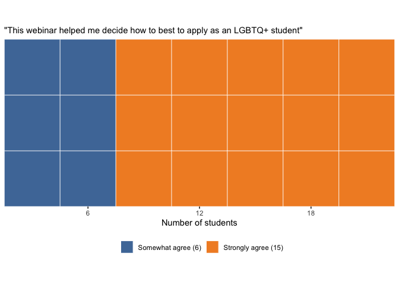<!-- -->

So overall, it looks like most students self-reported that the webinar
was helpful to them.

### Pre and post comparisons

Now we can delve into some of the pre- and post-webinar comparisons. For
these analyses, I mostly treated the likert data on an ordinal 1-5
scale. For the significance testing, I either averaged the ordinal
values for pre- and post- and performed a paired t-test or used a
Chi-squared test for goodness of fit on the overall contingency tables.
I also made two ways of visualizing the responses…any of this can be
changed, but it was my first-pass for feedback.

Note that for the line plots, the big bold line represents the mean
change and each of the gray, smaller lines represents an individual
person.

Also note that, right now, for any given question, I throw away all the
responses that don’t have both pre- and post-webinar answers. For many
people, there are answers in the pre-webinar section (but not the
post-webinar section), and in theory I could include those responses in
the analyses if we want…I’m trying to make up my mind if that’s
something I want to do, since it will change the statistics a little
bit.

**Confidence applying to medical school as an out LGBTQ+ person**

    ## `summarise()` ungrouping output (override with `.groups` argument)

    ## $means
    ## # A tibble: 2 x 2
    ##   timepoint response
    ##   <fct>        <dbl>
    ## 1 pre           3.65
    ## 2 post          4.2 
    ## 
    ## $plot

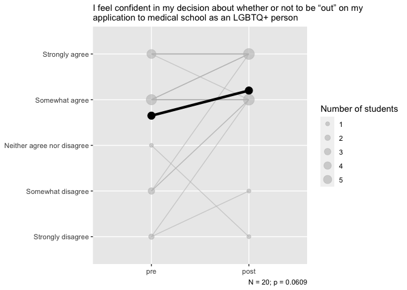<!-- -->

    ## 
    ## $likert

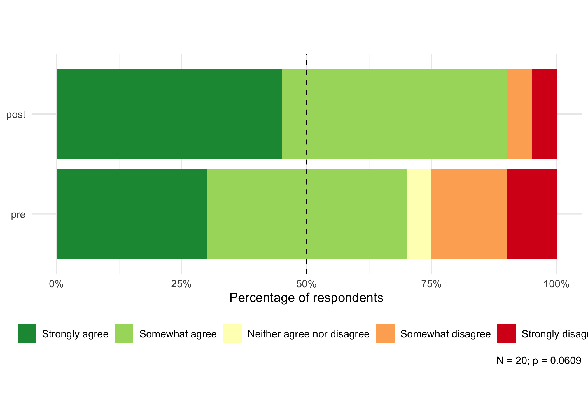<!-- -->

    ## 
    ## $t
    ## 
    ##  Paired t-test
    ## 
    ## data:  my_data %>% filter(timepoint == "pre") %>% pull(response) %>%  and my_data %>% filter(timepoint == "post") %>% pull(response) %>%     as.numeric() and     as.numeric()
    ## t = -1.9926, df = 19, p-value = 0.06086
    ## alternative hypothesis: true difference in means is not equal to 0
    ## 95 percent confidence interval:
    ##  -1.12770577  0.02770577
    ## sample estimates:
    ## mean of the differences 
    ##                   -0.55

**Feeling supported by your advisors**

    ## `summarise()` ungrouping output (override with `.groups` argument)

    ## $means
    ## # A tibble: 2 x 2
    ##   timepoint response
    ##   <fct>        <dbl>
    ## 1 pre           3.25
    ## 2 post          3.45
    ## 
    ## $plot

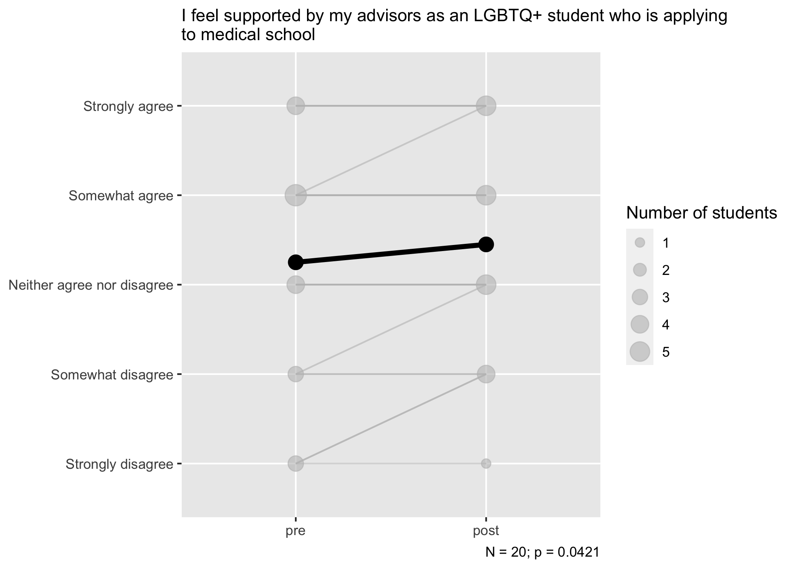<!-- -->

    ## 
    ## $likert

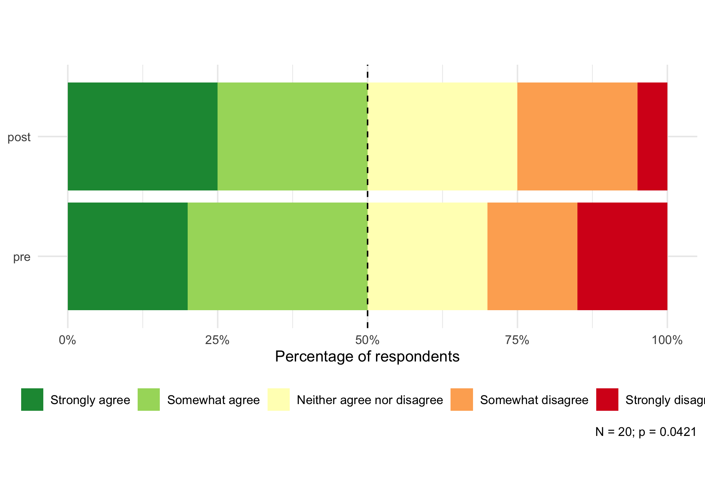<!-- -->

    ## 
    ## $t
    ## 
    ##  Paired t-test
    ## 
    ## data:  my_data %>% filter(timepoint == "pre") %>% pull(response) %>%  and my_data %>% filter(timepoint == "post") %>% pull(response) %>%     as.numeric() and     as.numeric()
    ## t = -2.1794, df = 19, p-value = 0.04209
    ## alternative hypothesis: true difference in means is not equal to 0
    ## 95 percent confidence interval:
    ##  -0.39206906 -0.00793094
    ## sample estimates:
    ## mean of the differences 
    ##                    -0.2

**Importance of finding an LGBTQ+ friendly community**

    ## Warning in chisq.test(., simulate.p.value = TRUE, B = 2000): cannot compute
    ## simulated p-value with zero marginals

    ## Warning in chisq.test(., simulate.p.value = TRUE, B = 2000): Chi-squared
    ## approximation may be incorrect

    ## `summarise()` ungrouping output (override with `.groups` argument)

    ## $means
    ## # A tibble: 2 x 2
    ##   timepoint response
    ##   <fct>        <dbl>
    ## 1 pre           4.84
    ## 2 post          4.79
    ## 
    ## $plot

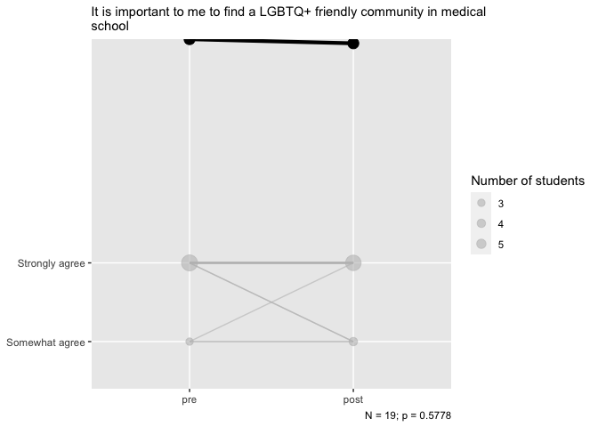<!-- -->

    ## 
    ## $likert

<!-- -->

    ## 
    ## $t
    ## 
    ##  Paired t-test
    ## 
    ## data:  my_data %>% filter(timepoint == "pre") %>% pull(response) %>%  and my_data %>% filter(timepoint == "post") %>% pull(response) %>%     as.numeric() and     as.numeric()
    ## t = 0.56695, df = 18, p-value = 0.5778
    ## alternative hypothesis: true difference in means is not equal to 0
    ## 95 percent confidence interval:
    ##  -0.1424041  0.2476673
    ## sample estimates:
    ## mean of the differences 
    ##              0.05263158

**Value having access to LGBTQ+ mentors/advisors **

    ## Warning in chisq.test(., simulate.p.value = TRUE, B = 2000): cannot compute
    ## simulated p-value with zero marginals

    ## Warning in chisq.test(., simulate.p.value = TRUE, B = 2000): Chi-squared
    ## approximation may be incorrect

    ## `summarise()` ungrouping output (override with `.groups` argument)

    ## $means
    ## # A tibble: 2 x 2
    ##   timepoint response
    ##   <fct>        <dbl>
    ## 1 pre           4.95
    ## 2 post          4.7 
    ## 
    ## $plot

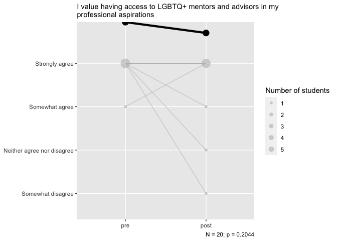<!-- -->

    ## 
    ## $likert

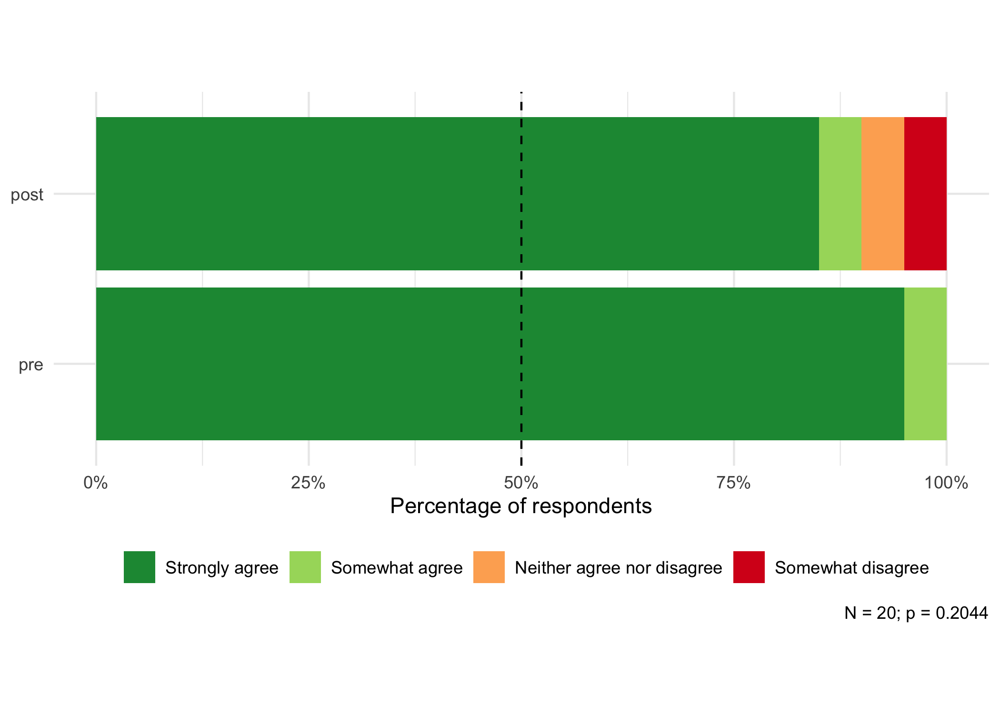<!-- -->

    ## 
    ## $t
    ## 
    ##  Paired t-test
    ## 
    ## data:  my_data %>% filter(timepoint == "pre") %>% pull(response) %>%  and my_data %>% filter(timepoint == "post") %>% pull(response) %>%     as.numeric() and     as.numeric()
    ## t = 1.3143, df = 19, p-value = 0.2044
    ## alternative hypothesis: true difference in means is not equal to 0
    ## 95 percent confidence interval:
    ##  -0.1481381  0.6481381
    ## sample estimates:
    ## mean of the differences 
    ##                    0.25

**Concern about applying to medical school as an out LGBTQ+ person**

    ## Warning in chisq.test(., simulate.p.value = TRUE, B = 2000): cannot compute
    ## simulated p-value with zero marginals

    ## Warning in chisq.test(., simulate.p.value = TRUE, B = 2000): Chi-squared
    ## approximation may be incorrect

    ## `summarise()` ungrouping output (override with `.groups` argument)

    ## $means
    ## # A tibble: 2 x 2
    ##   timepoint response
    ##   <fct>        <dbl>
    ## 1 pre           3.17
    ## 2 post          2.44
    ## 
    ## $plot

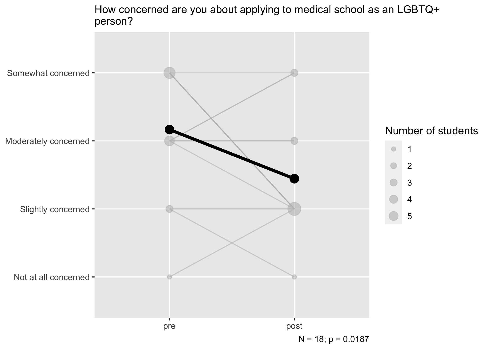<!-- -->

    ## 
    ## $likert

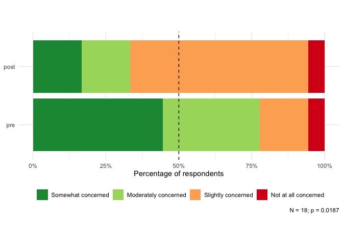<!-- -->

    ## 
    ## $t
    ## 
    ##  Paired t-test
    ## 
    ## data:  my_data %>% filter(timepoint == "pre") %>% pull(response) %>%  and my_data %>% filter(timepoint == "post") %>% pull(response) %>%     as.numeric() and     as.numeric()
    ## t = 2.6, df = 17, p-value = 0.01868
    ## alternative hypothesis: true difference in means is not equal to 0
    ## 95 percent confidence interval:
    ##  0.1361623 1.3082821
    ## sample estimates:
    ## mean of the differences 
    ##               0.7222222

**Preparedness applying to medical school as an LGBTQ+ person**

    ## Warning in chisq.test(., simulate.p.value = TRUE, B = 2000): cannot compute
    ## simulated p-value with zero marginals

    ## Warning in chisq.test(., simulate.p.value = TRUE, B = 2000): Chi-squared
    ## approximation may be incorrect

    ## `summarise()` ungrouping output (override with `.groups` argument)

    ## $means
    ## # A tibble: 2 x 2
    ##   timepoint response
    ##   <fct>        <dbl>
    ## 1 pre           2.5 
    ## 2 post          3.44
    ## 
    ## $plot

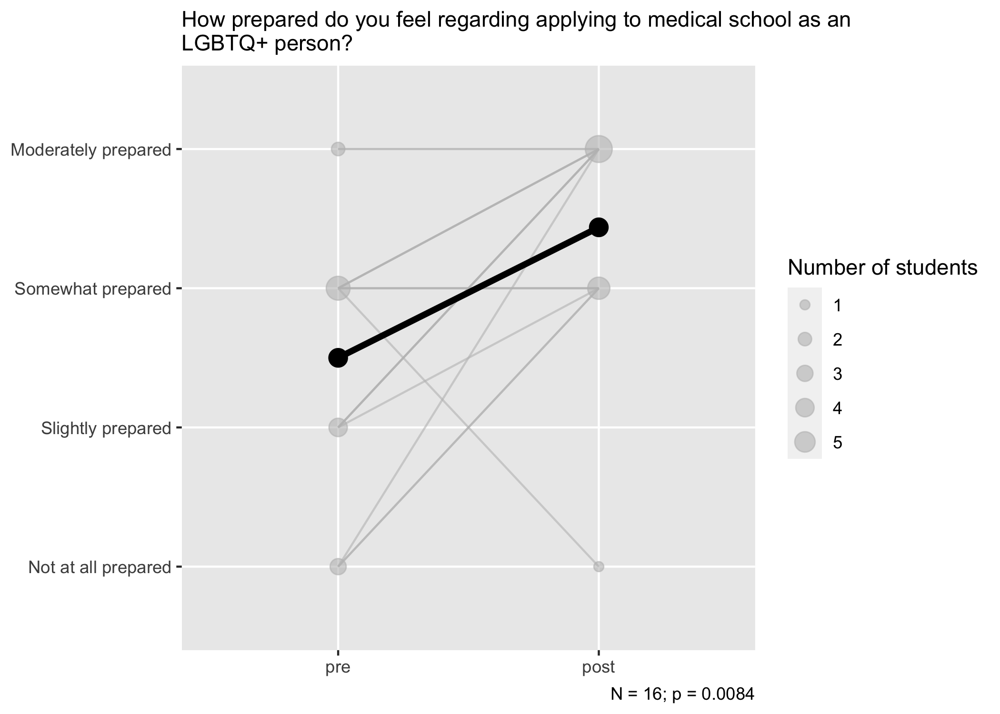<!-- -->

    ## 
    ## $likert

<!-- -->

    ## 
    ## $t
    ## 
    ##  Paired t-test
    ## 
    ## data:  my_data %>% filter(timepoint == "pre") %>% pull(response) %>%  and my_data %>% filter(timepoint == "post") %>% pull(response) %>%     as.numeric() and     as.numeric()
    ## t = -3.0325, df = 15, p-value = 0.008397
    ## alternative hypothesis: true difference in means is not equal to 0
    ## 95 percent confidence interval:
    ##  -1.5964348 -0.2785652
    ## sample estimates:
    ## mean of the differences 
    ##                 -0.9375

**Do you see being LGBTQ+ as an asset or a hindrance in your application
process?**

    ## `summarise()` ungrouping output (override with `.groups` argument)

    ## $means
    ## # A tibble: 2 x 2
    ##   timepoint response
    ##   <fct>        <dbl>
    ## 1 pre           3.3 
    ## 2 post          3.95
    ## 
    ## $plot

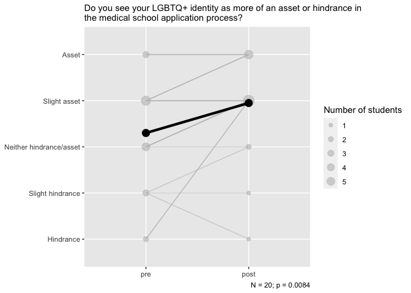<!-- -->

    ## 
    ## $likert

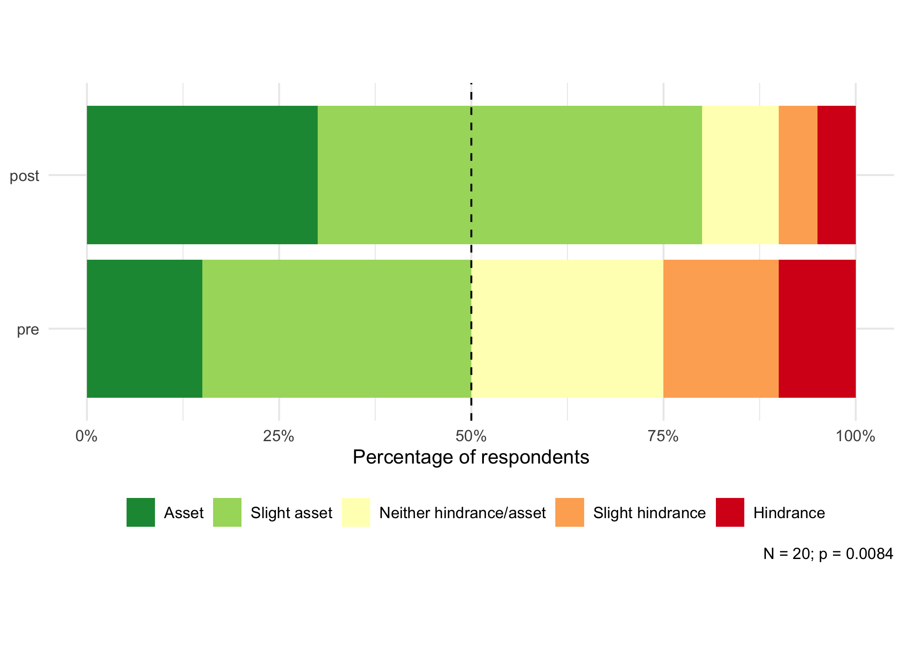<!-- -->

    ## 
    ## $t
    ## 
    ##  Paired t-test
    ## 
    ## data:  my_data %>% filter(timepoint == "pre") %>% pull(response) %>%  and my_data %>% filter(timepoint == "post") %>% pull(response) %>%     as.numeric() and     as.numeric()
    ## t = -2.9419, df = 19, p-value = 0.008369
    ## alternative hypothesis: true difference in means is not equal to 0
    ## 95 percent confidence interval:
    ##  -1.1124389 -0.1875611
    ## sample estimates:
    ## mean of the differences 
    ##                   -0.65

## Final comments

| Any final comments?                                                                                                                                                                                                                                                                                                                                                                                                                                                                                                                                                                                                                                                                                                                        |
| :----------------------------------------------------------------------------------------------------------------------------------------------------------------------------------------------------------------------------------------------------------------------------------------------------------------------------------------------------------------------------------------------------------------------------------------------------------------------------------------------------------------------------------------------------------------------------------------------------------------------------------------------------------------------------------------------------------------------------------------- |
| thank you for this. I hope to be involved more in MSPA as a premed and one day medical student.                                                                                                                                                                                                                                                                                                                                                                                                                                                                                                                                                                                                                                            |
| Thank you\! It was great hearing everyone’s thoughts and experiences, and I appreciate the time you all took to speak to us. Stay well\!                                                                                                                                                                                                                                                                                                                                                                                                                                                                                                                                                                                                   |
| It would be good to learn about what structures are in place to prevent adcoms from outing applicants without their consent either after they become matriculants, during interviews, or anything similar. Wasn’t comfortable raising this during the webinar, but am super appreciative of how helpful it was and how thoughtful all the panelists are\!                                                                                                                                                                                                                                                                                                                                                                                  |
| Thank you all so much\!\! This was wonderful and I felt very seen and learned a lot                                                                                                                                                                                                                                                                                                                                                                                                                                                                                                                                                                                                                                                        |
| Thank you all for your time and insight. It’s important for us to see folks like ourselves.                                                                                                                                                                                                                                                                                                                                                                                                                                                                                                                                                                                                                                                |
| Thank you so much for coordinating this Zoom\! It was so helpful and refreshing to talk to Queer medical students. There aren’t nearly enough LGBTQ+ people in STEM fields, but I’m glad MSPA provided this connection.                                                                                                                                                                                                                                                                                                                                                                                                                                                                                                                    |
| Thank you for this event\! This was amazing. I loved it\!                                                                                                                                                                                                                                                                                                                                                                                                                                                                                                                                                                                                                                                                                  |
| Thanks for the webinar. It was the first time that I saw something for queer pre-meds\!                                                                                                                                                                                                                                                                                                                                                                                                                                                                                                                                                                                                                                                    |
| Thanks so much for putting this on, it means a lot to me and eases many of my concerns.                                                                                                                                                                                                                                                                                                                                                                                                                                                                                                                                                                                                                                                    |
| N/A. Thanks\!                                                                                                                                                                                                                                                                                                                                                                                                                                                                                                                                                                                                                                                                                                                              |
| Thank you so much for putting the webinar together – it’s great to feel solidarity with queer medical students who’ve been through the process and had to make similar calculations. Some of the information towards the beginning of the webinar was pretty basic and not specific to being LGBT, and I found myself tuning out for that part. But hearing the personal stories and insights from the different panelists was awesome. Also, I wish there was more comfort around naming names, in terms of schools – we want to know which schools are doing a good job at recruiting and respecting LGBT students… and which schools aren’t. Thanks again, and I look forward to getting more involved when I’m an actual med student\! |
| It was a nice session. Thank you for discussing such a great topic.                                                                                                                                                                                                                                                                                                                                                                                                                                                                                                                                                                                                                                                                        |
| It enhanced everybody’s way of thinking and processing their lives.                                                                                                                                                                                                                                                                                                                                                                                                                                                                                                                                                                                                                                                                        |
| I really appreciate that you covered the general application process and interwove your queer experiences throughout it, as well as answering specific questions toward the end\! Thank you for having a diverse panel to speak to different experiences and intersections within the queer community :)                                                                                                                                                                                                                                                                                                                                                                                                                                   |
| Thanks for putting the event on\!                                                                                                                                                                                                                                                                                                                                                                                                                                                                                                                                                                                                                                                                                                          |
| Thank you again\!                                                                                                                                                                                                                                                                                                                                                                                                                                                                                                                                                                                                                                                                                                                          |
